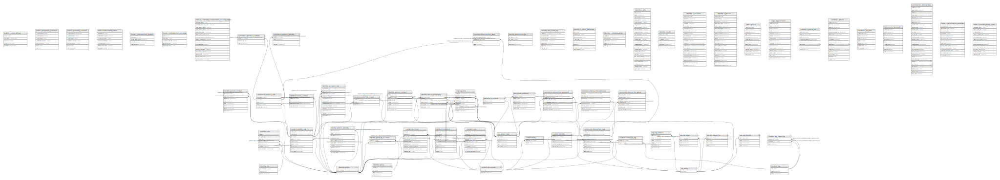

# marius

## Tables

| Name | Columns | Comment | Type |
| ---- | ------- | ------- | ---- |
| [public.spatial_ref_sys](public.spatial_ref_sys.md) | 5 |  | BASE TABLE |
| [public.geography_columns](public.geography_columns.md) | 7 |  | VIEW |
| [public.geometry_columns](public.geometry_columns.md) | 7 |  | VIEW |
| [meta.containment_intent](meta.containment_intent.md) | 7 |  | BASE TABLE |
| [meta.v_introspection_layout](meta.v_introspection_layout.md) | 4 |  | VIEW |
| [meta.v_introspection_security](meta.v_introspection_security.md) | 5 |  | VIEW |
| [meta.v_extended_containment_security_matrix](meta.v_extended_containment_security_matrix.md) | 16 |  | VIEW |
| [identity.entity](identity.entity.md) | 2 |  | BASE TABLE |
| [identity.permission_bit](identity.permission_bit.md) | 4 |  | BASE TABLE |
| [identity.role](identity.role.md) | 3 |  | BASE TABLE |
| [identity.auth](identity.auth.md) | 7 |  | BASE TABLE |
| [identity.account_core](identity.account_core.md) | 12 |  | BASE TABLE |
| [identity.person_identity](identity.person_identity.md) | 10 |  | BASE TABLE |
| [identity.person_contact](identity.person_contact.md) | 7 |  | BASE TABLE |
| [identity.person_biography](identity.person_biography.md) | 5 |  | BASE TABLE |
| [identity.person_content](identity.person_content.md) | 8 |  | BASE TABLE |
| [identity.group](identity.group.md) | 4 |  | BASE TABLE |
| [identity.group_to_account](identity.group_to_account.md) | 2 |  | BASE TABLE |
| [identity.dml_audit_log](identity.dml_audit_log.md) | 7 |  | BASE TABLE |
| [identity.v_admin_sessions](identity.v_admin_sessions.md) | 8 | Sessions actives de marius_admin. Toute ligne en production normale est une anomalie. ADR-001. | VIEW |
| [identity.v_shadow_writes](identity.v_shadow_writes.md) | 5 | DML émis directement par marius_user, hors procédures SECURITY DEFINER. Toute ligne est une violation ADR-001. | VIEW |
| [identity.v_role](identity.v_role.md) | 24 |  | VIEW |
| [identity.v_auth](identity.v_auth.md) | 6 |  | VIEW |
| [identity.v_account](identity.v_account.md) | 21 |  | VIEW |
| [identity.v_person](identity.v_person.md) | 21 |  | VIEW |
| [geo.place_core](geo.place_core.md) | 5 |  | BASE TABLE |
| [geo.postal_address](geo.postal_address.md) | 6 |  | BASE TABLE |
| [geo.place_content](geo.place_content.md) | 2 |  | BASE TABLE |
| [geo.v_place](geo.v_place.md) | 12 |  | VIEW |
| [org.entity](org.entity.md) | 1 |  | BASE TABLE |
| [org.org_core](org.org_core.md) | 8 |  | BASE TABLE |
| [org.org_identity](org.org_identity.md) | 4 |  | BASE TABLE |
| [org.org_contact](org.org_contact.md) | 6 |  | BASE TABLE |
| [org.org_legal](org.org_legal.md) | 4 |  | BASE TABLE |
| [org.org_hierarchy](org.org_hierarchy.md) | 4 |  | BASE TABLE |
| [org.v_organization](org.v_organization.md) | 15 |  | VIEW |
| [content.document](content.document.md) | 2 |  | BASE TABLE |
| [content.media_core](content.media_core.md) | 9 |  | BASE TABLE |
| [content.media_content](content.media_content.md) | 4 |  | BASE TABLE |
| [content.core](content.core.md) | 9 |  | BASE TABLE |
| [content.identity](content.identity.md) | 5 |  | BASE TABLE |
| [content.body](content.body.md) | 2 |  | BASE TABLE |
| [content.revision](content.revision.md) | 9 |  | BASE TABLE |
| [content.tag](content.tag.md) | 3 |  | BASE TABLE |
| [content.tag_hierarchy](content.tag_hierarchy.md) | 3 |  | BASE TABLE |
| [content.content_to_tag](content.content_to_tag.md) | 2 |  | BASE TABLE |
| [content.content_to_media](content.content_to_media.md) | 3 |  | BASE TABLE |
| [content.comment](content.comment.md) | 9 |  | BASE TABLE |
| [content.v_article_list](content.v_article_list.md) | 8 |  | VIEW |
| [content.v_article](content.v_article.md) | 16 |  | VIEW |
| [content.v_tag_tree](content.v_tag_tree.md) | 7 |  | VIEW |
| [commerce.product_core](commerce.product_core.md) | 5 |  | BASE TABLE |
| [commerce.product_identity](commerce.product_identity.md) | 4 |  | BASE TABLE |
| [commerce.product_content](commerce.product_content.md) | 3 |  | BASE TABLE |
| [commerce.transaction_core](commerce.transaction_core.md) | 9 |  | BASE TABLE |
| [commerce.transaction_price](commerce.transaction_price.md) | 7 |  | BASE TABLE |
| [commerce.transaction_payment](commerce.transaction_payment.md) | 7 |  | BASE TABLE |
| [commerce.transaction_delivery](commerce.transaction_delivery.md) | 8 |  | BASE TABLE |
| [commerce.transaction_item](commerce.transaction_item.md) | 4 |  | BASE TABLE |
| [commerce.v_product](commerce.v_product.md) | 10 |  | VIEW |
| [commerce.v_transaction](commerce.v_transaction.md) | 28 |  | VIEW |
| [meta.v_performance_sentinel](meta.v_performance_sentinel.md) | 13 | Audit de performance AOT/DOD : HOT-BLOCKER (colonnes mutables indexees via immutable_keys + pg_index), BRIN-DRIFT (correlation physique < 0.90, pire cas multi-BRIN), BLOAT (pg_relation_size / n_live_tup vs intent_density / fillfactor * 1.20). Court-circuit exempt_bloat_check : bloat_alert=FALSE pour les tables dictionnaire (faible cardinalite, immuables en production — identity.role). Correction fillfactor obligatoire : tables ff<100 (auth ff=70, product_core ff=80) produisent des faux positifs sans elle. Prerequis : ANALYZE execute. ADR-006 / ADR-010 / ADR-030 . meta_registry v2. | VIEW |
| [meta.v_master_health_audit](meta.v_master_health_audit.md) | 12 |  | VIEW |

## Stored procedures and functions

| Name | ReturnType | Arguments | Type |
| ---- | ------- | ------- | ---- |
| public.unaccent | text | regdictionary, text | FUNCTION |
| public.unaccent | text | text | FUNCTION |
| public.unaccent_init | internal | internal | FUNCTION |
| public.unaccent_lexize | internal | internal, internal, internal, internal | FUNCTION |
| public.ltree_in | ltree | cstring | FUNCTION |
| public.ltree_out | cstring | ltree | FUNCTION |
| public.ltree_cmp | int4 | ltree, ltree | FUNCTION |
| public.ltree_lt | bool | ltree, ltree | FUNCTION |
| public.ltree_le | bool | ltree, ltree | FUNCTION |
| public.ltree_eq | bool | ltree, ltree | FUNCTION |
| public.ltree_ge | bool | ltree, ltree | FUNCTION |
| public.ltree_gt | bool | ltree, ltree | FUNCTION |
| public.ltree_ne | bool | ltree, ltree | FUNCTION |
| public.subltree | ltree | ltree, integer, integer | FUNCTION |
| public.subpath | ltree | ltree, integer, integer | FUNCTION |
| public.subpath | ltree | ltree, integer | FUNCTION |
| public.index | int4 | ltree, ltree | FUNCTION |
| public.index | int4 | ltree, ltree, integer | FUNCTION |
| public.nlevel | int4 | ltree | FUNCTION |
| public.ltree2text | text | ltree | FUNCTION |
| public.text2ltree | ltree | text | FUNCTION |
| public.lca | ltree | ltree[] | FUNCTION |
| public.lca | ltree | ltree, ltree | FUNCTION |
| public.lca | ltree | ltree, ltree, ltree | FUNCTION |
| public.lca | ltree | ltree, ltree, ltree, ltree | FUNCTION |
| public.lca | ltree | ltree, ltree, ltree, ltree, ltree | FUNCTION |
| public.lca | ltree | ltree, ltree, ltree, ltree, ltree, ltree | FUNCTION |
| public.lca | ltree | ltree, ltree, ltree, ltree, ltree, ltree, ltree | FUNCTION |
| public.lca | ltree | ltree, ltree, ltree, ltree, ltree, ltree, ltree, ltree | FUNCTION |
| public.ltree_isparent | bool | ltree, ltree | FUNCTION |
| public.ltree_risparent | bool | ltree, ltree | FUNCTION |
| public.ltree_addltree | ltree | ltree, ltree | FUNCTION |
| public.ltree_addtext | ltree | ltree, text | FUNCTION |
| public.ltree_textadd | ltree | text, ltree | FUNCTION |
| public.ltreeparentsel | float8 | internal, oid, internal, integer | FUNCTION |
| public.lquery_in | lquery | cstring | FUNCTION |
| public.lquery_out | cstring | lquery | FUNCTION |
| public.ltq_regex | bool | ltree, lquery | FUNCTION |
| public.ltq_rregex | bool | lquery, ltree | FUNCTION |
| public.lt_q_regex | bool | ltree, lquery[] | FUNCTION |
| public.lt_q_rregex | bool | lquery[], ltree | FUNCTION |
| public.ltxtq_in | ltxtquery | cstring | FUNCTION |
| public.ltxtq_out | cstring | ltxtquery | FUNCTION |
| public.ltxtq_exec | bool | ltree, ltxtquery | FUNCTION |
| public.ltxtq_rexec | bool | ltxtquery, ltree | FUNCTION |
| public.ltree_gist_in | ltree_gist | cstring | FUNCTION |
| public.ltree_gist_out | cstring | ltree_gist | FUNCTION |
| public.ltree_consistent | bool | internal, ltree, smallint, oid, internal | FUNCTION |
| public.ltree_compress | internal | internal | FUNCTION |
| public.ltree_decompress | internal | internal | FUNCTION |
| public.ltree_penalty | internal | internal, internal, internal | FUNCTION |
| public.ltree_picksplit | internal | internal, internal | FUNCTION |
| public.ltree_union | ltree_gist | internal, internal | FUNCTION |
| public.ltree_same | internal | ltree_gist, ltree_gist, internal | FUNCTION |
| public._ltree_isparent | bool | ltree[], ltree | FUNCTION |
| public._ltree_r_isparent | bool | ltree, ltree[] | FUNCTION |
| public._ltree_risparent | bool | ltree[], ltree | FUNCTION |
| public._ltree_r_risparent | bool | ltree, ltree[] | FUNCTION |
| public._ltq_regex | bool | ltree[], lquery | FUNCTION |
| public._ltq_rregex | bool | lquery, ltree[] | FUNCTION |
| public._lt_q_regex | bool | ltree[], lquery[] | FUNCTION |
| public._lt_q_rregex | bool | lquery[], ltree[] | FUNCTION |
| public._ltxtq_exec | bool | ltree[], ltxtquery | FUNCTION |
| public._ltxtq_rexec | bool | ltxtquery, ltree[] | FUNCTION |
| public._ltree_extract_isparent | ltree | ltree[], ltree | FUNCTION |
| public._ltree_extract_risparent | ltree | ltree[], ltree | FUNCTION |
| public._ltq_extract_regex | ltree | ltree[], lquery | FUNCTION |
| public._ltxtq_extract_exec | ltree | ltree[], ltxtquery | FUNCTION |
| public._ltree_consistent | bool | internal, ltree[], smallint, oid, internal | FUNCTION |
| public._ltree_compress | internal | internal | FUNCTION |
| public._ltree_penalty | internal | internal, internal, internal | FUNCTION |
| public._ltree_picksplit | internal | internal, internal | FUNCTION |
| public._ltree_union | ltree_gist | internal, internal | FUNCTION |
| public._ltree_same | internal | ltree_gist, ltree_gist, internal | FUNCTION |
| public.ltree_recv | ltree | internal | FUNCTION |
| public.ltree_send | bytea | ltree | FUNCTION |
| public.lquery_recv | lquery | internal | FUNCTION |
| public.lquery_send | bytea | lquery | FUNCTION |
| public.ltxtq_recv | ltxtquery | internal | FUNCTION |
| public.ltxtq_send | bytea | ltxtquery | FUNCTION |
| public.ltree_gist_options | void | internal | FUNCTION |
| public._ltree_gist_options | void | internal | FUNCTION |
| public.hash_ltree | int4 | ltree | FUNCTION |
| public.hash_ltree_extended | int8 | ltree, bigint | FUNCTION |
| public.set_limit | float4 | real | FUNCTION |
| public.show_limit | float4 |  | FUNCTION |
| public.show_trgm | _text | text | FUNCTION |
| public.similarity | float4 | text, text | FUNCTION |
| public.similarity_op | bool | text, text | FUNCTION |
| public.word_similarity | float4 | text, text | FUNCTION |
| public.word_similarity_op | bool | text, text | FUNCTION |
| public.word_similarity_commutator_op | bool | text, text | FUNCTION |
| public.similarity_dist | float4 | text, text | FUNCTION |
| public.word_similarity_dist_op | float4 | text, text | FUNCTION |
| public.word_similarity_dist_commutator_op | float4 | text, text | FUNCTION |
| public.gtrgm_in | gtrgm | cstring | FUNCTION |
| public.gtrgm_out | cstring | gtrgm | FUNCTION |
| public.gtrgm_consistent | bool | internal, text, smallint, oid, internal | FUNCTION |
| public.gtrgm_distance | float8 | internal, text, smallint, oid, internal | FUNCTION |
| public.gtrgm_compress | internal | internal | FUNCTION |
| public.gtrgm_decompress | internal | internal | FUNCTION |
| public.gtrgm_penalty | internal | internal, internal, internal | FUNCTION |
| public.gtrgm_picksplit | internal | internal, internal | FUNCTION |
| public.gtrgm_union | gtrgm | internal, internal | FUNCTION |
| public.gtrgm_same | internal | gtrgm, gtrgm, internal | FUNCTION |
| public.gin_extract_value_trgm | internal | text, internal | FUNCTION |
| public.gin_extract_query_trgm | internal | text, internal, smallint, internal, internal, internal, internal | FUNCTION |
| public.gin_trgm_consistent | bool | internal, smallint, text, integer, internal, internal, internal, internal | FUNCTION |
| public.gin_trgm_triconsistent | char | internal, smallint, text, integer, internal, internal, internal | FUNCTION |
| public.strict_word_similarity | float4 | text, text | FUNCTION |
| public.strict_word_similarity_op | bool | text, text | FUNCTION |
| public.strict_word_similarity_commutator_op | bool | text, text | FUNCTION |
| public.strict_word_similarity_dist_op | float4 | text, text | FUNCTION |
| public.strict_word_similarity_dist_commutator_op | float4 | text, text | FUNCTION |
| public.gtrgm_options | void | internal | FUNCTION |
| public._postgis_deprecate | void | oldname text, newname text, version text | FUNCTION |
| public.spheroid_in | spheroid | cstring | FUNCTION |
| public.spheroid_out | cstring | spheroid | FUNCTION |
| public.geometry_in | geometry | cstring | FUNCTION |
| public.geometry_out | cstring | geometry | FUNCTION |
| public.geometry_typmod_in | int4 | cstring[] | FUNCTION |
| public.geometry_typmod_out | cstring | integer | FUNCTION |
| public.geometry_analyze | bool | internal | FUNCTION |
| public.geometry_recv | geometry | internal | FUNCTION |
| public.geometry_send | bytea | geometry | FUNCTION |
| public.geometry | geometry | geometry, integer, boolean | FUNCTION |
| public.geometry | geometry | point | FUNCTION |
| public.point | point | geometry | FUNCTION |
| public.geometry | geometry | path | FUNCTION |
| public.path | path | geometry | FUNCTION |
| public.geometry | geometry | polygon | FUNCTION |
| public.polygon | polygon | geometry | FUNCTION |
| public.st_x | float8 | geometry | FUNCTION |
| public.st_y | float8 | geometry | FUNCTION |
| public.st_z | float8 | geometry | FUNCTION |
| public.st_m | float8 | geometry | FUNCTION |
| public.box3d_in | box3d | cstring | FUNCTION |
| public.box3d_out | cstring | box3d | FUNCTION |
| public.box2d_in | box2d | cstring | FUNCTION |
| public.box2d_out | cstring | box2d | FUNCTION |
| public.box2df_in | box2df | cstring | FUNCTION |
| public.box2df_out | cstring | box2df | FUNCTION |
| public.gidx_in | gidx | cstring | FUNCTION |
| public.gidx_out | cstring | gidx | FUNCTION |
| public.geometry_lt | bool | geom1 geometry, geom2 geometry | FUNCTION |
| public.geometry_le | bool | geom1 geometry, geom2 geometry | FUNCTION |
| public.geometry_gt | bool | geom1 geometry, geom2 geometry | FUNCTION |
| public.geometry_ge | bool | geom1 geometry, geom2 geometry | FUNCTION |
| public.geometry_eq | bool | geom1 geometry, geom2 geometry | FUNCTION |
| public.geometry_neq | bool | geom1 geometry, geom2 geometry | FUNCTION |
| public.geometry_cmp | int4 | geom1 geometry, geom2 geometry | FUNCTION |
| public.geometry_sortsupport | void | internal | FUNCTION |
| public.geometry_hash | int4 | geometry | FUNCTION |
| public.geometry_gist_distance_2d | float8 | internal, geometry, integer | FUNCTION |
| public.geometry_gist_consistent_2d | bool | internal, geometry, integer | FUNCTION |
| public.geometry_gist_compress_2d | internal | internal | FUNCTION |
| public.geometry_gist_penalty_2d | internal | internal, internal, internal | FUNCTION |
| public.geometry_gist_picksplit_2d | internal | internal, internal | FUNCTION |
| public.geometry_gist_union_2d | internal | bytea, internal | FUNCTION |
| public.geometry_gist_same_2d | internal | geom1 geometry, geom2 geometry, internal | FUNCTION |
| public.geometry_gist_decompress_2d | internal | internal | FUNCTION |
| public.geometry_gist_sortsupport_2d | void | internal | FUNCTION |
| public._postgis_selectivity | float8 | tbl regclass, att_name text, geom geometry, mode text DEFAULT '2'::text | FUNCTION |
| public._postgis_join_selectivity | float8 | regclass, text, regclass, text, text DEFAULT '2'::text | FUNCTION |
| public._postgis_stats | text | tbl regclass, att_name text, text DEFAULT '2'::text | FUNCTION |
| public._postgis_index_extent | box2d | tbl regclass, col text | FUNCTION |
| public.gserialized_gist_sel_2d | float8 | internal, oid, internal, integer | FUNCTION |
| public.gserialized_gist_sel_nd | float8 | internal, oid, internal, integer | FUNCTION |
| public.gserialized_gist_joinsel_2d | float8 | internal, oid, internal, smallint | FUNCTION |
| public.gserialized_gist_joinsel_nd | float8 | internal, oid, internal, smallint | FUNCTION |
| public.geometry_overlaps | bool | geom1 geometry, geom2 geometry | FUNCTION |
| public.geometry_same | bool | geom1 geometry, geom2 geometry | FUNCTION |
| public.geometry_distance_centroid | float8 | geom1 geometry, geom2 geometry | FUNCTION |
| public.geometry_distance_box | float8 | geom1 geometry, geom2 geometry | FUNCTION |
| public.geometry_contains | bool | geom1 geometry, geom2 geometry | FUNCTION |
| public.geometry_within | bool | geom1 geometry, geom2 geometry | FUNCTION |
| public.geometry_left | bool | geom1 geometry, geom2 geometry | FUNCTION |
| public.geometry_overleft | bool | geom1 geometry, geom2 geometry | FUNCTION |
| public.geometry_below | bool | geom1 geometry, geom2 geometry | FUNCTION |
| public.geometry_overbelow | bool | geom1 geometry, geom2 geometry | FUNCTION |
| public.geometry_overright | bool | geom1 geometry, geom2 geometry | FUNCTION |
| public.geometry_right | bool | geom1 geometry, geom2 geometry | FUNCTION |
| public.geometry_overabove | bool | geom1 geometry, geom2 geometry | FUNCTION |
| public.geometry_above | bool | geom1 geometry, geom2 geometry | FUNCTION |
| public.geometry_gist_consistent_nd | bool | internal, geometry, integer | FUNCTION |
| public.geometry_gist_compress_nd | internal | internal | FUNCTION |
| public.geometry_gist_penalty_nd | internal | internal, internal, internal | FUNCTION |
| public.geometry_gist_picksplit_nd | internal | internal, internal | FUNCTION |
| public.geometry_gist_union_nd | internal | bytea, internal | FUNCTION |
| public.geometry_gist_same_nd | internal | geometry, geometry, internal | FUNCTION |
| public.geometry_gist_decompress_nd | internal | internal | FUNCTION |
| public.geometry_overlaps_nd | bool | geometry, geometry | FUNCTION |
| public.geometry_contains_nd | bool | geometry, geometry | FUNCTION |
| public.geometry_within_nd | bool | geometry, geometry | FUNCTION |
| public.geometry_same_nd | bool | geometry, geometry | FUNCTION |
| public.geometry_distance_centroid_nd | float8 | geometry, geometry | FUNCTION |
| public.geometry_distance_cpa | float8 | geometry, geometry | FUNCTION |
| public.geometry_gist_distance_nd | float8 | internal, geometry, integer | FUNCTION |
| public.st_shiftlongitude | geometry | geometry | FUNCTION |
| public.st_wrapx | geometry | geom geometry, wrap double precision, move double precision | FUNCTION |
| public.st_xmin | float8 | box3d | FUNCTION |
| public.st_ymin | float8 | box3d | FUNCTION |
| public.st_zmin | float8 | box3d | FUNCTION |
| public.st_xmax | float8 | box3d | FUNCTION |
| public.st_ymax | float8 | box3d | FUNCTION |
| public.st_zmax | float8 | box3d | FUNCTION |
| public.st_expand | box2d | box2d, double precision | FUNCTION |
| public.st_expand | box2d | box box2d, dx double precision, dy double precision | FUNCTION |
| public.postgis_getbbox | box2d | geometry | FUNCTION |
| public.st_makebox2d | box2d | geom1 geometry, geom2 geometry | FUNCTION |
| public.st_estimatedextent | box2d | text, text, text, boolean | FUNCTION |
| public.st_estimatedextent | box2d | text, text, text | FUNCTION |
| public.st_estimatedextent | box2d | text, text | FUNCTION |
| public.st_findextent | box2d | text, text, text | FUNCTION |
| public.st_findextent | box2d | text, text | FUNCTION |
| public.postgis_addbbox | geometry | geometry | FUNCTION |
| public.postgis_dropbbox | geometry | geometry | FUNCTION |
| public.postgis_hasbbox | bool | geometry | FUNCTION |
| public.st_quantizecoordinates | geometry | g geometry, prec_x integer, prec_y integer DEFAULT NULL::integer, prec_z integer DEFAULT NULL::integer, prec_m integer DEFAULT NULL::integer | FUNCTION |
| public.st_memsize | int4 | geometry | FUNCTION |
| public.st_summary | text | geometry | FUNCTION |
| public.st_npoints | int4 | geometry | FUNCTION |
| public.st_nrings | int4 | geometry | FUNCTION |
| public.st_3dlength | float8 | geometry | FUNCTION |
| public.st_length2d | float8 | geometry | FUNCTION |
| public.st_length | float8 | geometry | FUNCTION |
| public.st_lengthspheroid | float8 | geometry, spheroid | FUNCTION |
| public.st_length2dspheroid | float8 | geometry, spheroid | FUNCTION |
| public.st_3dperimeter | float8 | geometry | FUNCTION |
| public.st_perimeter2d | float8 | geometry | FUNCTION |
| public.st_perimeter | float8 | geometry | FUNCTION |
| public.st_area2d | float8 | geometry | FUNCTION |
| public.st_area | float8 | geometry | FUNCTION |
| public.st_ispolygoncw | bool | geometry | FUNCTION |
| public.st_ispolygonccw | bool | geometry | FUNCTION |
| public.st_distancespheroid | float8 | geom1 geometry, geom2 geometry, spheroid | FUNCTION |
| public.st_distancespheroid | float8 | geom1 geometry, geom2 geometry | FUNCTION |
| public.st_distance | float8 | geom1 geometry, geom2 geometry | FUNCTION |
| public.st_pointinsidecircle | bool | geometry, double precision, double precision, double precision | FUNCTION |
| public.st_azimuth | float8 | geom1 geometry, geom2 geometry | FUNCTION |
| public.st_project | geometry | geom1 geometry, distance double precision, azimuth double precision | FUNCTION |
| public.st_project | geometry | geom1 geometry, geom2 geometry, distance double precision | FUNCTION |
| public.st_angle | float8 | pt1 geometry, pt2 geometry, pt3 geometry, pt4 geometry DEFAULT '0101000000000000000000F87F000000000000F87F'::geometry | FUNCTION |
| public.st_lineextend | geometry | geom geometry, distance_forward double precision, distance_backward double precision DEFAULT 0.0 | FUNCTION |
| public.st_force2d | geometry | geometry | FUNCTION |
| public.st_force3dz | geometry | geom geometry, zvalue double precision DEFAULT 0.0 | FUNCTION |
| public.st_force3d | geometry | geom geometry, zvalue double precision DEFAULT 0.0 | FUNCTION |
| public.st_force3dm | geometry | geom geometry, mvalue double precision DEFAULT 0.0 | FUNCTION |
| public.st_force4d | geometry | geom geometry, zvalue double precision DEFAULT 0.0, mvalue double precision DEFAULT 0.0 | FUNCTION |
| public.st_forcecollection | geometry | geometry | FUNCTION |
| public.st_collectionextract | geometry | geometry, integer | FUNCTION |
| public.st_collectionextract | geometry | geometry | FUNCTION |
| public.st_collectionhomogenize | geometry | geometry | FUNCTION |
| public.st_multi | geometry | geometry | FUNCTION |
| public.st_forcecurve | geometry | geometry | FUNCTION |
| public.st_forcesfs | geometry | geometry | FUNCTION |
| public.st_forcesfs | geometry | geometry, version text | FUNCTION |
| public.st_expand | box3d | box3d, double precision | FUNCTION |
| public.st_expand | box3d | box box3d, dx double precision, dy double precision, dz double precision DEFAULT 0 | FUNCTION |
| public.st_expand | geometry | geometry, double precision | FUNCTION |
| public.st_expand | geometry | geom geometry, dx double precision, dy double precision, dz double precision DEFAULT 0, dm double precision DEFAULT 0 | FUNCTION |
| public.st_envelope | geometry | geometry | FUNCTION |
| public.st_boundingdiagonal | geometry | geom geometry, fits boolean DEFAULT false | FUNCTION |
| public.st_reverse | geometry | geometry | FUNCTION |
| public.st_scroll | geometry | geometry, geometry | FUNCTION |
| public.postgis_noop | geometry | geometry | FUNCTION |
| public.postgis_geos_noop | geometry | geometry | FUNCTION |
| public.st_normalize | geometry | geom geometry | FUNCTION |
| public.st_zmflag | int2 | geometry | FUNCTION |
| public.st_ndims | int2 | geometry | FUNCTION |
| public.st_hasz | bool | geometry | FUNCTION |
| public.st_hasm | bool | geometry | FUNCTION |
| public.st_asewkt | text | geometry | FUNCTION |
| public.st_asewkt | text | geometry, integer | FUNCTION |
| public.st_astwkb | bytea | geom geometry, prec integer DEFAULT NULL::integer, prec_z integer DEFAULT NULL::integer, prec_m integer DEFAULT NULL::integer, with_sizes boolean DEFAULT NULL::boolean, with_boxes boolean DEFAULT NULL::boolean | FUNCTION |
| public.st_astwkb | bytea | geom geometry[], ids bigint[], prec integer DEFAULT NULL::integer, prec_z integer DEFAULT NULL::integer, prec_m integer DEFAULT NULL::integer, with_sizes boolean DEFAULT NULL::boolean, with_boxes boolean DEFAULT NULL::boolean | FUNCTION |
| public.st_asewkb | bytea | geometry | FUNCTION |
| public.st_ashexewkb | text | geometry | FUNCTION |
| public.st_ashexewkb | text | geometry, text | FUNCTION |
| public.st_asewkb | bytea | geometry, text | FUNCTION |
| public.st_aslatlontext | text | geom geometry, tmpl text DEFAULT ''::text | FUNCTION |
| public.geomfromewkb | geometry | bytea | FUNCTION |
| public.st_geomfromewkb | geometry | bytea | FUNCTION |
| public.st_geomfromtwkb | geometry | bytea | FUNCTION |
| public.geomfromewkt | geometry | text | FUNCTION |
| public.st_geomfromewkt | geometry | text | FUNCTION |
| public.postgis_cache_bbox | trigger |  | FUNCTION |
| public.st_makepoint | geometry | double precision, double precision | FUNCTION |
| public.st_makepoint | geometry | double precision, double precision, double precision | FUNCTION |
| public.st_makepoint | geometry | double precision, double precision, double precision, double precision | FUNCTION |
| public.st_makepointm | geometry | double precision, double precision, double precision | FUNCTION |
| public.st_3dmakebox | box3d | geom1 geometry, geom2 geometry | FUNCTION |
| public.st_makeline | geometry | geometry[] | FUNCTION |
| public.st_linefrommultipoint | geometry | geometry | FUNCTION |
| public.st_makeline | geometry | geom1 geometry, geom2 geometry | FUNCTION |
| public.st_addpoint | geometry | geom1 geometry, geom2 geometry | FUNCTION |
| public.st_addpoint | geometry | geom1 geometry, geom2 geometry, integer | FUNCTION |
| public.st_removepoint | geometry | geometry, integer | FUNCTION |
| public.st_setpoint | geometry | geometry, integer, geometry | FUNCTION |
| public.st_makeenvelope | geometry | double precision, double precision, double precision, double precision, integer DEFAULT 0 | FUNCTION |
| public.st_tileenvelope | geometry | zoom integer, x integer, y integer, bounds geometry DEFAULT '0102000020110F00000200000093107C45F81B73C193107C45F81B73C193107C45F81B734193107C45F81B7341'::geometry, margin double precision DEFAULT 0.0 | FUNCTION |
| public.st_makepolygon | geometry | geometry, geometry[] | FUNCTION |
| public.st_makepolygon | geometry | geometry | FUNCTION |
| public.st_buildarea | geometry | geometry | FUNCTION |
| public.st_polygonize | geometry | geometry[] | FUNCTION |
| public.st_clusterintersecting | _geometry | geometry[] | FUNCTION |
| public.st_clusterwithin | _geometry | geometry[], double precision | FUNCTION |
| public.st_clusterdbscan | int4 | geometry, eps double precision, minpoints integer | w |
| public.st_clusterwithinwin | int4 | geometry, distance double precision | w |
| public.st_clusterintersectingwin | int4 | geometry | w |
| public.st_linemerge | geometry | geometry | FUNCTION |
| public.st_linemerge | geometry | geometry, boolean | FUNCTION |
| public.st_affine | geometry | geometry, double precision, double precision, double precision, double precision, double precision, double precision, double precision, double precision, double precision, double precision, double precision, double precision | FUNCTION |
| public.st_affine | geometry | geometry, double precision, double precision, double precision, double precision, double precision, double precision | FUNCTION |
| public.st_rotate | geometry | geometry, double precision | FUNCTION |
| public.st_rotate | geometry | geometry, double precision, double precision, double precision | FUNCTION |
| public.st_rotate | geometry | geometry, double precision, geometry | FUNCTION |
| public.st_rotatez | geometry | geometry, double precision | FUNCTION |
| public.st_rotatex | geometry | geometry, double precision | FUNCTION |
| public.st_rotatey | geometry | geometry, double precision | FUNCTION |
| public.st_translate | geometry | geometry, double precision, double precision, double precision | FUNCTION |
| public.st_translate | geometry | geometry, double precision, double precision | FUNCTION |
| public.st_scale | geometry | geometry, geometry | FUNCTION |
| public.st_scale | geometry | geometry, geometry, origin geometry | FUNCTION |
| public.st_scale | geometry | geometry, double precision, double precision, double precision | FUNCTION |
| public.st_scale | geometry | geometry, double precision, double precision | FUNCTION |
| public.st_transscale | geometry | geometry, double precision, double precision, double precision, double precision | FUNCTION |
| public.st_dump | geometry_dump | geometry | FUNCTION |
| public.st_dumprings | geometry_dump | geometry | FUNCTION |
| public.st_dumppoints | geometry_dump | geometry | FUNCTION |
| public.st_dumpsegments | geometry_dump | geometry | FUNCTION |
| public.populate_geometry_columns | text | use_typmod boolean DEFAULT true | FUNCTION |
| public.populate_geometry_columns | int4 | tbl_oid oid, use_typmod boolean DEFAULT true | FUNCTION |
| public.addgeometrycolumn | text | catalog_name character varying, schema_name character varying, table_name character varying, column_name character varying, new_srid_in integer, new_type character varying, new_dim integer, use_typmod boolean DEFAULT true | FUNCTION |
| public.addgeometrycolumn | text | schema_name character varying, table_name character varying, column_name character varying, new_srid integer, new_type character varying, new_dim integer, use_typmod boolean DEFAULT true | FUNCTION |
| public.addgeometrycolumn | text | table_name character varying, column_name character varying, new_srid integer, new_type character varying, new_dim integer, use_typmod boolean DEFAULT true | FUNCTION |
| public.dropgeometrycolumn | text | catalog_name character varying, schema_name character varying, table_name character varying, column_name character varying | FUNCTION |
| public.dropgeometrycolumn | text | schema_name character varying, table_name character varying, column_name character varying | FUNCTION |
| public.dropgeometrycolumn | text | table_name character varying, column_name character varying | FUNCTION |
| public.dropgeometrytable | text | catalog_name character varying, schema_name character varying, table_name character varying | FUNCTION |
| public.dropgeometrytable | text | schema_name character varying, table_name character varying | FUNCTION |
| public.dropgeometrytable | text | table_name character varying | FUNCTION |
| public.updategeometrysrid | text | catalogn_name character varying, schema_name character varying, table_name character varying, column_name character varying, new_srid_in integer | FUNCTION |
| public.updategeometrysrid | text | character varying, character varying, character varying, integer | FUNCTION |
| public.updategeometrysrid | text | character varying, character varying, integer | FUNCTION |
| public.find_srid | int4 | character varying, character varying, character varying | FUNCTION |
| public.get_proj4_from_srid | text | integer | FUNCTION |
| public.st_setsrid | geometry | geom geometry, srid integer | FUNCTION |
| public.st_srid | int4 | geom geometry | FUNCTION |
| public.postgis_transform_geometry | geometry | geom geometry, text, text, integer | FUNCTION |
| public.postgis_srs_codes | text | auth_name text | FUNCTION |
| public.postgis_srs | record | auth_name text, auth_srid text | FUNCTION |
| public.postgis_srs_all | record |  | FUNCTION |
| public.postgis_srs_search | record | bounds geometry, authname text DEFAULT 'EPSG'::text | FUNCTION |
| public.st_transform | geometry | geometry, integer | FUNCTION |
| public.st_transform | geometry | geom geometry, to_proj text | FUNCTION |
| public.st_transform | geometry | geom geometry, from_proj text, to_proj text | FUNCTION |
| public.st_transform | geometry | geom geometry, from_proj text, to_srid integer | FUNCTION |
| public.postgis_transform_pipeline_geometry | geometry | geom geometry, pipeline text, forward boolean, to_srid integer | FUNCTION |
| public.st_transformpipeline | geometry | geom geometry, pipeline text, to_srid integer DEFAULT 0 | FUNCTION |
| public.st_inversetransformpipeline | geometry | geom geometry, pipeline text, to_srid integer DEFAULT 0 | FUNCTION |
| public.postgis_version | text |  | FUNCTION |
| public.postgis_liblwgeom_version | text |  | FUNCTION |
| public.postgis_proj_version | text |  | FUNCTION |
| public.postgis_proj_compiled_version | text |  | FUNCTION |
| public.postgis_wagyu_version | text |  | FUNCTION |
| public.postgis_scripts_installed | text |  | FUNCTION |
| public.postgis_lib_version | text |  | FUNCTION |
| public.postgis_scripts_released | text |  | FUNCTION |
| public.postgis_geos_version | text |  | FUNCTION |
| public.postgis_geos_compiled_version | text |  | FUNCTION |
| public.postgis_lib_revision | text |  | FUNCTION |
| public.postgis_svn_version | text |  | FUNCTION |
| public.postgis_libxml_version | text |  | FUNCTION |
| public.postgis_scripts_build_date | text |  | FUNCTION |
| public.postgis_lib_build_date | text |  | FUNCTION |
| public._postgis_scripts_pgsql_version | text |  | FUNCTION |
| public._postgis_pgsql_version | text |  | FUNCTION |
| public.postgis_extensions_upgrade | text | target_version text DEFAULT NULL::text | FUNCTION |
| public.st_segmentize | geometry | geometry, double precision | FUNCTION |
| public.st_lineinterpolatepoint | geometry | geometry, double precision | FUNCTION |
| public.postgis_full_version | text |  | FUNCTION |
| public.box2d | box2d | geometry | FUNCTION |
| public.box3d | box3d | geometry | FUNCTION |
| public.box | box | geometry | FUNCTION |
| public.box2d | box2d | box3d | FUNCTION |
| public.box3d | box3d | box2d | FUNCTION |
| public.box | box | box3d | FUNCTION |
| public.text | text | geometry | FUNCTION |
| public.box3dtobox | box | box3d | FUNCTION |
| public.geometry | geometry | box2d | FUNCTION |
| public.geometry | geometry | box3d | FUNCTION |
| public.geometry | geometry | text | FUNCTION |
| public.geometry | geometry | bytea | FUNCTION |
| public.bytea | bytea | geometry | FUNCTION |
| public.st_simplify | geometry | geometry, double precision | FUNCTION |
| public.st_simplify | geometry | geometry, double precision, boolean | FUNCTION |
| public.st_simplifyvw | geometry | geometry, double precision | FUNCTION |
| public.st_seteffectivearea | geometry | geometry, double precision DEFAULT '-1'::integer, integer DEFAULT 1 | FUNCTION |
| public.st_filterbym | geometry | geometry, double precision, double precision DEFAULT NULL::double precision, boolean DEFAULT false | FUNCTION |
| public.st_chaikinsmoothing | geometry | geometry, integer DEFAULT 1, boolean DEFAULT false | FUNCTION |
| public.st_snaptogrid | geometry | geometry, double precision, double precision, double precision, double precision | FUNCTION |
| public.st_snaptogrid | geometry | geometry, double precision, double precision | FUNCTION |
| public.st_snaptogrid | geometry | geometry, double precision | FUNCTION |
| public.st_snaptogrid | geometry | geom1 geometry, geom2 geometry, double precision, double precision, double precision, double precision | FUNCTION |
| public.st_lineinterpolatepoints | geometry | geometry, double precision, repeat boolean DEFAULT true | FUNCTION |
| public.st_linesubstring | geometry | geometry, double precision, double precision | FUNCTION |
| public.st_linelocatepoint | float8 | geom1 geometry, geom2 geometry | FUNCTION |
| public.st_addmeasure | geometry | geometry, double precision, double precision | FUNCTION |
| public.st_closestpointofapproach | float8 | geometry, geometry | FUNCTION |
| public.st_distancecpa | float8 | geometry, geometry | FUNCTION |
| public.st_cpawithin | bool | geometry, geometry, double precision | FUNCTION |
| public.st_isvalidtrajectory | bool | geometry | FUNCTION |
| public.st_intersection | geometry | geom1 geometry, geom2 geometry, gridsize double precision DEFAULT '-1'::integer | FUNCTION |
| public.st_buffer | geometry | geom geometry, radius double precision, options text DEFAULT ''::text | FUNCTION |
| public.st_buffer | geometry | geom geometry, radius double precision, quadsegs integer | FUNCTION |
| public.st_minimumboundingradius | record | geometry, OUT center geometry, OUT radius double precision | FUNCTION |
| public.st_minimumboundingcircle | geometry | inputgeom geometry, segs_per_quarter integer DEFAULT 48 | FUNCTION |
| public.st_orientedenvelope | geometry | geometry | FUNCTION |
| public.st_offsetcurve | geometry | line geometry, distance double precision, params text DEFAULT ''::text | FUNCTION |
| public.st_generatepoints | geometry | area geometry, npoints integer | FUNCTION |
| public.st_generatepoints | geometry | area geometry, npoints integer, seed integer | FUNCTION |
| public.st_convexhull | geometry | geometry | FUNCTION |
| public.st_simplifypreservetopology | geometry | geometry, double precision | FUNCTION |
| public.st_isvalidreason | text | geometry | FUNCTION |
| public.st_isvaliddetail | valid_detail | geom geometry, flags integer DEFAULT 0 | FUNCTION |
| public.st_isvalidreason | text | geometry, integer | FUNCTION |
| public.st_isvalid | bool | geometry, integer | FUNCTION |
| public.st_hausdorffdistance | float8 | geom1 geometry, geom2 geometry | FUNCTION |
| public.st_hausdorffdistance | float8 | geom1 geometry, geom2 geometry, double precision | FUNCTION |
| public.st_frechetdistance | float8 | geom1 geometry, geom2 geometry, double precision DEFAULT '-1'::integer | FUNCTION |
| public.st_maximuminscribedcircle | record | geometry, OUT center geometry, OUT nearest geometry, OUT radius double precision | FUNCTION |
| public.st_largestemptycircle | record | geom geometry, tolerance double precision DEFAULT 0.0, boundary geometry DEFAULT '0101000000000000000000F87F000000000000F87F'::geometry, OUT center geometry, OUT nearest geometry, OUT radius double precision | FUNCTION |
| public.st_difference | geometry | geom1 geometry, geom2 geometry, gridsize double precision DEFAULT '-1.0'::numeric | FUNCTION |
| public.st_boundary | geometry | geometry | FUNCTION |
| public.st_points | geometry | geometry | FUNCTION |
| public.st_symdifference | geometry | geom1 geometry, geom2 geometry, gridsize double precision DEFAULT '-1.0'::numeric | FUNCTION |
| public.st_symmetricdifference | geometry | geom1 geometry, geom2 geometry | FUNCTION |
| public.st_union | geometry | geom1 geometry, geom2 geometry | FUNCTION |
| public.st_union | geometry | geom1 geometry, geom2 geometry, gridsize double precision | FUNCTION |
| public.st_unaryunion | geometry | geometry, gridsize double precision DEFAULT '-1.0'::numeric | FUNCTION |
| public.st_removerepeatedpoints | geometry | geom geometry, tolerance double precision DEFAULT 0.0 | FUNCTION |
| public.st_clipbybox2d | geometry | geom geometry, box box2d | FUNCTION |
| public.st_subdivide | geometry | geom geometry, maxvertices integer DEFAULT 256, gridsize double precision DEFAULT '-1.0'::numeric | FUNCTION |
| public.st_reduceprecision | geometry | geom geometry, gridsize double precision | FUNCTION |
| public.st_makevalid | geometry | geometry | FUNCTION |
| public.st_makevalid | geometry | geom geometry, params text | FUNCTION |
| public.st_cleangeometry | geometry | geometry | FUNCTION |
| public.st_split | geometry | geom1 geometry, geom2 geometry | FUNCTION |
| public.st_sharedpaths | geometry | geom1 geometry, geom2 geometry | FUNCTION |
| public.st_snap | geometry | geom1 geometry, geom2 geometry, double precision | FUNCTION |
| public.st_relatematch | bool | text, text | FUNCTION |
| public.st_node | geometry | g geometry | FUNCTION |
| public.pgis_geometry_union_parallel_serialfn | bytea | internal | FUNCTION |
| public.st_delaunaytriangles | geometry | g1 geometry, tolerance double precision DEFAULT 0.0, flags integer DEFAULT 0 | FUNCTION |
| public.st_triangulatepolygon | geometry | g1 geometry | FUNCTION |
| public._st_voronoi | geometry | g1 geometry, clip geometry DEFAULT NULL::geometry, tolerance double precision DEFAULT 0.0, return_polygons boolean DEFAULT true | FUNCTION |
| public.st_voronoipolygons | geometry | g1 geometry, tolerance double precision DEFAULT 0.0, extend_to geometry DEFAULT NULL::geometry | FUNCTION |
| public.st_voronoilines | geometry | g1 geometry, tolerance double precision DEFAULT 0.0, extend_to geometry DEFAULT NULL::geometry | FUNCTION |
| public.st_combinebbox | box3d | box3d, geometry | FUNCTION |
| public.st_combinebbox | box3d | box3d, box3d | FUNCTION |
| public.st_combinebbox | box2d | box2d, geometry | FUNCTION |
| public.st_extent | box2d | geometry | a |
| public.st_3dextent | box3d | geometry | a |
| public.st_collect | geometry | geom1 geometry, geom2 geometry | FUNCTION |
| public.st_memcollect | geometry | geometry | a |
| public.st_collect | geometry | geometry[] | FUNCTION |
| public.st_memunion | geometry | geometry | a |
| public.pgis_geometry_accum_transfn | internal | internal, geometry | FUNCTION |
| public.pgis_geometry_accum_transfn | internal | internal, geometry, double precision | FUNCTION |
| public.pgis_geometry_accum_transfn | internal | internal, geometry, double precision, integer | FUNCTION |
| public.pgis_geometry_collect_finalfn | geometry | internal | FUNCTION |
| public.pgis_geometry_polygonize_finalfn | geometry | internal | FUNCTION |
| public.pgis_geometry_clusterintersecting_finalfn | _geometry | internal | FUNCTION |
| public.pgis_geometry_clusterwithin_finalfn | _geometry | internal | FUNCTION |
| public.pgis_geometry_makeline_finalfn | geometry | internal | FUNCTION |
| public.pgis_geometry_coverageunion_finalfn | geometry | internal | FUNCTION |
| public.pgis_geometry_union_parallel_transfn | internal | internal, geometry | FUNCTION |
| public.pgis_geometry_union_parallel_transfn | internal | internal, geometry, double precision | FUNCTION |
| public.pgis_geometry_union_parallel_combinefn | internal | internal, internal | FUNCTION |
| public.pgis_geometry_union_parallel_deserialfn | internal | bytea, internal | FUNCTION |
| public.pgis_geometry_union_parallel_finalfn | geometry | internal | FUNCTION |
| public.st_union | geometry | geometry[] | FUNCTION |
| public.st_union | geometry | geometry | a |
| public.st_union | geometry | geometry, gridsize double precision | a |
| public.st_collect | geometry | geometry | a |
| public.st_clusterintersecting | _geometry | geometry | a |
| public.st_clusterwithin | _geometry | geometry, double precision | a |
| public.st_polygonize | geometry | geometry | a |
| public.st_makeline | geometry | geometry | a |
| public.st_coverageunion | geometry | geometry[] | FUNCTION |
| public.st_coverageunion | geometry | geometry | a |
| public.st_coveragesimplify | geometry | geom geometry, tolerance double precision, simplifyboundary boolean DEFAULT true | w |
| public.st_coverageinvalidedges | geometry | geom geometry, tolerance double precision DEFAULT 0.0 | w |
| public.st_coverageclean | geometry | geom geometry, gapmaximumwidth double precision DEFAULT 0.0, snappingdistance double precision DEFAULT '-1.0'::numeric, overlapmergestrategy text DEFAULT 'MERGE_LONGEST_BORDER'::text | w |
| public.st_clusterkmeans | int4 | geom geometry, k integer, max_radius double precision DEFAULT NULL::double precision | w |
| public.st_relate | text | geom1 geometry, geom2 geometry | FUNCTION |
| public.st_relate | text | geom1 geometry, geom2 geometry, integer | FUNCTION |
| public.st_relate | bool | geom1 geometry, geom2 geometry, text | FUNCTION |
| public.st_disjoint | bool | geom1 geometry, geom2 geometry | FUNCTION |
| public._st_linecrossingdirection | int4 | line1 geometry, line2 geometry | FUNCTION |
| public._st_dwithin | bool | geom1 geometry, geom2 geometry, double precision | FUNCTION |
| public._st_touches | bool | geom1 geometry, geom2 geometry | FUNCTION |
| public._st_intersects | bool | geom1 geometry, geom2 geometry | FUNCTION |
| public._st_crosses | bool | geom1 geometry, geom2 geometry | FUNCTION |
| public._st_contains | bool | geom1 geometry, geom2 geometry | FUNCTION |
| public._st_containsproperly | bool | geom1 geometry, geom2 geometry | FUNCTION |
| public._st_covers | bool | geom1 geometry, geom2 geometry | FUNCTION |
| public._st_coveredby | bool | geom1 geometry, geom2 geometry | FUNCTION |
| public._st_within | bool | geom1 geometry, geom2 geometry | FUNCTION |
| public._st_overlaps | bool | geom1 geometry, geom2 geometry | FUNCTION |
| public._st_dfullywithin | bool | geom1 geometry, geom2 geometry, double precision | FUNCTION |
| public._st_3ddwithin | bool | geom1 geometry, geom2 geometry, double precision | FUNCTION |
| public._st_3ddfullywithin | bool | geom1 geometry, geom2 geometry, double precision | FUNCTION |
| public._st_3dintersects | bool | geom1 geometry, geom2 geometry | FUNCTION |
| public._st_orderingequals | bool | geom1 geometry, geom2 geometry | FUNCTION |
| public._st_equals | bool | geom1 geometry, geom2 geometry | FUNCTION |
| public.postgis_index_supportfn | internal | internal | FUNCTION |
| public.st_linecrossingdirection | int4 | line1 geometry, line2 geometry | FUNCTION |
| public.st_dwithin | bool | geom1 geometry, geom2 geometry, double precision | FUNCTION |
| public.st_touches | bool | geom1 geometry, geom2 geometry | FUNCTION |
| public.st_intersects | bool | geom1 geometry, geom2 geometry | FUNCTION |
| public.st_crosses | bool | geom1 geometry, geom2 geometry | FUNCTION |
| public.st_contains | bool | geom1 geometry, geom2 geometry | FUNCTION |
| public.st_containsproperly | bool | geom1 geometry, geom2 geometry | FUNCTION |
| public.st_within | bool | geom1 geometry, geom2 geometry | FUNCTION |
| public.st_covers | bool | geom1 geometry, geom2 geometry | FUNCTION |
| public.st_coveredby | bool | geom1 geometry, geom2 geometry | FUNCTION |
| public.st_overlaps | bool | geom1 geometry, geom2 geometry | FUNCTION |
| public.st_dfullywithin | bool | geom1 geometry, geom2 geometry, double precision | FUNCTION |
| public.st_3ddwithin | bool | geom1 geometry, geom2 geometry, double precision | FUNCTION |
| public.st_3ddfullywithin | bool | geom1 geometry, geom2 geometry, double precision | FUNCTION |
| public.st_3dintersects | bool | geom1 geometry, geom2 geometry | FUNCTION |
| public.st_orderingequals | bool | geom1 geometry, geom2 geometry | FUNCTION |
| public.st_equals | bool | geom1 geometry, geom2 geometry | FUNCTION |
| public.st_isvalid | bool | geometry | FUNCTION |
| public.st_minimumclearance | float8 | geometry | FUNCTION |
| public.st_minimumclearanceline | geometry | geometry | FUNCTION |
| public.st_centroid | geometry | geometry | FUNCTION |
| public.st_geometricmedian | geometry | g geometry, tolerance double precision DEFAULT NULL::double precision, max_iter integer DEFAULT 10000, fail_if_not_converged boolean DEFAULT false | FUNCTION |
| public.st_isring | bool | geometry | FUNCTION |
| public.st_pointonsurface | geometry | geometry | FUNCTION |
| public.st_issimple | bool | geometry | FUNCTION |
| public.st_iscollection | bool | geometry | FUNCTION |
| public.equals | bool | geom1 geometry, geom2 geometry | FUNCTION |
| public._st_geomfromgml | geometry | text, integer | FUNCTION |
| public.st_geomfromgml | geometry | text, integer | FUNCTION |
| public.st_geomfromgml | geometry | text | FUNCTION |
| public.st_gmltosql | geometry | text | FUNCTION |
| public.st_gmltosql | geometry | text, integer | FUNCTION |
| public.st_geomfromkml | geometry | text | FUNCTION |
| public.st_geomfrommarc21 | geometry | marc21xml text | FUNCTION |
| public.st_asmarc21 | text | geom geometry, format text DEFAULT 'hdddmmss'::text | FUNCTION |
| public.st_geomfromgeojson | geometry | text | FUNCTION |
| public.st_geomfromgeojson | geometry | json | FUNCTION |
| public.st_geomfromgeojson | geometry | jsonb | FUNCTION |
| public.postgis_libjson_version | text |  | FUNCTION |
| public.st_linefromencodedpolyline | geometry | txtin text, nprecision integer DEFAULT 5 | FUNCTION |
| public.st_asencodedpolyline | text | geom geometry, nprecision integer DEFAULT 5 | FUNCTION |
| public.st_assvg | text | geom geometry, rel integer DEFAULT 0, maxdecimaldigits integer DEFAULT 15 | FUNCTION |
| public._st_asgml | text | integer, geometry, integer, integer, text, text | FUNCTION |
| public.st_asgml | text | geom geometry, maxdecimaldigits integer DEFAULT 15, options integer DEFAULT 0 | FUNCTION |
| public.st_asgml | text | version integer, geom geometry, maxdecimaldigits integer DEFAULT 15, options integer DEFAULT 0, nprefix text DEFAULT NULL::text, id text DEFAULT NULL::text | FUNCTION |
| public.pgis_asflatgeobuf_transfn | internal | internal, anyelement, boolean, text | FUNCTION |
| public.st_askml | text | geom geometry, maxdecimaldigits integer DEFAULT 15, nprefix text DEFAULT ''::text | FUNCTION |
| public.st_asgeojson | text | geom geometry, maxdecimaldigits integer DEFAULT 9, options integer DEFAULT 8 | FUNCTION |
| public.st_asgeojson | text | r record, geom_column text DEFAULT ''::text, maxdecimaldigits integer DEFAULT 9, pretty_bool boolean DEFAULT false, id_column text DEFAULT ''::text | FUNCTION |
| public.json | json | geometry | FUNCTION |
| public.jsonb | jsonb | geometry | FUNCTION |
| public.pgis_asmvt_transfn | internal | internal, anyelement | FUNCTION |
| public.pgis_asmvt_transfn | internal | internal, anyelement, text | FUNCTION |
| public.pgis_asmvt_transfn | internal | internal, anyelement, text, integer | FUNCTION |
| public.pgis_asmvt_transfn | internal | internal, anyelement, text, integer, text | FUNCTION |
| public.pgis_asmvt_transfn | internal | internal, anyelement, text, integer, text, text | FUNCTION |
| public.pgis_asmvt_finalfn | bytea | internal | FUNCTION |
| public.pgis_asmvt_combinefn | internal | internal, internal | FUNCTION |
| public.pgis_asmvt_serialfn | bytea | internal | FUNCTION |
| public.pgis_asmvt_deserialfn | internal | bytea, internal | FUNCTION |
| public.st_asmvt | bytea | anyelement | a |
| public.st_asmvt | bytea | anyelement, text | a |
| public.st_asmvt | bytea | anyelement, text, integer | a |
| public.st_asmvt | bytea | anyelement, text, integer, text | a |
| public.st_asmvt | bytea | anyelement, text, integer, text, text | a |
| public.st_asmvtgeom | geometry | geom geometry, bounds box2d, extent integer DEFAULT 4096, buffer integer DEFAULT 256, clip_geom boolean DEFAULT true | FUNCTION |
| public.postgis_libprotobuf_version | text |  | FUNCTION |
| public.pgis_asgeobuf_transfn | internal | internal, anyelement | FUNCTION |
| public.pgis_asgeobuf_transfn | internal | internal, anyelement, text | FUNCTION |
| public.pgis_asgeobuf_finalfn | bytea | internal | FUNCTION |
| public.st_asgeobuf | bytea | anyelement | a |
| public.st_asgeobuf | bytea | anyelement, text | a |
| public.pgis_asflatgeobuf_transfn | internal | internal, anyelement | FUNCTION |
| public.pgis_asflatgeobuf_transfn | internal | internal, anyelement, boolean | FUNCTION |
| public.pgis_asflatgeobuf_finalfn | bytea | internal | FUNCTION |
| public.st_asflatgeobuf | bytea | anyelement | a |
| public.st_asflatgeobuf | bytea | anyelement, boolean | a |
| public.st_asflatgeobuf | bytea | anyelement, boolean, text | a |
| public.st_fromflatgeobuftotable | void | text, text, bytea | FUNCTION |
| public.st_fromflatgeobuf | anyelement | anyelement, bytea | FUNCTION |
| public.st_geohash | text | geom geometry, maxchars integer DEFAULT 0 | FUNCTION |
| public._st_sortablehash | int8 | geom geometry | FUNCTION |
| public.st_box2dfromgeohash | box2d | text, integer DEFAULT NULL::integer | FUNCTION |
| public.st_pointfromgeohash | geometry | text, integer DEFAULT NULL::integer | FUNCTION |
| public.st_geomfromgeohash | geometry | text, integer DEFAULT NULL::integer | FUNCTION |
| public.st_numpoints | int4 | geometry | FUNCTION |
| public.st_numgeometries | int4 | geometry | FUNCTION |
| public.st_geometryn | geometry | geometry, integer | FUNCTION |
| public.st_dimension | int4 | geometry | FUNCTION |
| public.st_exteriorring | geometry | geometry | FUNCTION |
| public.st_numinteriorrings | int4 | geometry | FUNCTION |
| public.st_numinteriorring | int4 | geometry | FUNCTION |
| public.st_interiorringn | geometry | geometry, integer | FUNCTION |
| public.geometrytype | text | geometry | FUNCTION |
| public.st_geometrytype | text | geometry | FUNCTION |
| public.st_forcepolygoncw | geometry | geometry | FUNCTION |
| public.st_forcerhr | geometry | geometry | FUNCTION |
| public.st_forcepolygonccw | geometry | geometry | FUNCTION |
| public.st_pointn | geometry | geometry, integer | FUNCTION |
| public.st_numpatches | int4 | geometry | FUNCTION |
| public.st_patchn | geometry | geometry, integer | FUNCTION |
| public.st_startpoint | geometry | geometry | FUNCTION |
| public.st_endpoint | geometry | geometry | FUNCTION |
| public.st_isclosed | bool | geometry | FUNCTION |
| public.st_isempty | bool | geometry | FUNCTION |
| public.st_asbinary | bytea | geometry, text | FUNCTION |
| public.st_asbinary | bytea | geometry | FUNCTION |
| public.st_astext | text | geometry | FUNCTION |
| public.st_astext | text | geometry, integer | FUNCTION |
| public.st_geometryfromtext | geometry | text | FUNCTION |
| public.st_geometryfromtext | geometry | text, integer | FUNCTION |
| public.st_geomfromtext | geometry | text | FUNCTION |
| public.st_geomfromtext | geometry | text, integer | FUNCTION |
| public.st_wkttosql | geometry | text | FUNCTION |
| public.st_pointfromtext | geometry | text | FUNCTION |
| public.st_pointfromtext | geometry | text, integer | FUNCTION |
| public.st_linefromtext | geometry | text | FUNCTION |
| public.st_linefromtext | geometry | text, integer | FUNCTION |
| public.st_polyfromtext | geometry | text | FUNCTION |
| public.st_polyfromtext | geometry | text, integer | FUNCTION |
| public.st_polygonfromtext | geometry | text, integer | FUNCTION |
| public.st_polygonfromtext | geometry | text | FUNCTION |
| public.st_mlinefromtext | geometry | text, integer | FUNCTION |
| public.st_mlinefromtext | geometry | text | FUNCTION |
| public.st_multilinestringfromtext | geometry | text | FUNCTION |
| public.st_multilinestringfromtext | geometry | text, integer | FUNCTION |
| public.st_mpointfromtext | geometry | text, integer | FUNCTION |
| public.st_mpointfromtext | geometry | text | FUNCTION |
| public.st_multipointfromtext | geometry | text | FUNCTION |
| public.st_mpolyfromtext | geometry | text, integer | FUNCTION |
| public.st_mpolyfromtext | geometry | text | FUNCTION |
| public.st_multipolygonfromtext | geometry | text, integer | FUNCTION |
| public.st_multipolygonfromtext | geometry | text | FUNCTION |
| public.st_geomcollfromtext | geometry | text, integer | FUNCTION |
| public.st_geomcollfromtext | geometry | text | FUNCTION |
| public.st_geomfromwkb | geometry | bytea | FUNCTION |
| public.st_geomfromwkb | geometry | bytea, integer | FUNCTION |
| public.st_pointfromwkb | geometry | bytea, integer | FUNCTION |
| public.st_pointfromwkb | geometry | bytea | FUNCTION |
| public.st_linefromwkb | geometry | bytea, integer | FUNCTION |
| public.st_linefromwkb | geometry | bytea | FUNCTION |
| public.st_linestringfromwkb | geometry | bytea, integer | FUNCTION |
| public.st_linestringfromwkb | geometry | bytea | FUNCTION |
| public.st_polyfromwkb | geometry | bytea, integer | FUNCTION |
| public.st_polyfromwkb | geometry | bytea | FUNCTION |
| public.st_polygonfromwkb | geometry | bytea, integer | FUNCTION |
| public.st_polygonfromwkb | geometry | bytea | FUNCTION |
| public.st_mpointfromwkb | geometry | bytea, integer | FUNCTION |
| public.st_mpointfromwkb | geometry | bytea | FUNCTION |
| public.st_multipointfromwkb | geometry | bytea, integer | FUNCTION |
| public.st_multipointfromwkb | geometry | bytea | FUNCTION |
| public.st_multilinefromwkb | geometry | bytea | FUNCTION |
| public.st_mlinefromwkb | geometry | bytea, integer | FUNCTION |
| public.st_mlinefromwkb | geometry | bytea | FUNCTION |
| public.st_mpolyfromwkb | geometry | bytea, integer | FUNCTION |
| public.st_mpolyfromwkb | geometry | bytea | FUNCTION |
| public.st_multipolyfromwkb | geometry | bytea, integer | FUNCTION |
| public.st_multipolyfromwkb | geometry | bytea | FUNCTION |
| public.st_geomcollfromwkb | geometry | bytea, integer | FUNCTION |
| public.st_geomcollfromwkb | geometry | bytea | FUNCTION |
| public._st_maxdistance | float8 | geom1 geometry, geom2 geometry | FUNCTION |
| public.st_maxdistance | float8 | geom1 geometry, geom2 geometry | FUNCTION |
| public.st_closestpoint | geometry | geom1 geometry, geom2 geometry | FUNCTION |
| public.st_shortestline | geometry | geom1 geometry, geom2 geometry | FUNCTION |
| public._st_longestline | geometry | geom1 geometry, geom2 geometry | FUNCTION |
| public.st_longestline | geometry | geom1 geometry, geom2 geometry | FUNCTION |
| public.st_swapordinates | geometry | geom geometry, ords cstring | FUNCTION |
| public.st_flipcoordinates | geometry | geometry | FUNCTION |
| public.st_bdpolyfromtext | geometry | text, integer | FUNCTION |
| public.st_bdmpolyfromtext | geometry | text, integer | FUNCTION |
| public.geography_typmod_in | int4 | cstring[] | FUNCTION |
| public.geography_typmod_out | cstring | integer | FUNCTION |
| public.geography_in | geography | cstring, oid, integer | FUNCTION |
| public.geography_out | cstring | geography | FUNCTION |
| public.geography_recv | geography | internal, oid, integer | FUNCTION |
| public.geography_send | bytea | geography | FUNCTION |
| public.geography_analyze | bool | internal | FUNCTION |
| public.geography | geography | geography, integer, boolean | FUNCTION |
| public.geography | geography | bytea | FUNCTION |
| public.bytea | bytea | geography | FUNCTION |
| public.st_astext | text | geography | FUNCTION |
| public.st_astext | text | geography, integer | FUNCTION |
| public.st_astext | text | text | FUNCTION |
| public.st_geographyfromtext | geography | text | FUNCTION |
| public.st_geogfromtext | geography | text | FUNCTION |
| public.st_geogfromwkb | geography | bytea | FUNCTION |
| public.postgis_typmod_dims | int4 | integer | FUNCTION |
| public.postgis_typmod_srid | int4 | integer | FUNCTION |
| public.postgis_typmod_type | text | integer | FUNCTION |
| public.geography | geography | geometry | FUNCTION |
| public.geometry | geometry | geography | FUNCTION |
| public.geography_gist_consistent | bool | internal, geography, integer | FUNCTION |
| public.geography_gist_compress | internal | internal | FUNCTION |
| public.geography_gist_penalty | internal | internal, internal, internal | FUNCTION |
| public.geography_gist_picksplit | internal | internal, internal | FUNCTION |
| public.geography_gist_union | internal | bytea, internal | FUNCTION |
| public.geography_gist_same | internal | box2d, box2d, internal | FUNCTION |
| public.geography_gist_decompress | internal | internal | FUNCTION |
| public.geography_overlaps | bool | geography, geography | FUNCTION |
| public.geography_distance_knn | float8 | geography, geography | FUNCTION |
| public.geography_gist_distance | float8 | internal, geography, integer | FUNCTION |
| public.overlaps_geog | bool | gidx, geography | FUNCTION |
| public.overlaps_geog | bool | gidx, gidx | FUNCTION |
| public.overlaps_geog | bool | geography, gidx | FUNCTION |
| public.geog_brin_inclusion_add_value | bool | internal, internal, internal, internal | FUNCTION |
| public.geog_brin_inclusion_merge | internal | internal, internal | FUNCTION |
| public.geography_lt | bool | geography, geography | FUNCTION |
| public.geography_le | bool | geography, geography | FUNCTION |
| public.geography_gt | bool | geography, geography | FUNCTION |
| public.geography_ge | bool | geography, geography | FUNCTION |
| public.geography_eq | bool | geography, geography | FUNCTION |
| public.geography_cmp | int4 | geography, geography | FUNCTION |
| public.st_assvg | text | geog geography, rel integer DEFAULT 0, maxdecimaldigits integer DEFAULT 15 | FUNCTION |
| public.st_assvg | text | text | FUNCTION |
| public.st_asgml | text | version integer, geog geography, maxdecimaldigits integer DEFAULT 15, options integer DEFAULT 0, nprefix text DEFAULT 'gml'::text, id text DEFAULT ''::text | FUNCTION |
| public.st_asgml | text | geog geography, maxdecimaldigits integer DEFAULT 15, options integer DEFAULT 0, nprefix text DEFAULT 'gml'::text, id text DEFAULT ''::text | FUNCTION |
| public.st_asgml | text | text | FUNCTION |
| public.st_askml | text | geog geography, maxdecimaldigits integer DEFAULT 15, nprefix text DEFAULT ''::text | FUNCTION |
| public.st_askml | text | text | FUNCTION |
| public.geometrytype | text | geography | FUNCTION |
| public.st_asgeojson | text | geog geography, maxdecimaldigits integer DEFAULT 9, options integer DEFAULT 0 | FUNCTION |
| public.st_asgeojson | text | text | FUNCTION |
| public.st_distance | float8 | geog1 geography, geog2 geography, use_spheroid boolean DEFAULT true | FUNCTION |
| public.st_distance | float8 | text, text | FUNCTION |
| public._st_expand | geography | geography, double precision | FUNCTION |
| public._st_distanceuncached | float8 | geography, geography, double precision, boolean | FUNCTION |
| public._st_distanceuncached | float8 | geography, geography, boolean | FUNCTION |
| public._st_distanceuncached | float8 | geography, geography | FUNCTION |
| public._st_distancetree | float8 | geography, geography, double precision, boolean | FUNCTION |
| public._st_distancetree | float8 | geography, geography | FUNCTION |
| public._st_dwithinuncached | bool | geography, geography, double precision, boolean | FUNCTION |
| public._st_dwithinuncached | bool | geography, geography, double precision | FUNCTION |
| public.st_area | float8 | geog geography, use_spheroid boolean DEFAULT true | FUNCTION |
| public.st_area | float8 | text | FUNCTION |
| public.st_length | float8 | geog geography, use_spheroid boolean DEFAULT true | FUNCTION |
| public.st_length | float8 | text | FUNCTION |
| public.st_project | geography | geog geography, distance double precision, azimuth double precision | FUNCTION |
| public.st_project | geography | geog_from geography, geog_to geography, distance double precision | FUNCTION |
| public.st_azimuth | float8 | geog1 geography, geog2 geography | FUNCTION |
| public.st_perimeter | float8 | geog geography, use_spheroid boolean DEFAULT true | FUNCTION |
| public._st_pointoutside | geography | geography | FUNCTION |
| public.st_segmentize | geography | geog geography, max_segment_length double precision | FUNCTION |
| public._st_bestsrid | int4 | geography, geography | FUNCTION |
| public._st_bestsrid | int4 | geography | FUNCTION |
| public.st_asbinary | bytea | geography | FUNCTION |
| public.st_asbinary | bytea | geography, text | FUNCTION |
| public.st_asewkt | text | geography | FUNCTION |
| public.st_asewkt | text | geography, integer | FUNCTION |
| public.st_asewkt | text | text | FUNCTION |
| public.st_summary | text | geography | FUNCTION |
| public.st_geohash | text | geog geography, maxchars integer DEFAULT 0 | FUNCTION |
| public.st_srid | int4 | geog geography | FUNCTION |
| public.st_setsrid | geography | geog geography, srid integer | FUNCTION |
| public.st_centroid | geography | geography, use_spheroid boolean DEFAULT true | FUNCTION |
| public.st_centroid | geometry | text | FUNCTION |
| public._st_covers | bool | geog1 geography, geog2 geography | FUNCTION |
| public._st_dwithin | bool | geog1 geography, geog2 geography, tolerance double precision, use_spheroid boolean DEFAULT true | FUNCTION |
| public._st_coveredby | bool | geog1 geography, geog2 geography | FUNCTION |
| public.st_covers | bool | geog1 geography, geog2 geography | FUNCTION |
| public.st_dwithin | bool | geog1 geography, geog2 geography, tolerance double precision, use_spheroid boolean DEFAULT true | FUNCTION |
| public.st_coveredby | bool | geog1 geography, geog2 geography | FUNCTION |
| public.st_intersects | bool | geog1 geography, geog2 geography | FUNCTION |
| public.st_buffer | geography | geography, double precision | FUNCTION |
| public.st_buffer | geography | geography, double precision, integer | FUNCTION |
| public.st_buffer | geography | geography, double precision, text | FUNCTION |
| public.st_buffer | geometry | text, double precision | FUNCTION |
| public.st_buffer | geometry | text, double precision, integer | FUNCTION |
| public.st_buffer | geometry | text, double precision, text | FUNCTION |
| public.st_intersection | geography | geography, geography | FUNCTION |
| public.st_intersection | geometry | text, text | FUNCTION |
| public.st_covers | bool | text, text | FUNCTION |
| public.st_coveredby | bool | text, text | FUNCTION |
| public.st_dwithin | bool | text, text, double precision | FUNCTION |
| public.st_intersects | bool | text, text | FUNCTION |
| public.st_closestpoint | geography | geography, geography, use_spheroid boolean DEFAULT true | FUNCTION |
| public.st_closestpoint | geometry | text, text | FUNCTION |
| public.st_shortestline | geography | geography, geography, use_spheroid boolean DEFAULT true | FUNCTION |
| public.st_shortestline | geometry | text, text | FUNCTION |
| public.st_linesubstring | geography | geography, double precision, double precision | FUNCTION |
| public.st_linesubstring | geometry | text, double precision, double precision | FUNCTION |
| public.st_linelocatepoint | float8 | geography, geography, use_spheroid boolean DEFAULT true | FUNCTION |
| public.st_linelocatepoint | float8 | text, text | FUNCTION |
| public.st_lineinterpolatepoints | geography | geography, double precision, use_spheroid boolean DEFAULT true, repeat boolean DEFAULT true | FUNCTION |
| public.st_lineinterpolatepoints | geometry | text, double precision | FUNCTION |
| public.st_lineinterpolatepoint | geography | geography, double precision, use_spheroid boolean DEFAULT true | FUNCTION |
| public.st_lineinterpolatepoint | geometry | text, double precision | FUNCTION |
| public.st_distancesphere | float8 | geom1 geometry, geom2 geometry | FUNCTION |
| public.st_distancesphere | float8 | geom1 geometry, geom2 geometry, radius double precision | FUNCTION |
| public.postgis_type_name | varchar | geomname character varying, coord_dimension integer, use_new_name boolean DEFAULT true | FUNCTION |
| public.postgis_constraint_srid | int4 | geomschema text, geomtable text, geomcolumn text | FUNCTION |
| public.postgis_constraint_dims | int4 | geomschema text, geomtable text, geomcolumn text | FUNCTION |
| public.postgis_constraint_type | varchar | geomschema text, geomtable text, geomcolumn text | FUNCTION |
| public.st_3ddistance | float8 | geom1 geometry, geom2 geometry | FUNCTION |
| public.st_3dmaxdistance | float8 | geom1 geometry, geom2 geometry | FUNCTION |
| public.st_3dclosestpoint | geometry | geom1 geometry, geom2 geometry | FUNCTION |
| public.st_3dshortestline | geometry | geom1 geometry, geom2 geometry | FUNCTION |
| public.st_3dlongestline | geometry | geom1 geometry, geom2 geometry | FUNCTION |
| public.st_coorddim | int2 | geometry geometry | FUNCTION |
| public.st_curvetoline | geometry | geom geometry, tol double precision DEFAULT 32, toltype integer DEFAULT 0, flags integer DEFAULT 0 | FUNCTION |
| public.st_hasarc | bool | geometry geometry | FUNCTION |
| public.st_linetocurve | geometry | geometry geometry | FUNCTION |
| public.st_numcurves | int4 | geometry geometry | FUNCTION |
| public.st_curven | geometry | geometry geometry, i integer | FUNCTION |
| public.st_point | geometry | double precision, double precision | FUNCTION |
| public.st_point | geometry | double precision, double precision, srid integer | FUNCTION |
| public.st_pointz | geometry | xcoordinate double precision, ycoordinate double precision, zcoordinate double precision, srid integer DEFAULT 0 | FUNCTION |
| public.st_pointm | geometry | xcoordinate double precision, ycoordinate double precision, mcoordinate double precision, srid integer DEFAULT 0 | FUNCTION |
| public.st_pointzm | geometry | xcoordinate double precision, ycoordinate double precision, zcoordinate double precision, mcoordinate double precision, srid integer DEFAULT 0 | FUNCTION |
| public.st_polygon | geometry | geometry, integer | FUNCTION |
| public.st_wkbtosql | geometry | wkb bytea | FUNCTION |
| public.st_locatebetween | geometry | geometry geometry, frommeasure double precision, tomeasure double precision, leftrightoffset double precision DEFAULT 0.0 | FUNCTION |
| public.st_locatealong | geometry | geometry geometry, measure double precision, leftrightoffset double precision DEFAULT 0.0 | FUNCTION |
| public.st_locatebetweenelevations | geometry | geometry geometry, fromelevation double precision, toelevation double precision | FUNCTION |
| public.st_interpolatepoint | float8 | line geometry, point geometry | FUNCTION |
| public.st_hexagon | geometry | size double precision, cell_i integer, cell_j integer, origin geometry DEFAULT '010100000000000000000000000000000000000000'::geometry | FUNCTION |
| public.st_square | geometry | size double precision, cell_i integer, cell_j integer, origin geometry DEFAULT '010100000000000000000000000000000000000000'::geometry | FUNCTION |
| public.st_hexagongrid | record | size double precision, bounds geometry, OUT geom geometry, OUT i integer, OUT j integer | FUNCTION |
| public.st_squaregrid | record | size double precision, bounds geometry, OUT geom geometry, OUT i integer, OUT j integer | FUNCTION |
| public.contains_2d | bool | box2df, geometry | FUNCTION |
| public.is_contained_2d | bool | box2df, geometry | FUNCTION |
| public.overlaps_2d | bool | box2df, geometry | FUNCTION |
| public.overlaps_2d | bool | box2df, box2df | FUNCTION |
| public.contains_2d | bool | box2df, box2df | FUNCTION |
| public.is_contained_2d | bool | box2df, box2df | FUNCTION |
| public.contains_2d | bool | geometry, box2df | FUNCTION |
| public.is_contained_2d | bool | geometry, box2df | FUNCTION |
| public.overlaps_2d | bool | geometry, box2df | FUNCTION |
| public.overlaps_nd | bool | gidx, geometry | FUNCTION |
| public.overlaps_nd | bool | gidx, gidx | FUNCTION |
| public.overlaps_nd | bool | geometry, gidx | FUNCTION |
| public.geom2d_brin_inclusion_add_value | bool | internal, internal, internal, internal | FUNCTION |
| public.geom2d_brin_inclusion_merge | internal | internal, internal | FUNCTION |
| public.geom3d_brin_inclusion_add_value | bool | internal, internal, internal, internal | FUNCTION |
| public.geom3d_brin_inclusion_merge | internal | internal, internal | FUNCTION |
| public.geom4d_brin_inclusion_add_value | bool | internal, internal, internal, internal | FUNCTION |
| public.geom4d_brin_inclusion_merge | internal | internal, internal | FUNCTION |
| public.st_simplifypolygonhull | geometry | geom geometry, vertex_fraction double precision, is_outer boolean DEFAULT true | FUNCTION |
| public.st_concavehull | geometry | param_geom geometry, param_pctconvex double precision, param_allow_holes boolean DEFAULT false | FUNCTION |
| public._st_asx3d | text | integer, geometry, integer, integer, text | FUNCTION |
| public.st_asx3d | text | geom geometry, maxdecimaldigits integer DEFAULT 15, options integer DEFAULT 0 | FUNCTION |
| public.st_angle | float8 | line1 geometry, line2 geometry | FUNCTION |
| public.st_3dlineinterpolatepoint | geometry | geometry, double precision | FUNCTION |
| public.geometry_spgist_config_2d | void | internal, internal | FUNCTION |
| public.geometry_spgist_choose_2d | void | internal, internal | FUNCTION |
| public.geometry_spgist_picksplit_2d | void | internal, internal | FUNCTION |
| public.geometry_spgist_inner_consistent_2d | void | internal, internal | FUNCTION |
| public.geometry_spgist_leaf_consistent_2d | bool | internal, internal | FUNCTION |
| public.geometry_spgist_compress_2d | internal | internal | FUNCTION |
| public.geometry_overlaps_3d | bool | geom1 geometry, geom2 geometry | FUNCTION |
| public.geometry_contains_3d | bool | geom1 geometry, geom2 geometry | FUNCTION |
| public.geometry_contained_3d | bool | geom1 geometry, geom2 geometry | FUNCTION |
| public.geometry_same_3d | bool | geom1 geometry, geom2 geometry | FUNCTION |
| public.geometry_spgist_config_3d | void | internal, internal | FUNCTION |
| public.geometry_spgist_choose_3d | void | internal, internal | FUNCTION |
| public.geometry_spgist_picksplit_3d | void | internal, internal | FUNCTION |
| public.geometry_spgist_inner_consistent_3d | void | internal, internal | FUNCTION |
| public.geometry_spgist_leaf_consistent_3d | bool | internal, internal | FUNCTION |
| public.geometry_spgist_compress_3d | internal | internal | FUNCTION |
| public.geometry_spgist_config_nd | void | internal, internal | FUNCTION |
| public.geometry_spgist_choose_nd | void | internal, internal | FUNCTION |
| public.geometry_spgist_picksplit_nd | void | internal, internal | FUNCTION |
| public.geometry_spgist_inner_consistent_nd | void | internal, internal | FUNCTION |
| public.geometry_spgist_leaf_consistent_nd | bool | internal, internal | FUNCTION |
| public.geometry_spgist_compress_nd | internal | internal | FUNCTION |
| public.geography_spgist_config_nd | void | internal, internal | FUNCTION |
| public.geography_spgist_choose_nd | void | internal, internal | FUNCTION |
| public.geography_spgist_picksplit_nd | void | internal, internal | FUNCTION |
| public.geography_spgist_inner_consistent_nd | void | internal, internal | FUNCTION |
| public.geography_spgist_leaf_consistent_nd | bool | internal, internal | FUNCTION |
| public.geography_spgist_compress_nd | internal | internal | FUNCTION |
| public.st_letters | geometry | letters text, font json DEFAULT NULL::json | FUNCTION |
| public.st_removeirrelevantpointsforview | geometry | geometry, box2d, boolean DEFAULT false | FUNCTION |
| public.st_removesmallparts | geometry | geometry, double precision, double precision | FUNCTION |
| public.immutable_unaccent | text | text | FUNCTION |
| public.fn_slug_deduplicate | trigger |  | FUNCTION |
| identity.fn_dml_audit | trigger |  | FUNCTION |
| identity.fn_update_modified_at | trigger |  | FUNCTION |
| meta.f_generate_dod_template | text | p_table_name text, p_columns text[] | FUNCTION |
| meta.f_compile_entity_profile | text |  | FUNCTION |
| identity.fn_deny_created_at_update | trigger |  | FUNCTION |
| identity.fn_deny_entity_id_update | trigger |  | FUNCTION |
| identity.has_permission | bool | p_entity_id integer, p_permission integer | FUNCTION |
| identity.rls_user_id | int4 |  | FUNCTION |
| identity.rls_auth_bits | int4 |  | FUNCTION |
| content.remove_media_from_document | void | IN p_document_id integer, IN p_media_id integer | PROCEDURE |
| identity.create_account | record | IN p_username character varying, IN p_password_hash character varying, IN p_slug character varying, OUT p_entity_id integer, IN p_role_id smallint DEFAULT 7, IN p_language character varying DEFAULT 'fr_FR'::character varying | PROCEDURE |
| identity.create_person | record | OUT p_entity_id integer, IN p_given_name character varying DEFAULT NULL::character varying, IN p_family_name character varying DEFAULT NULL::character varying, IN p_gender smallint DEFAULT NULL::smallint, IN p_nationality smallint DEFAULT NULL::smallint | PROCEDURE |
| geo.create_place | record | OUT p_place_id integer, IN p_name character varying DEFAULT NULL::character varying, IN p_elevation smallint DEFAULT NULL::smallint, IN p_type_id smallint DEFAULT NULL::smallint, IN p_lat double precision DEFAULT NULL::double precision, IN p_lng double precision DEFAULT NULL::double precision, IN p_country_code smallint DEFAULT NULL::smallint, IN p_street_address character varying DEFAULT NULL::character varying, IN p_postal_code character varying DEFAULT NULL::character varying, IN p_locality character varying DEFAULT NULL::character varying, IN p_region character varying DEFAULT NULL::character varying | PROCEDURE |
| content.fn_revision_num | trigger |  | FUNCTION |
| content.create_document | record | IN p_author_id integer, IN p_name character varying, IN p_slug character varying, OUT p_document_id integer, IN p_doc_type smallint DEFAULT 0, IN p_status smallint DEFAULT 0, IN p_content text DEFAULT NULL::text, IN p_description character varying DEFAULT NULL::character varying, IN p_alt_headline character varying DEFAULT NULL::character varying | PROCEDURE |
| org.create_organization | record | IN p_name character varying, IN p_slug character varying, OUT p_entity_id integer, IN p_type character varying DEFAULT NULL::character varying, IN p_place_id integer DEFAULT NULL::integer, IN p_contact_id integer DEFAULT NULL::integer | PROCEDURE |
| content.publish_document | void | IN p_document_id integer | PROCEDURE |
| content.add_tag_to_document | void | IN p_document_id integer, IN p_tag_id integer | PROCEDURE |
| commerce.fn_deny_transaction_item_update | trigger |  | FUNCTION |
| content.create_media | record | IN p_author_id integer, OUT p_media_id integer, IN p_mime_type character varying DEFAULT NULL::character varying, IN p_folder_url character varying DEFAULT NULL::character varying, IN p_file_name character varying DEFAULT NULL::character varying, IN p_width integer DEFAULT NULL::integer, IN p_height integer DEFAULT NULL::integer, IN p_name character varying DEFAULT NULL::character varying, IN p_description character varying DEFAULT NULL::character varying, IN p_copyright_notice character varying DEFAULT NULL::character varying | PROCEDURE |
| content.add_media_to_document | void | IN p_document_id integer, IN p_media_id integer, IN p_position smallint DEFAULT 0 | PROCEDURE |
| identity.anonymize_person | void | IN p_entity_id integer | PROCEDURE |
| identity.record_login | void | IN p_entity_id integer | PROCEDURE |
| identity.grant_permission | void | IN p_role_id smallint, IN p_permission integer | PROCEDURE |
| identity.revoke_permission | void | IN p_role_id smallint, IN p_permission integer | PROCEDURE |
| identity.create_group | record | IN p_name character varying, OUT p_group_id integer | PROCEDURE |
| identity.add_account_to_group | void | IN p_group_id integer, IN p_account_entity_id integer | PROCEDURE |
| org.add_organization_to_hierarchy | void | IN p_entity_id integer, IN p_parent_entity_id integer DEFAULT NULL::integer | PROCEDURE |
| commerce.create_transaction | record | IN p_client_entity_id integer, IN p_seller_entity_id integer, OUT p_transaction_id integer, IN p_currency_code smallint DEFAULT 978, IN p_status smallint DEFAULT 0, IN p_description text DEFAULT NULL::text | PROCEDURE |
| content.create_tag | record | IN p_name character varying, IN p_slug character varying, OUT p_tag_id integer, IN p_parent_id integer DEFAULT NULL::integer | PROCEDURE |
| content.remove_tag_from_document | void | IN p_document_id integer, IN p_tag_id integer | PROCEDURE |
| commerce.create_transaction_item | void | IN p_transaction_id integer, IN p_product_id integer, IN p_quantity integer DEFAULT 1 | PROCEDURE |
| content.save_revision | void | IN p_document_id integer, IN p_author_id integer | PROCEDURE |
| content.create_comment | record | IN p_document_id integer, IN p_account_entity_id integer, IN p_content text, OUT p_comment_id integer, IN p_parent_id integer DEFAULT NULL::integer, IN p_status smallint DEFAULT 1 | PROCEDURE |
| commerce.create_product | record | IN p_name character varying, IN p_slug character varying, OUT p_product_id integer, IN p_price_cents bigint DEFAULT NULL::bigint, IN p_stock integer DEFAULT 0, IN p_isbn_ean character varying DEFAULT NULL::character varying | PROCEDURE |

## Relations

---

> Generated by [tbls](https://github.com/k1LoW/tbls)
