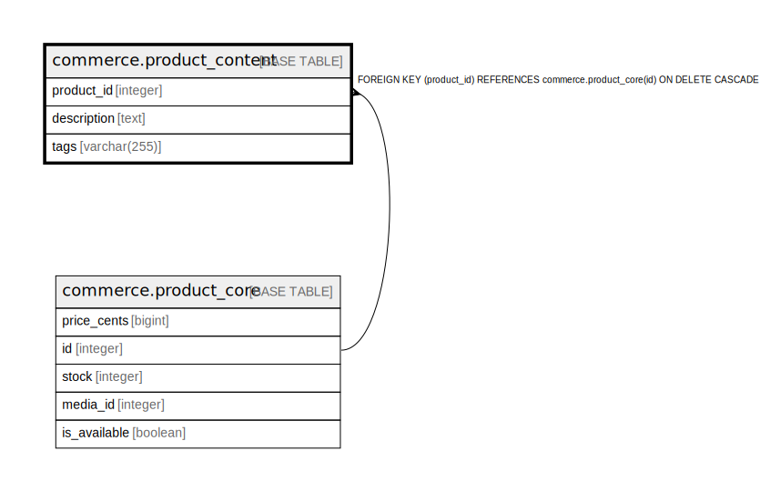

# commerce.product_content

## Description

## Columns

| Name | Type | Default | Nullable | Children | Parents | Comment |
| ---- | ---- | ------- | -------- | -------- | ------- | ------- |
| product_id | integer |  | false |  | [commerce.product_core](commerce.product_core.md) |  |
| description | text |  | true |  |  |  |
| tags | varchar(255) |  | true |  |  |  |

## Constraints

| Name | Type | Definition |
| ---- | ---- | ---------- |
| product_content_product_id_fkey | FOREIGN KEY | FOREIGN KEY (product_id) REFERENCES commerce.product_core(id) ON DELETE CASCADE |
| product_content_pkey | PRIMARY KEY | PRIMARY KEY (product_id) |

## Indexes

| Name | Definition |
| ---- | ---------- |
| product_content_pkey | CREATE UNIQUE INDEX product_content_pkey ON commerce.product_content USING btree (product_id) |

## Relations

---

> Generated by [tbls](https://github.com/k1LoW/tbls)
