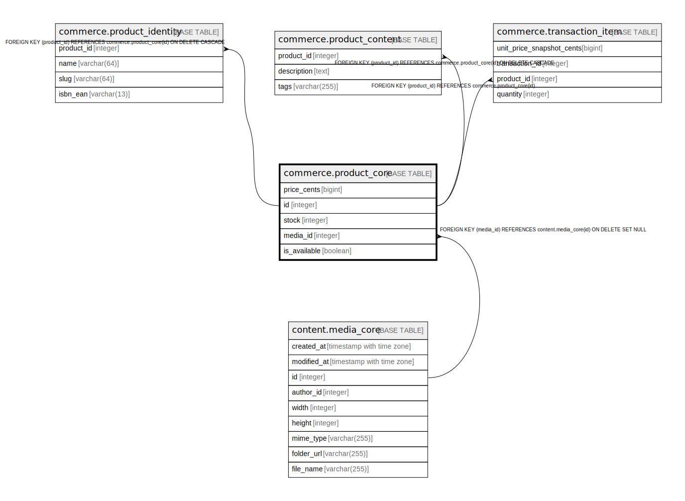

# commerce.product_core

## Description

## Columns

| Name | Type | Default | Nullable | Children | Parents | Comment |
| ---- | ---- | ------- | -------- | -------- | ------- | ------- |
| price_cents | bigint |  | true |  |  |  |
| id | integer |  | false | [commerce.product_identity](commerce.product_identity.md) [commerce.product_content](commerce.product_content.md) [commerce.transaction_item](commerce.transaction_item.md) |  |  |
| stock | integer | 0 | false |  |  |  |
| media_id | integer |  | true |  | [content.media_core](content.media_core.md) |  |
| is_available | boolean | true | false |  |  |  |

## Constraints

| Name | Type | Definition |
| ---- | ---- | ---------- |
| product_core_price_cents_check | CHECK | CHECK ((price_cents >= 0)) |
| product_core_stock_check | CHECK | CHECK ((stock >= 0)) |
| fk_product_core_media | FOREIGN KEY | FOREIGN KEY (media_id) REFERENCES content.media_core(id) ON DELETE SET NULL |
| product_core_pkey | PRIMARY KEY | PRIMARY KEY (id) |

## Indexes

| Name | Definition |
| ---- | ---------- |
| product_core_pkey | CREATE UNIQUE INDEX product_core_pkey ON commerce.product_core USING btree (id) |
| product_core_catalog | CREATE INDEX product_core_catalog ON commerce.product_core USING btree (price_cents) WHERE (is_available = true) |

## Relations

---

> Generated by [tbls](https://github.com/k1LoW/tbls)
