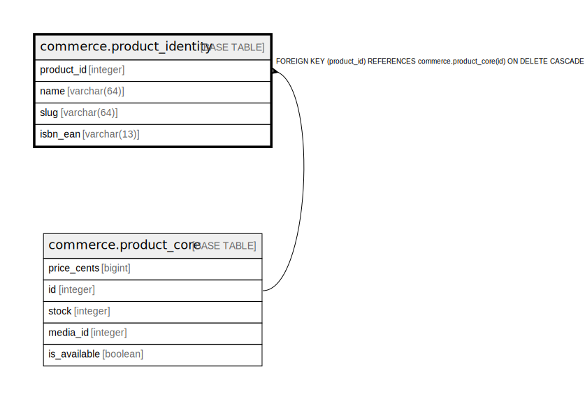

# commerce.product_identity

## Description

## Columns

| Name | Type | Default | Nullable | Children | Parents | Comment |
| ---- | ---- | ------- | -------- | -------- | ------- | ------- |
| product_id | integer |  | false |  | [commerce.product_core](commerce.product_core.md) |  |
| name | varchar(64) |  | false |  |  |  |
| slug | varchar(64) |  | false |  |  |  |
| isbn_ean | varchar(13) |  | true |  |  |  |

## Constraints

| Name | Type | Definition |
| ---- | ---- | ---------- |
| isbn_ean_format | CHECK | CHECK (((isbn_ean IS NULL) OR ((isbn_ean)::text ~ '^[0-9]{13}$'::text))) |
| slug_format | CHECK | CHECK (((slug)::text ~ '^[a-z0-9-]+$'::text)) |
| product_identity_product_id_fkey | FOREIGN KEY | FOREIGN KEY (product_id) REFERENCES commerce.product_core(id) ON DELETE CASCADE |
| product_identity_pkey | PRIMARY KEY | PRIMARY KEY (product_id) |
| product_identity_slug_key | UNIQUE | UNIQUE (slug) |
| product_identity_isbn_ean_key | UNIQUE | UNIQUE (isbn_ean) |

## Indexes

| Name | Definition |
| ---- | ---------- |
| product_identity_pkey | CREATE UNIQUE INDEX product_identity_pkey ON commerce.product_identity USING btree (product_id) |
| product_identity_slug_key | CREATE UNIQUE INDEX product_identity_slug_key ON commerce.product_identity USING btree (slug) |
| product_identity_isbn_ean_key | CREATE UNIQUE INDEX product_identity_isbn_ean_key ON commerce.product_identity USING btree (isbn_ean) |

## Relations

---

> Generated by [tbls](https://github.com/k1LoW/tbls)
