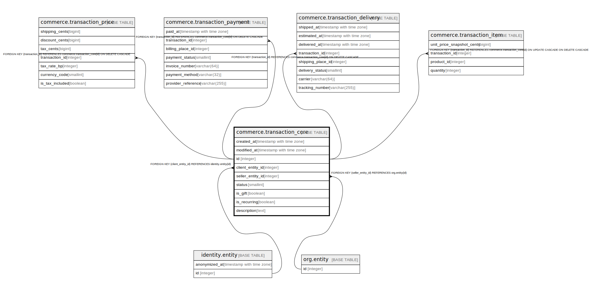

# commerce.transaction_core

## Description

## Columns

| Name | Type | Default | Nullable | Children | Parents | Comment |
| ---- | ---- | ------- | -------- | -------- | ------- | ------- |
| created_at | timestamp with time zone | now() | false |  |  |  |
| modified_at | timestamp with time zone |  | true |  |  |  |
| id | integer |  | false | [commerce.transaction_price](commerce.transaction_price.md) [commerce.transaction_payment](commerce.transaction_payment.md) [commerce.transaction_delivery](commerce.transaction_delivery.md) [commerce.transaction_item](commerce.transaction_item.md) |  |  |
| client_entity_id | integer |  | false |  | [identity.entity](identity.entity.md) |  |
| seller_entity_id | integer |  | false |  | [org.entity](org.entity.md) |  |
| status | smallint | 0 | false |  |  |  |
| is_gift | boolean | false | false |  |  |  |
| is_recurring | boolean | false | false |  |  |  |
| description | text |  | true |  |  |  |

## Constraints

| Name | Type | Definition |
| ---- | ---- | ---------- |
| status_range | CHECK | CHECK ((status = ANY (ARRAY[0, 1, 2, 3, 9]))) |
| fk_transaction_core_client | FOREIGN KEY | FOREIGN KEY (client_entity_id) REFERENCES identity.entity(id) |
| fk_transaction_core_seller | FOREIGN KEY | FOREIGN KEY (seller_entity_id) REFERENCES org.entity(id) |
| transaction_core_pkey | PRIMARY KEY | PRIMARY KEY (id) |

## Indexes

| Name | Definition |
| ---- | ---------- |
| transaction_core_pkey | CREATE UNIQUE INDEX transaction_core_pkey ON commerce.transaction_core USING btree (id) |
| transaction_core_pending | CREATE INDEX transaction_core_pending ON commerce.transaction_core USING btree (client_entity_id, created_at DESC) WHERE (status = 0) |
| transaction_created_brin | CREATE INDEX transaction_created_brin ON commerce.transaction_core USING brin (created_at) WITH (pages_per_range='128') |

## Triggers

| Name | Definition |
| ---- | ---------- |
| transaction_modified_at | CREATE TRIGGER transaction_modified_at BEFORE UPDATE ON commerce.transaction_core FOR EACH ROW WHEN ((old.status IS DISTINCT FROM new.status)) EXECUTE FUNCTION identity.fn_update_modified_at() |
| transaction_deny_created_at_update | CREATE TRIGGER transaction_deny_created_at_update BEFORE UPDATE ON commerce.transaction_core FOR EACH ROW WHEN ((old.created_at IS DISTINCT FROM new.created_at)) EXECUTE FUNCTION identity.fn_deny_created_at_update() |
| transaction_core_deny_id_update | CREATE TRIGGER transaction_core_deny_id_update BEFORE UPDATE ON commerce.transaction_core FOR EACH ROW WHEN ((old.id IS DISTINCT FROM new.id)) EXECUTE FUNCTION identity.fn_deny_entity_id_update() |
| audit_commerce_transaction_core | CREATE TRIGGER audit_commerce_transaction_core AFTER INSERT OR DELETE OR UPDATE ON commerce.transaction_core FOR EACH ROW EXECUTE FUNCTION identity.fn_dml_audit() |

## Relations

---

> Generated by [tbls](https://github.com/k1LoW/tbls)
