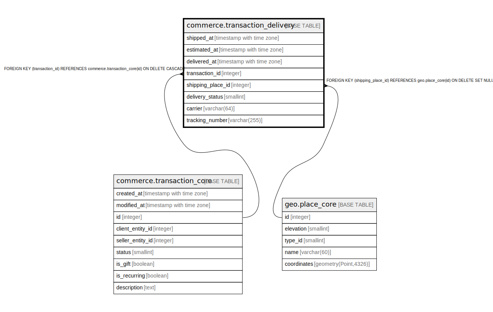

# commerce.transaction_delivery

## Description

## Columns

| Name | Type | Default | Nullable | Children | Parents | Comment |
| ---- | ---- | ------- | -------- | -------- | ------- | ------- |
| shipped_at | timestamp with time zone |  | true |  |  |  |
| estimated_at | timestamp with time zone |  | true |  |  |  |
| delivered_at | timestamp with time zone |  | true |  |  |  |
| transaction_id | integer |  | false |  | [commerce.transaction_core](commerce.transaction_core.md) |  |
| shipping_place_id | integer |  | true |  | [geo.place_core](geo.place_core.md) |  |
| delivery_status | smallint | 0 | false |  |  |  |
| carrier | varchar(64) |  | true |  |  |  |
| tracking_number | varchar(255) |  | true |  |  |  |

## Constraints

| Name | Type | Definition |
| ---- | ---- | ---------- |
| delivery_status_range | CHECK | CHECK ((delivery_status = ANY (ARRAY[0, 1, 2, 3, 4, 9]))) |
| fk_transaction_delivery_shipping_place | FOREIGN KEY | FOREIGN KEY (shipping_place_id) REFERENCES geo.place_core(id) ON DELETE SET NULL |
| transaction_delivery_transaction_id_fkey | FOREIGN KEY | FOREIGN KEY (transaction_id) REFERENCES commerce.transaction_core(id) ON DELETE CASCADE |
| transaction_delivery_pkey | PRIMARY KEY | PRIMARY KEY (transaction_id) |

## Indexes

| Name | Definition |
| ---- | ---------- |
| transaction_delivery_pkey | CREATE UNIQUE INDEX transaction_delivery_pkey ON commerce.transaction_delivery USING btree (transaction_id) |

## Relations

---

> Generated by [tbls](https://github.com/k1LoW/tbls)
