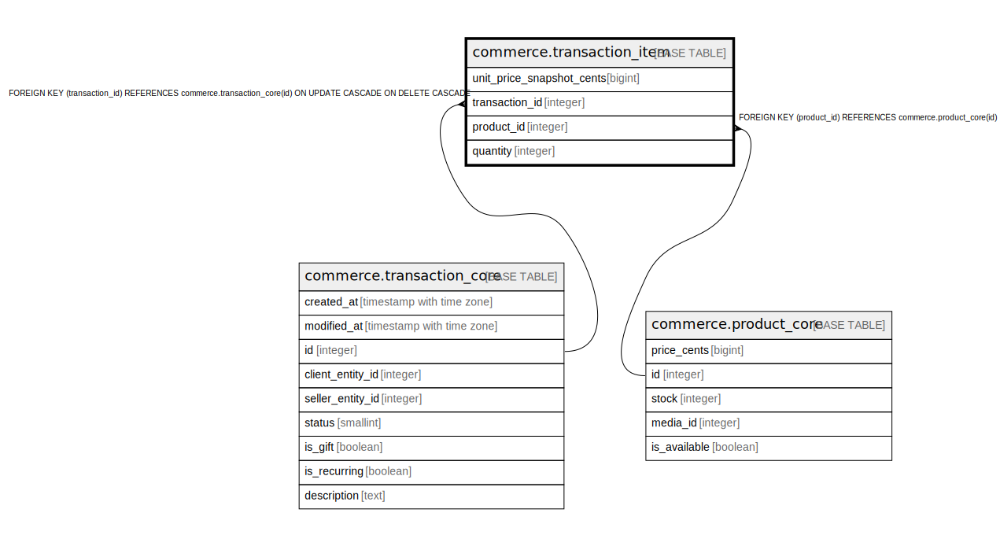

# commerce.transaction_item

## Description

## Columns

| Name | Type | Default | Nullable | Children | Parents | Comment |
| ---- | ---- | ------- | -------- | -------- | ------- | ------- |
| unit_price_snapshot_cents | bigint |  | false |  |  |  |
| transaction_id | integer |  | false |  | [commerce.transaction_core](commerce.transaction_core.md) |  |
| product_id | integer |  | false |  | [commerce.product_core](commerce.product_core.md) |  |
| quantity | integer | 1 | false |  |  |  |

## Constraints

| Name | Type | Definition |
| ---- | ---- | ---------- |
| transaction_item_quantity_check | CHECK | CHECK ((quantity > 0)) |
| transaction_item_unit_price_snapshot_cents_check | CHECK | CHECK ((unit_price_snapshot_cents >= 0)) |
| transaction_item_product_id_fkey | FOREIGN KEY | FOREIGN KEY (product_id) REFERENCES commerce.product_core(id) |
| transaction_item_transaction_id_fkey | FOREIGN KEY | FOREIGN KEY (transaction_id) REFERENCES commerce.transaction_core(id) ON UPDATE CASCADE ON DELETE CASCADE |
| transaction_item_pkey | PRIMARY KEY | PRIMARY KEY (transaction_id, product_id) |

## Indexes

| Name | Definition |
| ---- | ---------- |
| transaction_item_pkey | CREATE UNIQUE INDEX transaction_item_pkey ON commerce.transaction_item USING btree (transaction_id, product_id) |
| transaction_item_product | CREATE INDEX transaction_item_product ON commerce.transaction_item USING btree (product_id) |

## Triggers

| Name | Definition |
| ---- | ---------- |
| transaction_item_immutable | CREATE TRIGGER transaction_item_immutable BEFORE UPDATE ON commerce.transaction_item FOR EACH ROW EXECUTE FUNCTION commerce.fn_deny_transaction_item_update() |
| audit_commerce_transaction_item | CREATE TRIGGER audit_commerce_transaction_item AFTER INSERT OR DELETE OR UPDATE ON commerce.transaction_item FOR EACH ROW EXECUTE FUNCTION identity.fn_dml_audit() |

## Relations

---

> Generated by [tbls](https://github.com/k1LoW/tbls)
