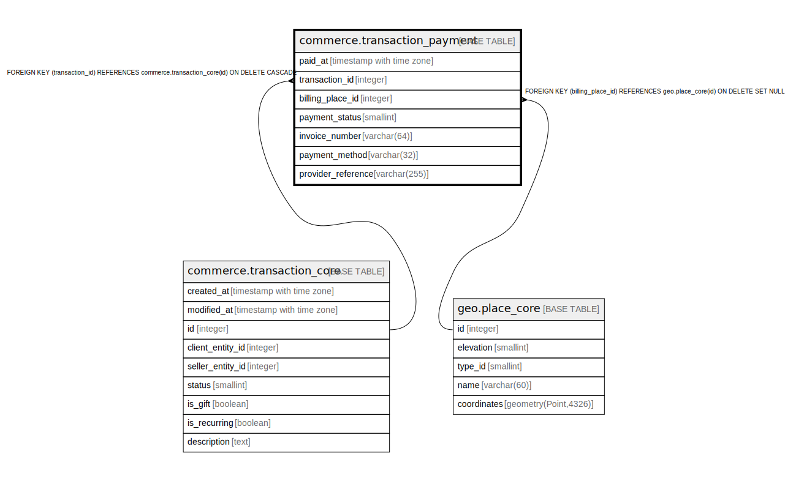

# commerce.transaction_payment

## Description

## Columns

| Name | Type | Default | Nullable | Children | Parents | Comment |
| ---- | ---- | ------- | -------- | -------- | ------- | ------- |
| paid_at | timestamp with time zone |  | true |  |  |  |
| transaction_id | integer |  | false |  | [commerce.transaction_core](commerce.transaction_core.md) |  |
| billing_place_id | integer |  | true |  | [geo.place_core](geo.place_core.md) |  |
| payment_status | smallint | 0 | false |  |  |  |
| invoice_number | varchar(64) |  | true |  |  |  |
| payment_method | varchar(32) |  | true |  |  |  |
| provider_reference | varchar(255) |  | true |  |  |  |

## Constraints

| Name | Type | Definition |
| ---- | ---- | ---------- |
| payment_status_range | CHECK | CHECK ((payment_status = ANY (ARRAY[0, 1, 2, 3, 9]))) |
| fk_transaction_payment_billing_place | FOREIGN KEY | FOREIGN KEY (billing_place_id) REFERENCES geo.place_core(id) ON DELETE SET NULL |
| transaction_payment_transaction_id_fkey | FOREIGN KEY | FOREIGN KEY (transaction_id) REFERENCES commerce.transaction_core(id) ON DELETE CASCADE |
| transaction_payment_pkey | PRIMARY KEY | PRIMARY KEY (transaction_id) |
| transaction_payment_invoice_number_key | UNIQUE | UNIQUE (invoice_number) |

## Indexes

| Name | Definition |
| ---- | ---------- |
| transaction_payment_pkey | CREATE UNIQUE INDEX transaction_payment_pkey ON commerce.transaction_payment USING btree (transaction_id) |
| transaction_payment_invoice_number_key | CREATE UNIQUE INDEX transaction_payment_invoice_number_key ON commerce.transaction_payment USING btree (invoice_number) |

## Triggers

| Name | Definition |
| ---- | ---------- |
| audit_commerce_transaction_payment | CREATE TRIGGER audit_commerce_transaction_payment AFTER INSERT OR DELETE OR UPDATE ON commerce.transaction_payment FOR EACH ROW EXECUTE FUNCTION identity.fn_dml_audit() |

## Relations

---

> Generated by [tbls](https://github.com/k1LoW/tbls)
