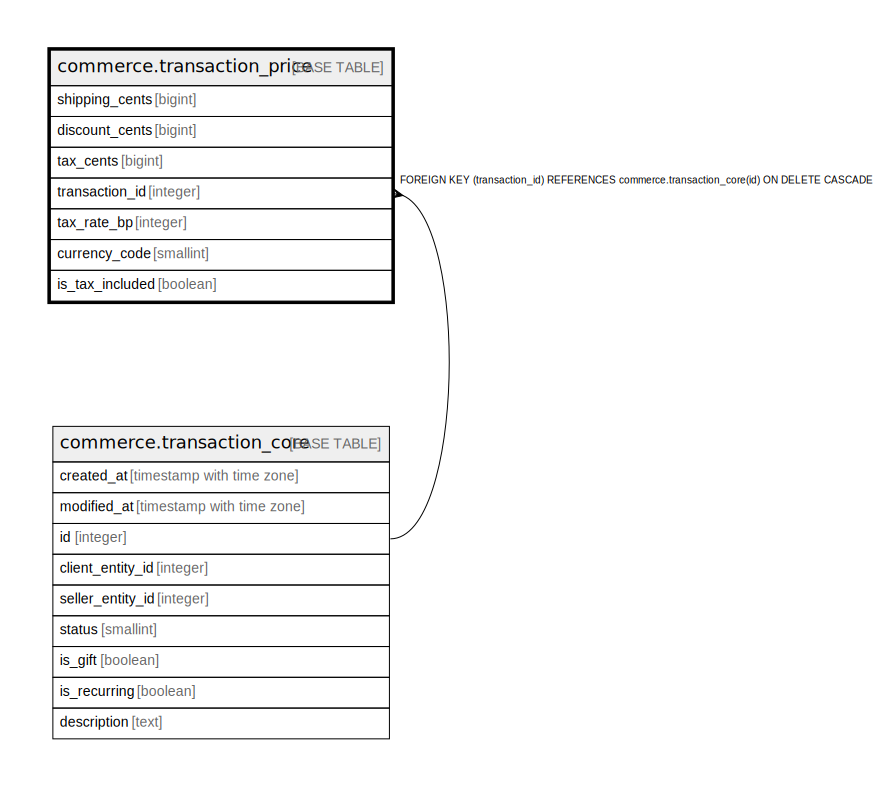

# commerce.transaction_price

## Description

## Columns

| Name | Type | Default | Nullable | Children | Parents | Comment |
| ---- | ---- | ------- | -------- | -------- | ------- | ------- |
| shipping_cents | bigint | 0 | false |  |  |  |
| discount_cents | bigint | 0 | false |  |  |  |
| tax_cents | bigint | 0 | false |  |  |  |
| transaction_id | integer |  | false |  | [commerce.transaction_core](commerce.transaction_core.md) |  |
| tax_rate_bp | integer | 0 | false |  |  |  |
| currency_code | smallint | 978 | false |  |  |  |
| is_tax_included | boolean | false | false |  |  |  |

## Constraints

| Name | Type | Definition |
| ---- | ---- | ---------- |
| currency_code_range | CHECK | CHECK (((currency_code >= 1) AND (currency_code <= 999))) |
| transaction_price_discount_cents_check | CHECK | CHECK ((discount_cents >= 0)) |
| transaction_price_shipping_cents_check | CHECK | CHECK ((shipping_cents >= 0)) |
| transaction_price_tax_cents_check | CHECK | CHECK ((tax_cents >= 0)) |
| transaction_price_tax_rate_bp_check | CHECK | CHECK ((tax_rate_bp >= 0)) |
| transaction_price_transaction_id_fkey | FOREIGN KEY | FOREIGN KEY (transaction_id) REFERENCES commerce.transaction_core(id) ON DELETE CASCADE |
| transaction_price_pkey | PRIMARY KEY | PRIMARY KEY (transaction_id) |

## Indexes

| Name | Definition |
| ---- | ---------- |
| transaction_price_pkey | CREATE UNIQUE INDEX transaction_price_pkey ON commerce.transaction_price USING btree (transaction_id) |

## Relations

---

> Generated by [tbls](https://github.com/k1LoW/tbls)
