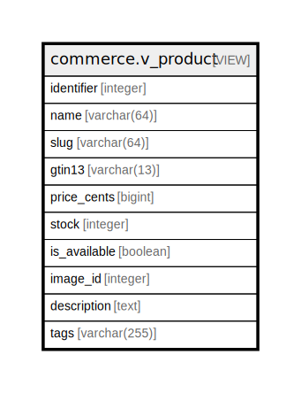

# commerce.v_product

## Description

<details>
<summary><strong>Table Definition</strong></summary>

```sql
CREATE VIEW v_product AS (
 SELECT pc.id AS identifier,
    pi.name,
    pi.slug,
    pi.isbn_ean AS gtin13,
    pc.price_cents,
    pc.stock,
    pc.is_available,
    pc.media_id AS image_id,
    pco.description,
    pco.tags
   FROM ((commerce.product_core pc
     JOIN commerce.product_identity pi ON ((pi.product_id = pc.id)))
     LEFT JOIN commerce.product_content pco ON ((pco.product_id = pc.id)))
)
```

</details>

## Columns

| Name | Type | Default | Nullable | Children | Parents | Comment |
| ---- | ---- | ------- | -------- | -------- | ------- | ------- |
| identifier | integer |  | true |  |  |  |
| name | varchar(64) |  | true |  |  |  |
| slug | varchar(64) |  | true |  |  |  |
| gtin13 | varchar(13) |  | true |  |  |  |
| price_cents | bigint |  | true |  |  |  |
| stock | integer |  | true |  |  |  |
| is_available | boolean |  | true |  |  |  |
| image_id | integer |  | true |  |  |  |
| description | text |  | true |  |  |  |
| tags | varchar(255) |  | true |  |  |  |

## Referenced Tables

| Name | Columns | Comment | Type |
| ---- | ------- | ------- | ---- |
| [commerce.product_core](commerce.product_core.md) | 5 |  | BASE TABLE |
| [commerce.product_identity](commerce.product_identity.md) | 4 |  | BASE TABLE |
| [commerce.product_content](commerce.product_content.md) | 3 |  | BASE TABLE |

## Relations



---

> Generated by [tbls](https://github.com/k1LoW/tbls)
