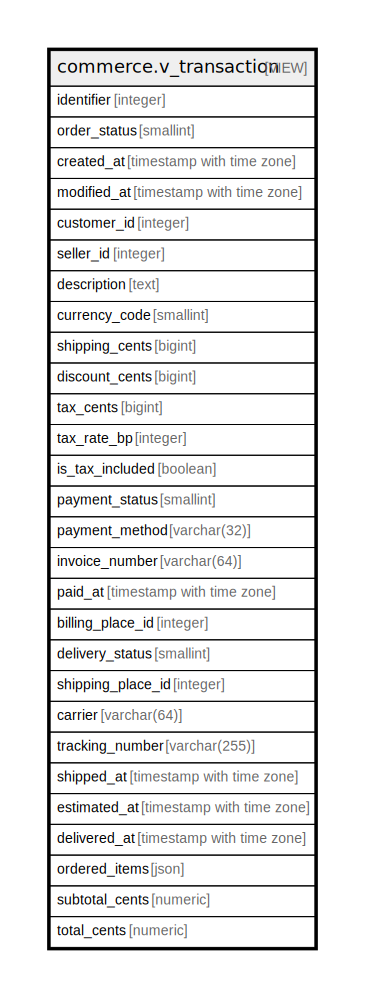

# commerce.v_transaction

## Description

<details>
<summary><strong>Table Definition</strong></summary>

```sql
CREATE VIEW v_transaction AS (
 SELECT tc.id AS identifier,
    tc.status AS order_status,
    tc.created_at,
    tc.modified_at,
    tc.client_entity_id AS customer_id,
    tc.seller_entity_id AS seller_id,
    tc.description,
    tp.currency_code,
    tp.shipping_cents,
    tp.discount_cents,
    tp.tax_cents,
    tp.tax_rate_bp,
    tp.is_tax_included,
    tpay.payment_status,
    tpay.payment_method,
    tpay.invoice_number,
    tpay.paid_at,
    tpay.billing_place_id,
    tdel.delivery_status,
    tdel.shipping_place_id,
    tdel.carrier,
    tdel.tracking_number,
    tdel.shipped_at,
    tdel.estimated_at,
    tdel.delivered_at,
    json_agg(json_build_object('product_id', ti.product_id, 'product_name', pi.name, 'quantity', ti.quantity, 'unit_price_cents', ti.unit_price_snapshot_cents, 'line_total_cents', (ti.quantity * ti.unit_price_snapshot_cents)) ORDER BY ti.product_id) AS ordered_items,
    sum((ti.quantity * ti.unit_price_snapshot_cents)) AS subtotal_cents,
    (((sum((ti.quantity * ti.unit_price_snapshot_cents)) + (COALESCE(tp.shipping_cents, (0)::bigint))::numeric) + (COALESCE(tp.tax_cents, (0)::bigint))::numeric) - (COALESCE(tp.discount_cents, (0)::bigint))::numeric) AS total_cents
   FROM (((((commerce.transaction_core tc
     JOIN commerce.transaction_item ti ON ((ti.transaction_id = tc.id)))
     JOIN commerce.product_identity pi ON ((pi.product_id = ti.product_id)))
     LEFT JOIN commerce.transaction_price tp ON ((tp.transaction_id = tc.id)))
     LEFT JOIN commerce.transaction_payment tpay ON ((tpay.transaction_id = tc.id)))
     LEFT JOIN commerce.transaction_delivery tdel ON ((tdel.transaction_id = tc.id)))
  WHERE ((tc.client_entity_id = identity.rls_user_id()) OR ((identity.rls_auth_bits() & 131072) = 131072) OR ((identity.rls_auth_bits() & 262144) = 262144))
  GROUP BY tc.id, tc.status, tc.created_at, tc.modified_at, tc.client_entity_id, tc.seller_entity_id, tc.description, tp.currency_code, tp.shipping_cents, tp.discount_cents, tp.tax_cents, tp.tax_rate_bp, tp.is_tax_included, tpay.payment_status, tpay.payment_method, tpay.invoice_number, tpay.paid_at, tpay.billing_place_id, tdel.delivery_status, tdel.shipping_place_id, tdel.carrier, tdel.tracking_number, tdel.shipped_at, tdel.estimated_at, tdel.delivered_at
)
```

</details>

## Columns

| Name | Type | Default | Nullable | Children | Parents | Comment |
| ---- | ---- | ------- | -------- | -------- | ------- | ------- |
| identifier | integer |  | true |  |  |  |
| order_status | smallint |  | true |  |  |  |
| created_at | timestamp with time zone |  | true |  |  |  |
| modified_at | timestamp with time zone |  | true |  |  |  |
| customer_id | integer |  | true |  |  |  |
| seller_id | integer |  | true |  |  |  |
| description | text |  | true |  |  |  |
| currency_code | smallint |  | true |  |  |  |
| shipping_cents | bigint |  | true |  |  |  |
| discount_cents | bigint |  | true |  |  |  |
| tax_cents | bigint |  | true |  |  |  |
| tax_rate_bp | integer |  | true |  |  |  |
| is_tax_included | boolean |  | true |  |  |  |
| payment_status | smallint |  | true |  |  |  |
| payment_method | varchar(32) |  | true |  |  |  |
| invoice_number | varchar(64) |  | true |  |  |  |
| paid_at | timestamp with time zone |  | true |  |  |  |
| billing_place_id | integer |  | true |  |  |  |
| delivery_status | smallint |  | true |  |  |  |
| shipping_place_id | integer |  | true |  |  |  |
| carrier | varchar(64) |  | true |  |  |  |
| tracking_number | varchar(255) |  | true |  |  |  |
| shipped_at | timestamp with time zone |  | true |  |  |  |
| estimated_at | timestamp with time zone |  | true |  |  |  |
| delivered_at | timestamp with time zone |  | true |  |  |  |
| ordered_items | json |  | true |  |  |  |
| subtotal_cents | numeric |  | true |  |  |  |
| total_cents | numeric |  | true |  |  |  |

## Referenced Tables

| Name | Columns | Comment | Type |
| ---- | ------- | ------- | ---- |
| [commerce.transaction_core](commerce.transaction_core.md) | 9 |  | BASE TABLE |
| [commerce.transaction_item](commerce.transaction_item.md) | 4 |  | BASE TABLE |
| [commerce.product_identity](commerce.product_identity.md) | 4 |  | BASE TABLE |
| [commerce.transaction_price](commerce.transaction_price.md) | 7 |  | BASE TABLE |
| [commerce.transaction_payment](commerce.transaction_payment.md) | 7 |  | BASE TABLE |
| [commerce.transaction_delivery](commerce.transaction_delivery.md) | 8 |  | BASE TABLE |

## Relations



---

> Generated by [tbls](https://github.com/k1LoW/tbls)
