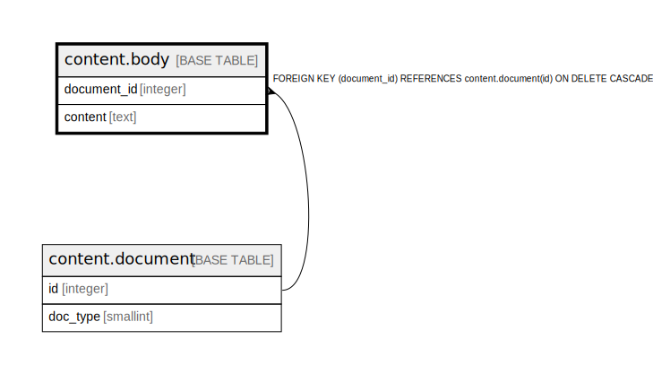

# content.body

## Description

## Columns

| Name | Type | Default | Nullable | Children | Parents | Comment |
| ---- | ---- | ------- | -------- | -------- | ------- | ------- |
| document_id | integer |  | false |  | [content.document](content.document.md) |  |
| content | text |  | true |  |  |  |

## Constraints

| Name | Type | Definition |
| ---- | ---- | ---------- |
| body_document_id_fkey | FOREIGN KEY | FOREIGN KEY (document_id) REFERENCES content.document(id) ON DELETE CASCADE |
| body_pkey | PRIMARY KEY | PRIMARY KEY (document_id) |

## Indexes

| Name | Definition |
| ---- | ---------- |
| body_pkey | CREATE UNIQUE INDEX body_pkey ON content.body USING btree (document_id) |

## Relations

---

> Generated by [tbls](https://github.com/k1LoW/tbls)
