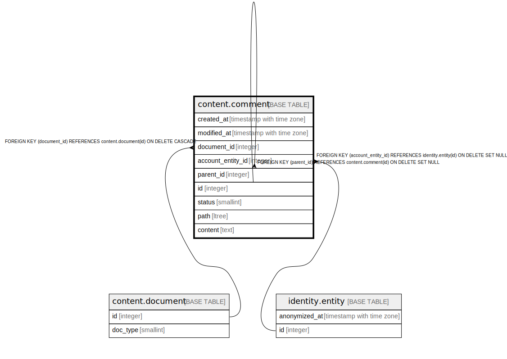

# content.comment

## Description

## Columns

| Name | Type | Default | Nullable | Children | Parents | Comment |
| ---- | ---- | ------- | -------- | -------- | ------- | ------- |
| created_at | timestamp with time zone | now() | false |  |  |  |
| modified_at | timestamp with time zone |  | true |  |  |  |
| document_id | integer |  | false |  | [content.document](content.document.md) |  |
| account_entity_id | integer |  | true |  | [identity.entity](identity.entity.md) |  |
| parent_id | integer |  | true |  | [content.comment](content.comment.md) |  |
| id | integer |  | false | [content.comment](content.comment.md) |  |  |
| status | smallint | 1 | false |  |  |  |
| path | ltree |  | true |  |  |  |
| content | text |  | false |  |  |  |

## Constraints

| Name | Type | Definition |
| ---- | ---- | ---------- |
| comment_path_not_null | CHECK | CHECK ((path IS NOT NULL)) |
| content_notempty | CHECK | CHECK ((char_length(TRIM(BOTH FROM content)) > 0)) |
| status_range | CHECK | CHECK ((status = ANY (ARRAY[0, 1, 9]))) |
| fk_comment_account | FOREIGN KEY | FOREIGN KEY (account_entity_id) REFERENCES identity.entity(id) ON DELETE SET NULL |
| comment_document_id_fkey | FOREIGN KEY | FOREIGN KEY (document_id) REFERENCES content.document(id) ON DELETE CASCADE |
| comment_parent_id_fkey | FOREIGN KEY | FOREIGN KEY (parent_id) REFERENCES content.comment(id) ON DELETE SET NULL |
| comment_pkey | PRIMARY KEY | PRIMARY KEY (id) |

## Indexes

| Name | Definition |
| ---- | ---------- |
| comment_pkey | CREATE UNIQUE INDEX comment_pkey ON content.comment USING btree (id) |
| comment_path_gist | CREATE INDEX comment_path_gist ON content.comment USING gist (path) |
| comment_doc_path | CREATE INDEX comment_doc_path ON content.comment USING btree (document_id, path) |
| comment_approved | CREATE INDEX comment_approved ON content.comment USING btree (document_id, created_at) WHERE (status = 1) |

## Relations

---

> Generated by [tbls](https://github.com/k1LoW/tbls)
