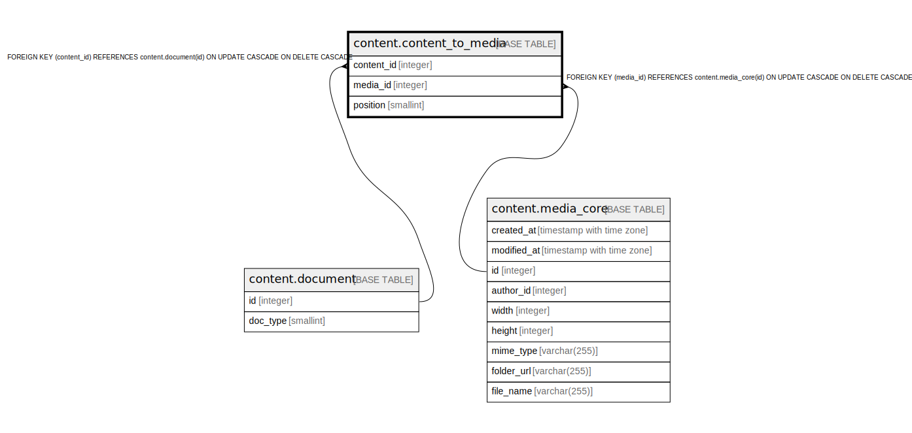

# content.content_to_media

## Description

## Columns

| Name | Type | Default | Nullable | Children | Parents | Comment |
| ---- | ---- | ------- | -------- | -------- | ------- | ------- |
| content_id | integer |  | false |  | [content.document](content.document.md) |  |
| media_id | integer |  | false |  | [content.media_core](content.media_core.md) |  |
| position | smallint | 0 | false |  |  |  |

## Constraints

| Name | Type | Definition |
| ---- | ---- | ---------- |
| position_range | CHECK | CHECK (("position" >= 0)) |
| content_to_media_content_id_fkey | FOREIGN KEY | FOREIGN KEY (content_id) REFERENCES content.document(id) ON UPDATE CASCADE ON DELETE CASCADE |
| content_to_media_media_id_fkey | FOREIGN KEY | FOREIGN KEY (media_id) REFERENCES content.media_core(id) ON UPDATE CASCADE ON DELETE CASCADE |
| content_to_media_pkey | PRIMARY KEY | PRIMARY KEY (content_id, media_id) |

## Indexes

| Name | Definition |
| ---- | ---------- |
| content_to_media_pkey | CREATE UNIQUE INDEX content_to_media_pkey ON content.content_to_media USING btree (content_id, media_id) |
| content_to_media_inv | CREATE INDEX content_to_media_inv ON content.content_to_media USING btree (media_id, content_id) |
| content_to_media_pos | CREATE INDEX content_to_media_pos ON content.content_to_media USING btree (content_id, "position") |

## Relations

---

> Generated by [tbls](https://github.com/k1LoW/tbls)
