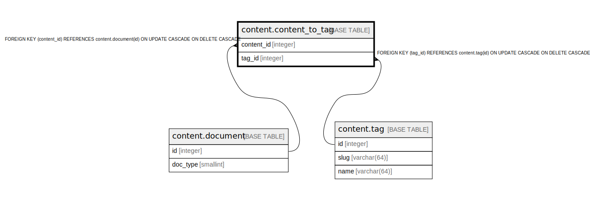

# content.content_to_tag

## Description

## Columns

| Name | Type | Default | Nullable | Children | Parents | Comment |
| ---- | ---- | ------- | -------- | -------- | ------- | ------- |
| content_id | integer |  | false |  | [content.document](content.document.md) |  |
| tag_id | integer |  | false |  | [content.tag](content.tag.md) |  |

## Constraints

| Name | Type | Definition |
| ---- | ---- | ---------- |
| content_to_tag_content_id_fkey | FOREIGN KEY | FOREIGN KEY (content_id) REFERENCES content.document(id) ON UPDATE CASCADE ON DELETE CASCADE |
| content_to_tag_tag_id_fkey | FOREIGN KEY | FOREIGN KEY (tag_id) REFERENCES content.tag(id) ON UPDATE CASCADE ON DELETE CASCADE |
| content_to_tag_pkey | PRIMARY KEY | PRIMARY KEY (content_id, tag_id) |

## Indexes

| Name | Definition |
| ---- | ---------- |
| content_to_tag_pkey | CREATE UNIQUE INDEX content_to_tag_pkey ON content.content_to_tag USING btree (content_id, tag_id) |
| content_to_tag_inv | CREATE INDEX content_to_tag_inv ON content.content_to_tag USING btree (tag_id, content_id) |

## Relations

---

> Generated by [tbls](https://github.com/k1LoW/tbls)
