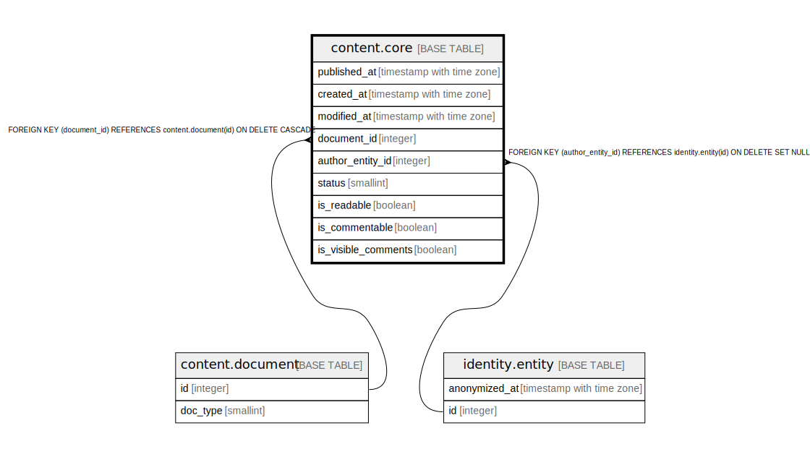

# content.core

## Description

## Columns

| Name | Type | Default | Nullable | Children | Parents | Comment |
| ---- | ---- | ------- | -------- | -------- | ------- | ------- |
| published_at | timestamp with time zone |  | true |  |  |  |
| created_at | timestamp with time zone | now() | false |  |  |  |
| modified_at | timestamp with time zone |  | true |  |  |  |
| document_id | integer |  | false |  | [content.document](content.document.md) |  |
| author_entity_id | integer |  | true |  | [identity.entity](identity.entity.md) |  |
| status | smallint | 0 | false |  |  |  |
| is_readable | boolean | true | false |  |  |  |
| is_commentable | boolean | false | false |  |  |  |
| is_visible_comments | boolean | true | false |  |  |  |

## Constraints

| Name | Type | Definition |
| ---- | ---- | ---------- |
| status_range | CHECK | CHECK ((status = ANY (ARRAY[0, 1, 2, 9]))) |
| fk_content_core_author | FOREIGN KEY | FOREIGN KEY (author_entity_id) REFERENCES identity.entity(id) ON DELETE SET NULL |
| core_document_id_fkey | FOREIGN KEY | FOREIGN KEY (document_id) REFERENCES content.document(id) ON DELETE CASCADE |
| core_pkey | PRIMARY KEY | PRIMARY KEY (document_id) |

## Indexes

| Name | Definition |
| ---- | ---------- |
| core_pkey | CREATE UNIQUE INDEX core_pkey ON content.core USING btree (document_id) |
| core_published | CREATE INDEX core_published ON content.core USING btree (published_at DESC) WHERE (status = 1) |
| core_author | CREATE INDEX core_author ON content.core USING btree (author_entity_id, published_at DESC) WHERE ((status = 1) AND (author_entity_id IS NOT NULL)) |
| core_created_brin | CREATE INDEX core_created_brin ON content.core USING brin (created_at) WITH (pages_per_range='128') |
| core_modified | CREATE INDEX core_modified ON content.core USING btree (modified_at DESC) WHERE (modified_at IS NOT NULL) |

## Triggers

| Name | Definition |
| ---- | ---------- |
| content_core_modified_at | CREATE TRIGGER content_core_modified_at BEFORE UPDATE ON content.core FOR EACH ROW WHEN (((old.status IS DISTINCT FROM new.status) OR (old.is_readable IS DISTINCT FROM new.is_readable) OR (old.is_commentable IS DISTINCT FROM new.is_commentable))) EXECUTE FUNCTION identity.fn_update_modified_at() |
| core_deny_created_at_update | CREATE TRIGGER core_deny_created_at_update BEFORE UPDATE ON content.core FOR EACH ROW WHEN ((old.created_at IS DISTINCT FROM new.created_at)) EXECUTE FUNCTION identity.fn_deny_created_at_update() |
| core_deny_document_id_update | CREATE TRIGGER core_deny_document_id_update BEFORE UPDATE ON content.core FOR EACH ROW WHEN ((old.document_id IS DISTINCT FROM new.document_id)) EXECUTE FUNCTION identity.fn_deny_entity_id_update() |

## Relations

---

> Generated by [tbls](https://github.com/k1LoW/tbls)
