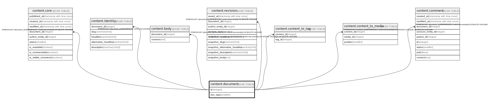

# content.document

## Description

## Columns

| Name | Type | Default | Nullable | Children | Parents | Comment |
| ---- | ---- | ------- | -------- | -------- | ------- | ------- |
| id | integer |  | false | [content.core](content.core.md) [content.identity](content.identity.md) [content.body](content.body.md) [content.revision](content.revision.md) [content.content_to_tag](content.content_to_tag.md) [content.content_to_media](content.content_to_media.md) [content.comment](content.comment.md) |  |  |
| doc_type | smallint | 0 | false |  |  |  |

## Constraints

| Name | Type | Definition |
| ---- | ---- | ---------- |
| doc_type_range | CHECK | CHECK ((doc_type = ANY (ARRAY[0, 1, 2, 3]))) |
| document_pkey | PRIMARY KEY | PRIMARY KEY (id) |

## Indexes

| Name | Definition |
| ---- | ---------- |
| document_pkey | CREATE UNIQUE INDEX document_pkey ON content.document USING btree (id) |

## Relations

---

> Generated by [tbls](https://github.com/k1LoW/tbls)
