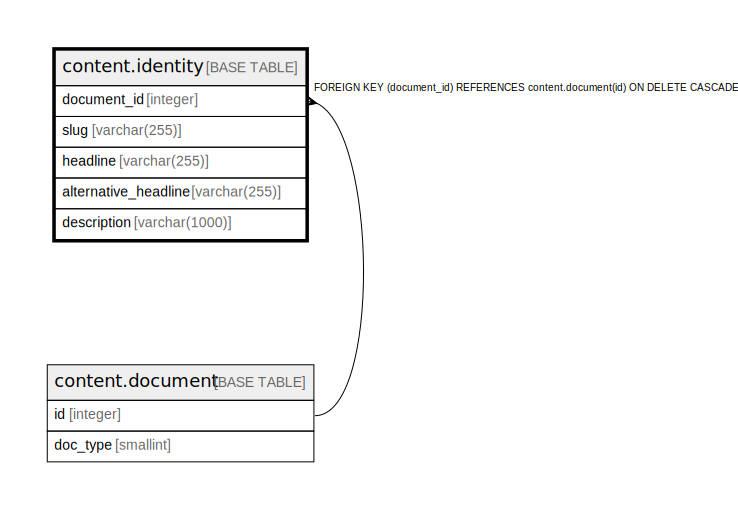

# content.identity

## Description

## Columns

| Name | Type | Default | Nullable | Children | Parents | Comment |
| ---- | ---- | ------- | -------- | -------- | ------- | ------- |
| document_id | integer |  | false |  | [content.document](content.document.md) |  |
| slug | varchar(255) |  | false |  |  |  |
| headline | varchar(255) |  | false |  |  |  |
| alternative_headline | varchar(255) |  | true |  |  |  |
| description | varchar(1000) |  | true |  |  |  |

## Constraints

| Name | Type | Definition |
| ---- | ---- | ---------- |
| slug_format | CHECK | CHECK (((slug)::text ~ '^[a-z0-9-]+$'::text)) |
| identity_document_id_fkey | FOREIGN KEY | FOREIGN KEY (document_id) REFERENCES content.document(id) ON DELETE CASCADE |
| identity_pkey | PRIMARY KEY | PRIMARY KEY (document_id) |
| identity_slug_key | UNIQUE | UNIQUE (slug) |

## Indexes

| Name | Definition |
| ---- | ---------- |
| identity_pkey | CREATE UNIQUE INDEX identity_pkey ON content.identity USING btree (document_id) |
| identity_slug_key | CREATE UNIQUE INDEX identity_slug_key ON content.identity USING btree (slug) |
| content_identity_headline_trgm | CREATE INDEX content_identity_headline_trgm ON content.identity USING gin (immutable_unaccent((headline)::text) gin_trgm_ops) |

## Triggers

| Name | Definition |
| ---- | ---------- |
| content_identity_slug_dedup | CREATE TRIGGER content_identity_slug_dedup BEFORE INSERT OR UPDATE OF slug ON content.identity FOR EACH ROW EXECUTE FUNCTION fn_slug_deduplicate() |

## Relations

---

> Generated by [tbls](https://github.com/k1LoW/tbls)
