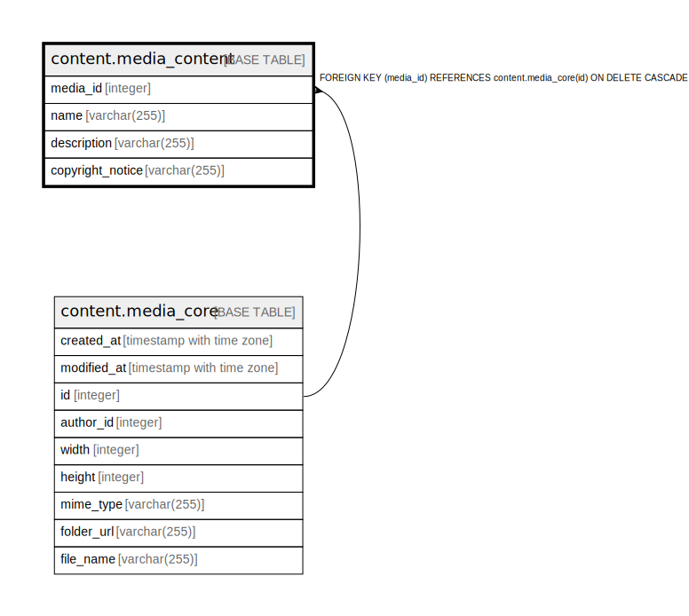

# content.media_content

## Description

## Columns

| Name | Type | Default | Nullable | Children | Parents | Comment |
| ---- | ---- | ------- | -------- | -------- | ------- | ------- |
| media_id | integer |  | false |  | [content.media_core](content.media_core.md) |  |
| name | varchar(255) |  | true |  |  |  |
| description | varchar(255) |  | true |  |  |  |
| copyright_notice | varchar(255) |  | true |  |  |  |

## Constraints

| Name | Type | Definition |
| ---- | ---- | ---------- |
| media_content_media_id_fkey | FOREIGN KEY | FOREIGN KEY (media_id) REFERENCES content.media_core(id) ON DELETE CASCADE |
| media_content_pkey | PRIMARY KEY | PRIMARY KEY (media_id) |

## Indexes

| Name | Definition |
| ---- | ---------- |
| media_content_pkey | CREATE UNIQUE INDEX media_content_pkey ON content.media_content USING btree (media_id) |

## Relations

---

> Generated by [tbls](https://github.com/k1LoW/tbls)
