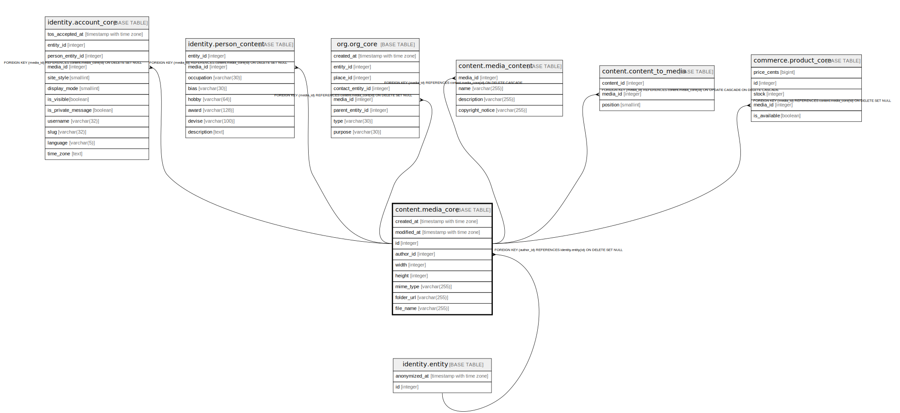

# content.media_core

## Description

## Columns

| Name | Type | Default | Nullable | Children | Parents | Comment |
| ---- | ---- | ------- | -------- | -------- | ------- | ------- |
| created_at | timestamp with time zone | now() | false |  |  |  |
| modified_at | timestamp with time zone |  | true |  |  |  |
| id | integer |  | false | [identity.account_core](identity.account_core.md) [identity.person_content](identity.person_content.md) [org.org_core](org.org_core.md) [content.media_content](content.media_content.md) [content.content_to_media](content.content_to_media.md) [commerce.product_core](commerce.product_core.md) |  |  |
| author_id | integer |  | true |  | [identity.entity](identity.entity.md) |  |
| width | integer |  | true |  |  |  |
| height | integer |  | true |  |  |  |
| mime_type | varchar(255) |  | true |  |  |  |
| folder_url | varchar(255) |  | true |  |  |  |
| file_name | varchar(255) |  | true |  |  |  |

## Constraints

| Name | Type | Definition |
| ---- | ---- | ---------- |
| fk_media_core_author | FOREIGN KEY | FOREIGN KEY (author_id) REFERENCES identity.entity(id) ON DELETE SET NULL |
| media_core_pkey | PRIMARY KEY | PRIMARY KEY (id) |

## Indexes

| Name | Definition |
| ---- | ---------- |
| media_core_pkey | CREATE UNIQUE INDEX media_core_pkey ON content.media_core USING btree (id) |

## Triggers

| Name | Definition |
| ---- | ---------- |
| media_core_modified_at | CREATE TRIGGER media_core_modified_at BEFORE UPDATE ON content.media_core FOR EACH ROW WHEN ((((old.mime_type)::text IS DISTINCT FROM (new.mime_type)::text) OR ((old.folder_url)::text IS DISTINCT FROM (new.folder_url)::text) OR ((old.file_name)::text IS DISTINCT FROM (new.file_name)::text) OR (old.width IS DISTINCT FROM new.width) OR (old.height IS DISTINCT FROM new.height))) EXECUTE FUNCTION identity.fn_update_modified_at() |

## Relations

---

> Generated by [tbls](https://github.com/k1LoW/tbls)
