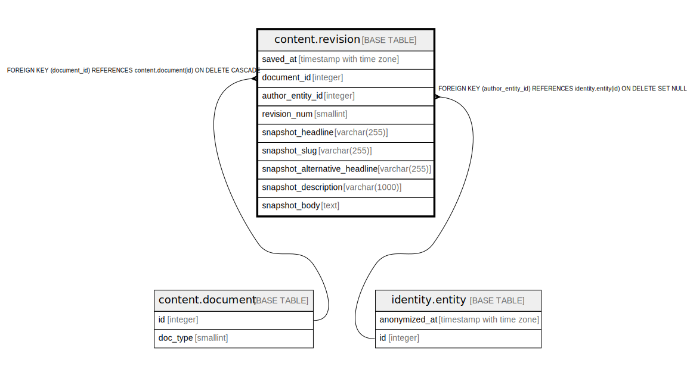

# content.revision

## Description

## Columns

| Name | Type | Default | Nullable | Children | Parents | Comment |
| ---- | ---- | ------- | -------- | -------- | ------- | ------- |
| saved_at | timestamp with time zone | now() | false |  |  |  |
| document_id | integer |  | false |  | [content.document](content.document.md) |  |
| author_entity_id | integer |  | true |  | [identity.entity](identity.entity.md) |  |
| revision_num | smallint | 0 | false |  |  |  |
| snapshot_headline | varchar(255) |  | false |  |  |  |
| snapshot_slug | varchar(255) |  | false |  |  |  |
| snapshot_alternative_headline | varchar(255) |  | true |  |  |  |
| snapshot_description | varchar(1000) |  | true |  |  |  |
| snapshot_body | text |  | true |  |  |  |

## Constraints

| Name | Type | Definition |
| ---- | ---- | ---------- |
| revision_num_positive | CHECK | CHECK ((revision_num > 0)) |
| fk_revision_author | FOREIGN KEY | FOREIGN KEY (author_entity_id) REFERENCES identity.entity(id) ON DELETE SET NULL |
| revision_document_id_fkey | FOREIGN KEY | FOREIGN KEY (document_id) REFERENCES content.document(id) ON DELETE CASCADE |
| revision_pkey | PRIMARY KEY | PRIMARY KEY (document_id, revision_num) |

## Indexes

| Name | Definition |
| ---- | ---------- |
| revision_pkey | CREATE UNIQUE INDEX revision_pkey ON content.revision USING btree (document_id, revision_num) |
| revision_recent | CREATE INDEX revision_recent ON content.revision USING btree (document_id, revision_num DESC) |

## Triggers

| Name | Definition |
| ---- | ---------- |
| content_revision_num | CREATE TRIGGER content_revision_num BEFORE INSERT ON content.revision FOR EACH ROW EXECUTE FUNCTION content.fn_revision_num() |

## Relations

---

> Generated by [tbls](https://github.com/k1LoW/tbls)
