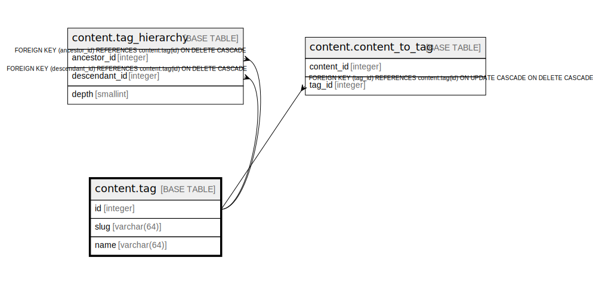

# content.tag

## Description

## Columns

| Name | Type | Default | Nullable | Children | Parents | Comment |
| ---- | ---- | ------- | -------- | -------- | ------- | ------- |
| id | integer |  | false | [content.tag_hierarchy](content.tag_hierarchy.md) [content.content_to_tag](content.content_to_tag.md) |  |  |
| slug | varchar(64) |  | false |  |  |  |
| name | varchar(64) |  | false |  |  |  |

## Constraints

| Name | Type | Definition |
| ---- | ---- | ---------- |
| slug_format | CHECK | CHECK (((slug)::text ~ '^[a-z0-9-]+$'::text)) |
| tag_pkey | PRIMARY KEY | PRIMARY KEY (id) |
| tag_slug_key | UNIQUE | UNIQUE (slug) |

## Indexes

| Name | Definition |
| ---- | ---------- |
| tag_pkey | CREATE UNIQUE INDEX tag_pkey ON content.tag USING btree (id) |
| tag_slug_key | CREATE UNIQUE INDEX tag_slug_key ON content.tag USING btree (slug) |

## Relations

---

> Generated by [tbls](https://github.com/k1LoW/tbls)
