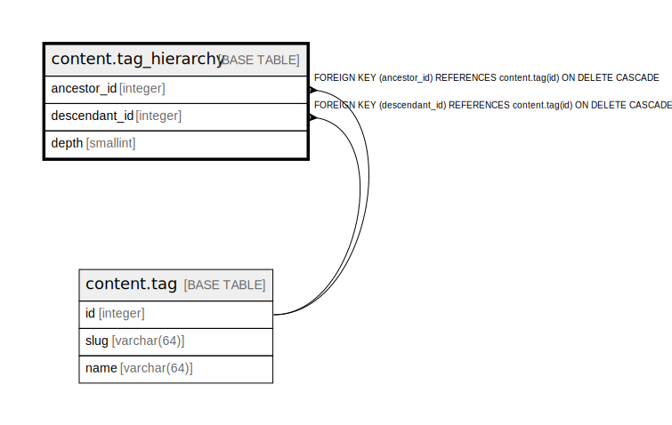

# content.tag_hierarchy

## Description

## Columns

| Name | Type | Default | Nullable | Children | Parents | Comment |
| ---- | ---- | ------- | -------- | -------- | ------- | ------- |
| ancestor_id | integer |  | false |  | [content.tag](content.tag.md) |  |
| descendant_id | integer |  | false |  | [content.tag](content.tag.md) |  |
| depth | smallint |  | false |  |  |  |

## Constraints

| Name | Type | Definition |
| ---- | ---- | ---------- |
| depth_range | CHECK | CHECK (((depth >= 0) AND (depth <= 4))) |
| tag_hierarchy_ancestor_id_fkey | FOREIGN KEY | FOREIGN KEY (ancestor_id) REFERENCES content.tag(id) ON DELETE CASCADE |
| tag_hierarchy_descendant_id_fkey | FOREIGN KEY | FOREIGN KEY (descendant_id) REFERENCES content.tag(id) ON DELETE CASCADE |
| tag_hierarchy_pkey | PRIMARY KEY | PRIMARY KEY (ancestor_id, descendant_id) |

## Indexes

| Name | Definition |
| ---- | ---------- |
| tag_hierarchy_pkey | CREATE UNIQUE INDEX tag_hierarchy_pkey ON content.tag_hierarchy USING btree (ancestor_id, descendant_id) |
| tag_hierarchy_descendant | CREATE INDEX tag_hierarchy_descendant ON content.tag_hierarchy USING btree (descendant_id, depth) |

## Relations

---

> Generated by [tbls](https://github.com/k1LoW/tbls)
