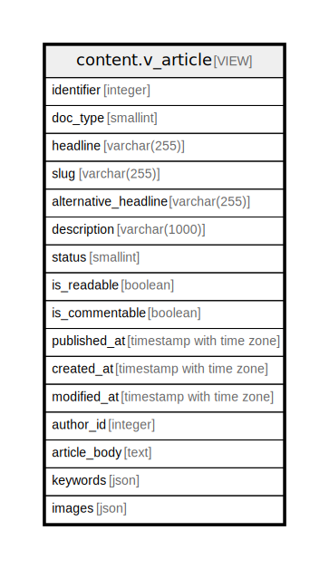

# content.v_article

## Description

<details>
<summary><strong>Table Definition</strong></summary>

```sql
CREATE VIEW v_article AS (
 SELECT d.id AS identifier,
    d.doc_type,
    ci.headline,
    ci.slug,
    ci.alternative_headline,
    ci.description,
    co.status,
    co.is_readable,
    co.is_commentable,
    co.published_at,
    co.created_at,
    co.modified_at,
    co.author_entity_id AS author_id,
    b.content AS article_body,
    ( SELECT json_agg(json_build_object('id', t.id, 'name', t.name, 'slug', t.slug) ORDER BY t.name) AS json_agg
           FROM (content.content_to_tag ct
             JOIN content.tag t ON ((t.id = ct.tag_id)))
          WHERE (ct.content_id = d.id)) AS keywords,
    ( SELECT json_agg(json_build_object('id', m.id, 'name', mc.name, 'url', (((m.folder_url)::text || '/'::text) || (m.file_name)::text), 'mime_type', m.mime_type, 'width', m.width, 'height', m.height, 'position', ctm."position") ORDER BY ctm."position") AS json_agg
           FROM ((content.content_to_media ctm
             JOIN content.media_core m ON ((m.id = ctm.media_id)))
             LEFT JOIN content.media_content mc ON ((mc.media_id = m.id)))
          WHERE (ctm.content_id = d.id)) AS images
   FROM (((content.document d
     JOIN content.core co ON ((co.document_id = d.id)))
     JOIN content.identity ci ON ((ci.document_id = d.id)))
     LEFT JOIN content.body b ON ((b.document_id = d.id)))
  WHERE ((co.status = 1) OR ((identity.rls_auth_bits() & 16) = 16) OR ((identity.rls_auth_bits() & 32768) = 32768) OR (co.author_entity_id = identity.rls_user_id()))
)
```

</details>

## Columns

| Name | Type | Default | Nullable | Children | Parents | Comment |
| ---- | ---- | ------- | -------- | -------- | ------- | ------- |
| identifier | integer |  | true |  |  |  |
| doc_type | smallint |  | true |  |  |  |
| headline | varchar(255) |  | true |  |  |  |
| slug | varchar(255) |  | true |  |  |  |
| alternative_headline | varchar(255) |  | true |  |  |  |
| description | varchar(1000) |  | true |  |  |  |
| status | smallint |  | true |  |  |  |
| is_readable | boolean |  | true |  |  |  |
| is_commentable | boolean |  | true |  |  |  |
| published_at | timestamp with time zone |  | true |  |  |  |
| created_at | timestamp with time zone |  | true |  |  |  |
| modified_at | timestamp with time zone |  | true |  |  |  |
| author_id | integer |  | true |  |  |  |
| article_body | text |  | true |  |  |  |
| keywords | json |  | true |  |  |  |
| images | json |  | true |  |  |  |

## Referenced Tables

| Name | Columns | Comment | Type |
| ---- | ------- | ------- | ---- |
| [content.content_to_tag](content.content_to_tag.md) | 2 |  | BASE TABLE |
| [content.tag](content.tag.md) | 3 |  | BASE TABLE |
| [content.content_to_media](content.content_to_media.md) | 3 |  | BASE TABLE |
| [content.media_core](content.media_core.md) | 9 |  | BASE TABLE |
| [content.media_content](content.media_content.md) | 4 |  | BASE TABLE |
| [content.document](content.document.md) | 2 |  | BASE TABLE |
| [content.core](content.core.md) | 9 |  | BASE TABLE |
| [content.identity](content.identity.md) | 5 |  | BASE TABLE |
| [content.body](content.body.md) | 2 |  | BASE TABLE |

## Relations



---

> Generated by [tbls](https://github.com/k1LoW/tbls)
