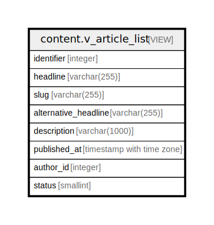

# content.v_article_list

## Description

<details>
<summary><strong>Table Definition</strong></summary>

```sql
CREATE VIEW v_article_list AS (
 SELECT d.id AS identifier,
    ci.headline,
    ci.slug,
    ci.alternative_headline,
    ci.description,
    co.published_at,
    co.author_entity_id AS author_id,
    co.status
   FROM ((content.document d
     JOIN content.core co ON ((co.document_id = d.id)))
     JOIN content.identity ci ON ((ci.document_id = d.id)))
  WHERE ((co.status = 1) OR ((identity.rls_auth_bits() & 16) = 16) OR ((identity.rls_auth_bits() & 32768) = 32768) OR (co.author_entity_id = identity.rls_user_id()))
)
```

</details>

## Columns

| Name | Type | Default | Nullable | Children | Parents | Comment |
| ---- | ---- | ------- | -------- | -------- | ------- | ------- |
| identifier | integer |  | true |  |  |  |
| headline | varchar(255) |  | true |  |  |  |
| slug | varchar(255) |  | true |  |  |  |
| alternative_headline | varchar(255) |  | true |  |  |  |
| description | varchar(1000) |  | true |  |  |  |
| published_at | timestamp with time zone |  | true |  |  |  |
| author_id | integer |  | true |  |  |  |
| status | smallint |  | true |  |  |  |

## Referenced Tables

| Name | Columns | Comment | Type |
| ---- | ------- | ------- | ---- |
| [content.document](content.document.md) | 2 |  | BASE TABLE |
| [content.core](content.core.md) | 9 |  | BASE TABLE |
| [content.identity](content.identity.md) | 5 |  | BASE TABLE |

## Relations



---

> Generated by [tbls](https://github.com/k1LoW/tbls)
