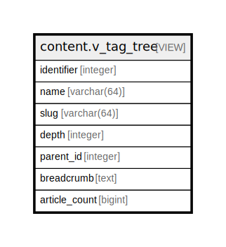

# content.v_tag_tree

## Description

<details>
<summary><strong>Table Definition</strong></summary>

```sql
CREATE VIEW v_tag_tree AS (
 SELECT id AS identifier,
    name,
    slug,
    COALESCE((( SELECT max(th.depth) AS max
           FROM content.tag_hierarchy th
          WHERE ((th.descendant_id = t.id) AND (th.ancestor_id <> t.id))))::integer, 0) AS depth,
    ( SELECT th_p.ancestor_id
           FROM content.tag_hierarchy th_p
          WHERE ((th_p.descendant_id = t.id) AND (th_p.depth = 1))
         LIMIT 1) AS parent_id,
    ( SELECT string_agg((a.name)::text, ' > '::text ORDER BY th_a.depth DESC) AS string_agg
           FROM (content.tag_hierarchy th_a
             JOIN content.tag a ON ((a.id = th_a.ancestor_id)))
          WHERE ((th_a.descendant_id = t.id) AND (th_a.depth > 0))) AS breadcrumb,
    ( SELECT count(*) AS count
           FROM (content.content_to_tag ct
             JOIN content.core co ON ((co.document_id = ct.content_id)))
          WHERE ((ct.tag_id = t.id) AND (co.status = 1))) AS article_count
   FROM content.tag t
)
```

</details>

## Columns

| Name | Type | Default | Nullable | Children | Parents | Comment |
| ---- | ---- | ------- | -------- | -------- | ------- | ------- |
| identifier | integer |  | true |  |  |  |
| name | varchar(64) |  | true |  |  |  |
| slug | varchar(64) |  | true |  |  |  |
| depth | integer |  | true |  |  |  |
| parent_id | integer |  | true |  |  |  |
| breadcrumb | text |  | true |  |  |  |
| article_count | bigint |  | true |  |  |  |

## Referenced Tables

| Name | Columns | Comment | Type |
| ---- | ------- | ------- | ---- |
| [content.tag_hierarchy](content.tag_hierarchy.md) | 3 |  | BASE TABLE |
| [content.tag](content.tag.md) | 3 |  | BASE TABLE |
| [content.content_to_tag](content.content_to_tag.md) | 2 |  | BASE TABLE |
| [content.core](content.core.md) | 9 |  | BASE TABLE |

## Relations



---

> Generated by [tbls](https://github.com/k1LoW/tbls)
