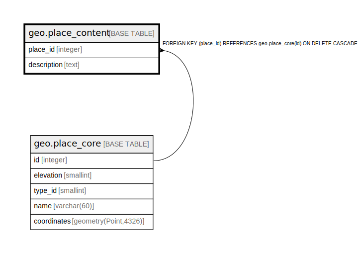

# geo.place_content

## Description

## Columns

| Name | Type | Default | Nullable | Children | Parents | Comment |
| ---- | ---- | ------- | -------- | -------- | ------- | ------- |
| place_id | integer |  | false |  | [geo.place_core](geo.place_core.md) |  |
| description | text |  | true |  |  |  |

## Constraints

| Name | Type | Definition |
| ---- | ---- | ---------- |
| place_content_place_id_fkey | FOREIGN KEY | FOREIGN KEY (place_id) REFERENCES geo.place_core(id) ON DELETE CASCADE |
| place_content_pkey | PRIMARY KEY | PRIMARY KEY (place_id) |

## Indexes

| Name | Definition |
| ---- | ---------- |
| place_content_pkey | CREATE UNIQUE INDEX place_content_pkey ON geo.place_content USING btree (place_id) |

## Relations

---

> Generated by [tbls](https://github.com/k1LoW/tbls)
