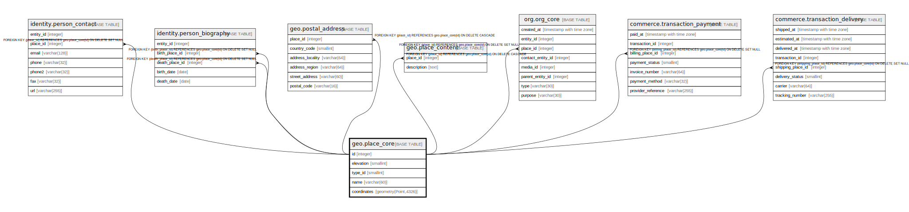

# geo.place_core

## Description

## Columns

| Name | Type | Default | Nullable | Children | Parents | Comment |
| ---- | ---- | ------- | -------- | -------- | ------- | ------- |
| id | integer |  | false | [identity.person_contact](identity.person_contact.md) [identity.person_biography](identity.person_biography.md) [geo.postal_address](geo.postal_address.md) [geo.place_content](geo.place_content.md) [org.org_core](org.org_core.md) [commerce.transaction_payment](commerce.transaction_payment.md) [commerce.transaction_delivery](commerce.transaction_delivery.md) |  |  |
| elevation | smallint |  | true |  |  |  |
| type_id | smallint |  | true |  |  |  |
| name | varchar(60) |  | true |  |  |  |
| coordinates | geometry(Point,4326) |  | true |  |  |  |

## Constraints

| Name | Type | Definition |
| ---- | ---- | ---------- |
| coordinates_valid | CHECK | CHECK (((coordinates IS NULL) OR st_isvalid(coordinates))) |
| place_core_pkey | PRIMARY KEY | PRIMARY KEY (id) |

## Indexes

| Name | Definition |
| ---- | ---------- |
| place_core_pkey | CREATE UNIQUE INDEX place_core_pkey ON geo.place_core USING btree (id) |
| place_core_gist | CREATE INDEX place_core_gist ON geo.place_core USING gist (coordinates) WHERE (coordinates IS NOT NULL) |

## Relations

---

> Generated by [tbls](https://github.com/k1LoW/tbls)
