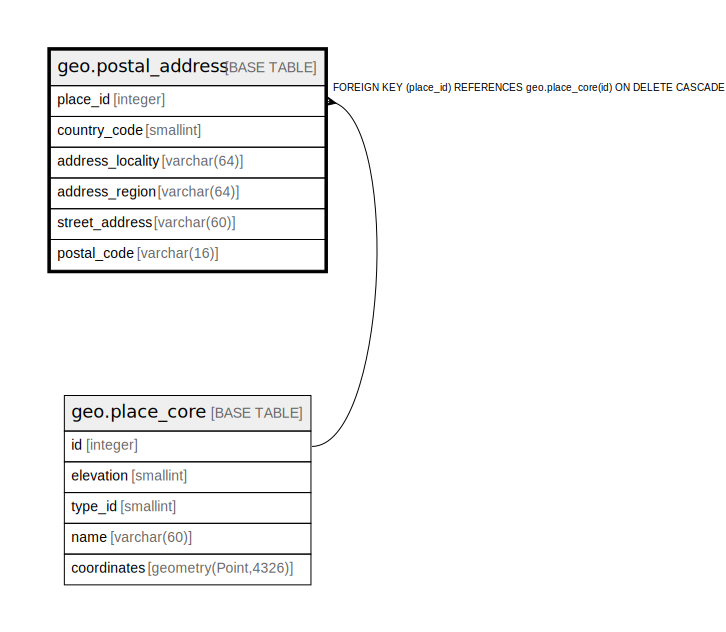

# geo.postal_address

## Description

## Columns

| Name | Type | Default | Nullable | Children | Parents | Comment |
| ---- | ---- | ------- | -------- | -------- | ------- | ------- |
| place_id | integer |  | false |  | [geo.place_core](geo.place_core.md) |  |
| country_code | smallint |  | true |  |  |  |
| address_locality | varchar(64) |  | true |  |  |  |
| address_region | varchar(64) |  | true |  |  |  |
| street_address | varchar(60) |  | true |  |  |  |
| postal_code | varchar(16) |  | true |  |  |  |

## Constraints

| Name | Type | Definition |
| ---- | ---- | ---------- |
| country_code_range | CHECK | CHECK (((country_code IS NULL) OR ((country_code >= 1) AND (country_code <= 999)))) |
| postal_address_place_id_fkey | FOREIGN KEY | FOREIGN KEY (place_id) REFERENCES geo.place_core(id) ON DELETE CASCADE |
| postal_address_pkey | PRIMARY KEY | PRIMARY KEY (place_id) |

## Indexes

| Name | Definition |
| ---- | ---------- |
| postal_address_pkey | CREATE UNIQUE INDEX postal_address_pkey ON geo.postal_address USING btree (place_id) |
| postal_address_country_locality | CREATE INDEX postal_address_country_locality ON geo.postal_address USING btree (country_code, address_locality) WHERE (country_code IS NOT NULL) |

## Relations

---

> Generated by [tbls](https://github.com/k1LoW/tbls)
