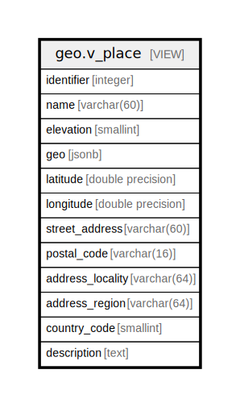

# geo.v_place

## Description

<details>
<summary><strong>Table Definition</strong></summary>

```sql
CREATE VIEW v_place AS (
 SELECT c.id AS identifier,
    c.name,
    c.elevation,
        CASE
            WHEN (c.coordinates IS NOT NULL) THEN (st_asgeojson(c.coordinates))::jsonb
            ELSE NULL::jsonb
        END AS geo,
    st_y(c.coordinates) AS latitude,
    st_x(c.coordinates) AS longitude,
    pa.street_address,
    pa.postal_code,
    pa.address_locality,
    pa.address_region,
    pa.country_code,
    co.description
   FROM ((geo.place_core c
     LEFT JOIN geo.postal_address pa ON ((pa.place_id = c.id)))
     LEFT JOIN geo.place_content co ON ((co.place_id = c.id)))
)
```

</details>

## Columns

| Name | Type | Default | Nullable | Children | Parents | Comment |
| ---- | ---- | ------- | -------- | -------- | ------- | ------- |
| identifier | integer |  | true |  |  |  |
| name | varchar(60) |  | true |  |  |  |
| elevation | smallint |  | true |  |  |  |
| geo | jsonb |  | true |  |  |  |
| latitude | double precision |  | true |  |  |  |
| longitude | double precision |  | true |  |  |  |
| street_address | varchar(60) |  | true |  |  |  |
| postal_code | varchar(16) |  | true |  |  |  |
| address_locality | varchar(64) |  | true |  |  |  |
| address_region | varchar(64) |  | true |  |  |  |
| country_code | smallint |  | true |  |  |  |
| description | text |  | true |  |  |  |

## Referenced Tables

| Name | Columns | Comment | Type |
| ---- | ------- | ------- | ---- |
| [geo.place_core](geo.place_core.md) | 5 |  | BASE TABLE |
| [geo.postal_address](geo.postal_address.md) | 6 |  | BASE TABLE |
| [geo.place_content](geo.place_content.md) | 2 |  | BASE TABLE |

## Relations



---

> Generated by [tbls](https://github.com/k1LoW/tbls)
