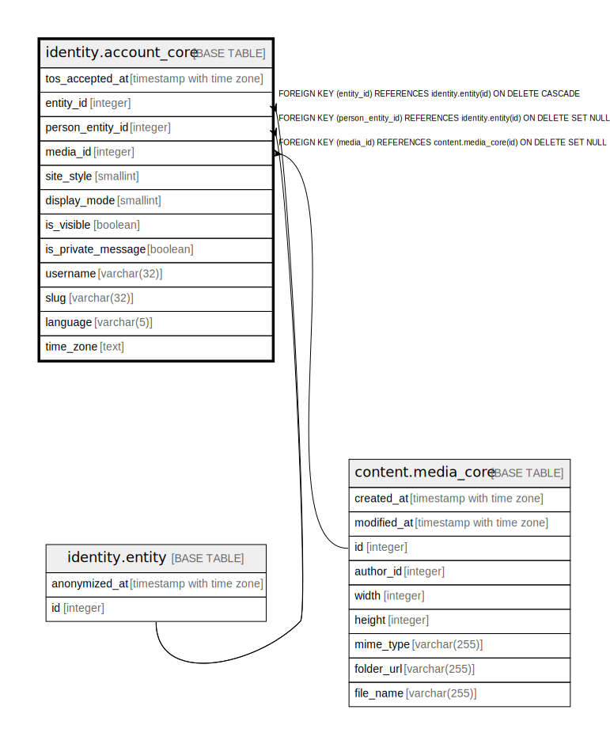

# identity.account_core

## Description

## Columns

| Name | Type | Default | Nullable | Children | Parents | Comment |
| ---- | ---- | ------- | -------- | -------- | ------- | ------- |
| tos_accepted_at | timestamp with time zone |  | true |  |  |  |
| entity_id | integer |  | false |  | [identity.entity](identity.entity.md) |  |
| person_entity_id | integer |  | true |  | [identity.entity](identity.entity.md) |  |
| media_id | integer |  | true |  | [content.media_core](content.media_core.md) |  |
| site_style | smallint |  | true |  |  |  |
| display_mode | smallint | 0 | false |  |  |  |
| is_visible | boolean | true | false |  |  |  |
| is_private_message | boolean | false | false |  |  |  |
| username | varchar(32) |  | false |  |  |  |
| slug | varchar(32) |  | false |  |  |  |
| language | varchar(5) | 'fr_FR'::character varying | false |  |  |  |
| time_zone | text |  | true |  |  |  |

## Constraints

| Name | Type | Definition |
| ---- | ---- | ---------- |
| display_mode_range | CHECK | CHECK (((display_mode >= 0) AND (display_mode <= 3))) |
| slug_format | CHECK | CHECK (((slug)::text ~ '^[a-z0-9-]+$'::text)) |
| account_core_entity_id_fkey | FOREIGN KEY | FOREIGN KEY (entity_id) REFERENCES identity.entity(id) ON DELETE CASCADE |
| account_core_person_entity_id_fkey | FOREIGN KEY | FOREIGN KEY (person_entity_id) REFERENCES identity.entity(id) ON DELETE SET NULL |
| account_core_pkey | PRIMARY KEY | PRIMARY KEY (entity_id) |
| account_core_username_key | UNIQUE | UNIQUE (username) |
| account_core_slug_key | UNIQUE | UNIQUE (slug) |
| fk_account_core_media | FOREIGN KEY | FOREIGN KEY (media_id) REFERENCES content.media_core(id) ON DELETE SET NULL |

## Indexes

| Name | Definition |
| ---- | ---------- |
| account_core_pkey | CREATE UNIQUE INDEX account_core_pkey ON identity.account_core USING btree (entity_id) |
| account_core_username_key | CREATE UNIQUE INDEX account_core_username_key ON identity.account_core USING btree (username) |
| account_core_slug_key | CREATE UNIQUE INDEX account_core_slug_key ON identity.account_core USING btree (slug) |

## Triggers

| Name | Definition |
| ---- | ---------- |
| audit_identity_account_core | CREATE TRIGGER audit_identity_account_core AFTER INSERT OR DELETE OR UPDATE ON identity.account_core FOR EACH ROW EXECUTE FUNCTION identity.fn_dml_audit() |
| account_slug_dedup | CREATE TRIGGER account_slug_dedup BEFORE INSERT OR UPDATE OF slug ON identity.account_core FOR EACH ROW EXECUTE FUNCTION fn_slug_deduplicate() |
| account_core_deny_entity_id_update | CREATE TRIGGER account_core_deny_entity_id_update BEFORE UPDATE ON identity.account_core FOR EACH ROW WHEN ((old.entity_id IS DISTINCT FROM new.entity_id)) EXECUTE FUNCTION identity.fn_deny_entity_id_update() |

## Relations

---

> Generated by [tbls](https://github.com/k1LoW/tbls)
