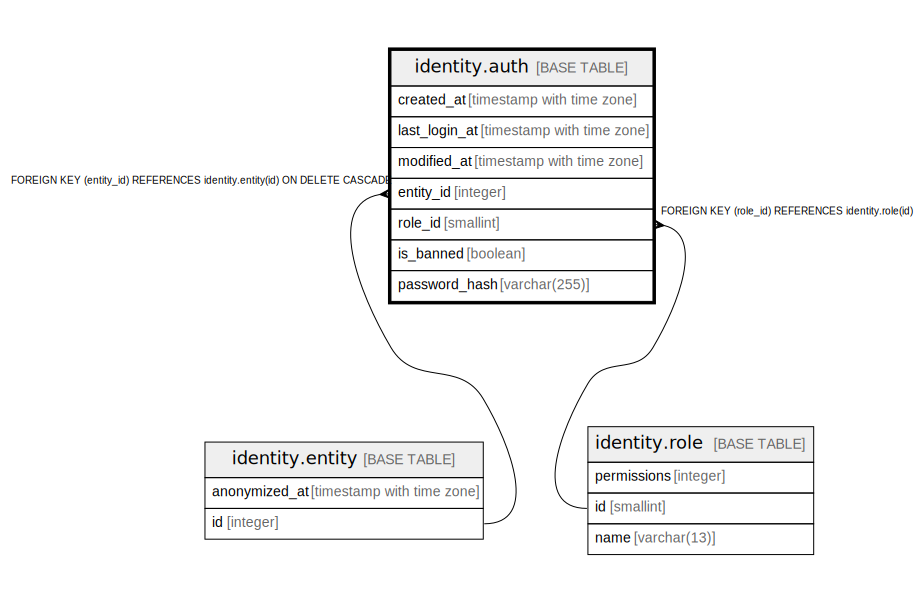

# identity.auth

## Description

## Columns

| Name | Type | Default | Nullable | Children | Parents | Comment |
| ---- | ---- | ------- | -------- | -------- | ------- | ------- |
| created_at | timestamp with time zone | now() | false |  |  |  |
| last_login_at | timestamp with time zone |  | true |  |  |  |
| modified_at | timestamp with time zone |  | true |  |  |  |
| entity_id | integer |  | false |  | [identity.entity](identity.entity.md) |  |
| role_id | smallint | 7 | false |  | [identity.role](identity.role.md) |  |
| is_banned | boolean | false | false |  |  |  |
| password_hash | varchar(255) |  | false |  |  |  |

## Constraints

| Name | Type | Definition |
| ---- | ---- | ---------- |
| auth_entity_id_fkey | FOREIGN KEY | FOREIGN KEY (entity_id) REFERENCES identity.entity(id) ON DELETE CASCADE |
| auth_role_id_fkey | FOREIGN KEY | FOREIGN KEY (role_id) REFERENCES identity.role(id) |
| auth_pkey | PRIMARY KEY | PRIMARY KEY (entity_id) |

## Indexes

| Name | Definition |
| ---- | ---------- |
| auth_pkey | CREATE UNIQUE INDEX auth_pkey ON identity.auth USING btree (entity_id) |
| auth_created_at_brin | CREATE INDEX auth_created_at_brin ON identity.auth USING brin (created_at) WITH (pages_per_range='128') |

## Triggers

| Name | Definition |
| ---- | ---------- |
| audit_identity_auth | CREATE TRIGGER audit_identity_auth AFTER INSERT OR DELETE OR UPDATE ON identity.auth FOR EACH ROW EXECUTE FUNCTION identity.fn_dml_audit() |
| auth_modified_at | CREATE TRIGGER auth_modified_at BEFORE UPDATE ON identity.auth FOR EACH ROW WHEN ((((old.password_hash)::text IS DISTINCT FROM (new.password_hash)::text) OR (old.role_id IS DISTINCT FROM new.role_id) OR (old.is_banned IS DISTINCT FROM new.is_banned))) EXECUTE FUNCTION identity.fn_update_modified_at() |
| auth_deny_created_at_update | CREATE TRIGGER auth_deny_created_at_update BEFORE UPDATE ON identity.auth FOR EACH ROW WHEN ((old.created_at IS DISTINCT FROM new.created_at)) EXECUTE FUNCTION identity.fn_deny_created_at_update() |
| auth_deny_entity_id_update | CREATE TRIGGER auth_deny_entity_id_update BEFORE UPDATE ON identity.auth FOR EACH ROW WHEN ((old.entity_id IS DISTINCT FROM new.entity_id)) EXECUTE FUNCTION identity.fn_deny_entity_id_update() |

## Relations

---

> Generated by [tbls](https://github.com/k1LoW/tbls)
