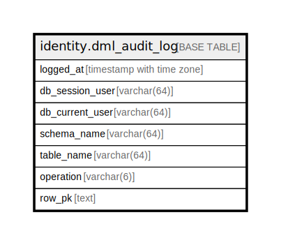

# identity.dml_audit_log

## Description

## Columns

| Name | Type | Default | Nullable | Children | Parents | Comment |
| ---- | ---- | ------- | -------- | -------- | ------- | ------- |
| logged_at | timestamp with time zone | now() | false |  |  |  |
| db_session_user | varchar(64) |  | false |  |  |  |
| db_current_user | varchar(64) |  | false |  |  |  |
| schema_name | varchar(64) |  | false |  |  |  |
| table_name | varchar(64) |  | false |  |  |  |
| operation | varchar(6) |  | false |  |  |  |
| row_pk | text |  | true |  |  |  |

## Indexes

| Name | Definition |
| ---- | ---------- |
| dml_audit_log_ts | CREATE INDEX dml_audit_log_ts ON identity.dml_audit_log USING btree (logged_at DESC) |

## Relations

---

> Generated by [tbls](https://github.com/k1LoW/tbls)
