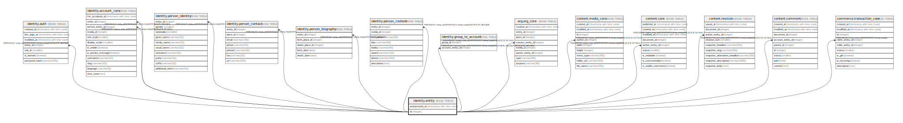

# identity.entity

## Description

## Columns

| Name | Type | Default | Nullable | Children | Parents | Comment |
| ---- | ---- | ------- | -------- | -------- | ------- | ------- |
| anonymized_at | timestamp with time zone |  | true |  |  |  |
| id | integer |  | false | [identity.auth](identity.auth.md) [identity.account_core](identity.account_core.md) [identity.person_identity](identity.person_identity.md) [identity.person_contact](identity.person_contact.md) [identity.person_biography](identity.person_biography.md) [identity.person_content](identity.person_content.md) [identity.group_to_account](identity.group_to_account.md) [org.org_core](org.org_core.md) [content.media_core](content.media_core.md) [content.core](content.core.md) [content.revision](content.revision.md) [content.comment](content.comment.md) [commerce.transaction_core](commerce.transaction_core.md) |  |  |

## Constraints

| Name | Type | Definition |
| ---- | ---- | ---------- |
| entity_pkey | PRIMARY KEY | PRIMARY KEY (id) |

## Indexes

| Name | Definition |
| ---- | ---------- |
| entity_pkey | CREATE UNIQUE INDEX entity_pkey ON identity.entity USING btree (id) |

## Triggers

| Name | Definition |
| ---- | ---------- |
| audit_identity_entity | CREATE TRIGGER audit_identity_entity AFTER INSERT OR DELETE OR UPDATE ON identity.entity FOR EACH ROW EXECUTE FUNCTION identity.fn_dml_audit() |

## Relations

---

> Generated by [tbls](https://github.com/k1LoW/tbls)
