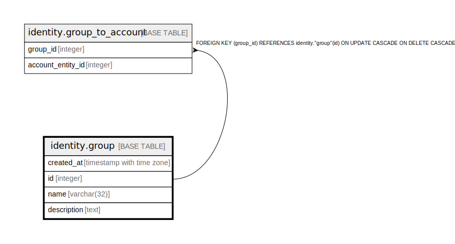

# identity.group

## Description

## Columns

| Name | Type | Default | Nullable | Children | Parents | Comment |
| ---- | ---- | ------- | -------- | -------- | ------- | ------- |
| created_at | timestamp with time zone | now() | false |  |  |  |
| id | integer |  | false | [identity.group_to_account](identity.group_to_account.md) |  |  |
| name | varchar(32) |  | false |  |  |  |
| description | text |  | true |  |  |  |

## Constraints

| Name | Type | Definition |
| ---- | ---- | ---------- |
| group_pkey | PRIMARY KEY | PRIMARY KEY (id) |
| group_name_key | UNIQUE | UNIQUE (name) |

## Indexes

| Name | Definition |
| ---- | ---------- |
| group_pkey | CREATE UNIQUE INDEX group_pkey ON identity."group" USING btree (id) |
| group_name_key | CREATE UNIQUE INDEX group_name_key ON identity."group" USING btree (name) |

## Relations

---

> Generated by [tbls](https://github.com/k1LoW/tbls)
