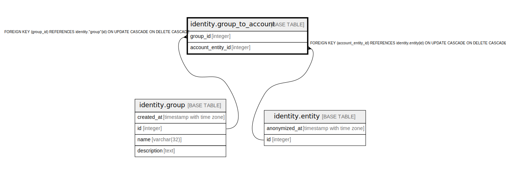

# identity.group_to_account

## Description

## Columns

| Name | Type | Default | Nullable | Children | Parents | Comment |
| ---- | ---- | ------- | -------- | -------- | ------- | ------- |
| group_id | integer |  | false |  | [identity.group](identity.group.md) |  |
| account_entity_id | integer |  | false |  | [identity.entity](identity.entity.md) |  |

## Constraints

| Name | Type | Definition |
| ---- | ---- | ---------- |
| group_to_account_account_entity_id_fkey | FOREIGN KEY | FOREIGN KEY (account_entity_id) REFERENCES identity.entity(id) ON UPDATE CASCADE ON DELETE CASCADE |
| group_to_account_group_id_fkey | FOREIGN KEY | FOREIGN KEY (group_id) REFERENCES identity."group"(id) ON UPDATE CASCADE ON DELETE CASCADE |
| group_to_account_pkey | PRIMARY KEY | PRIMARY KEY (group_id, account_entity_id) |

## Indexes

| Name | Definition |
| ---- | ---------- |
| group_to_account_pkey | CREATE UNIQUE INDEX group_to_account_pkey ON identity.group_to_account USING btree (group_id, account_entity_id) |

## Relations

---

> Generated by [tbls](https://github.com/k1LoW/tbls)
