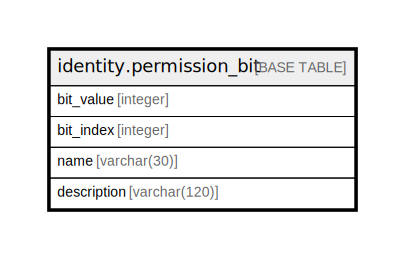

# identity.permission_bit

## Description

## Columns

| Name | Type | Default | Nullable | Children | Parents | Comment |
| ---- | ---- | ------- | -------- | -------- | ------- | ------- |
| bit_value | integer |  | false |  |  |  |
| bit_index | integer |  | false |  |  |  |
| name | varchar(30) |  | false |  |  |  |
| description | varchar(120) |  | true |  |  |  |

## Constraints

| Name | Type | Definition |
| ---- | ---- | ---------- |
| index_range | CHECK | CHECK (((bit_index >= 0) AND (bit_index <= 30))) |
| power_of_2 | CHECK | CHECK (((bit_value > 0) AND ((bit_value & (bit_value - 1)) = 0))) |
| permission_bit_pkey | PRIMARY KEY | PRIMARY KEY (bit_value) |
| permission_bit_name_key | UNIQUE | UNIQUE (name) |
| permission_bit_bit_index_key | UNIQUE | UNIQUE (bit_index) |

## Indexes

| Name | Definition |
| ---- | ---------- |
| permission_bit_pkey | CREATE UNIQUE INDEX permission_bit_pkey ON identity.permission_bit USING btree (bit_value) |
| permission_bit_name_key | CREATE UNIQUE INDEX permission_bit_name_key ON identity.permission_bit USING btree (name) |
| permission_bit_bit_index_key | CREATE UNIQUE INDEX permission_bit_bit_index_key ON identity.permission_bit USING btree (bit_index) |

## Relations

---

> Generated by [tbls](https://github.com/k1LoW/tbls)
