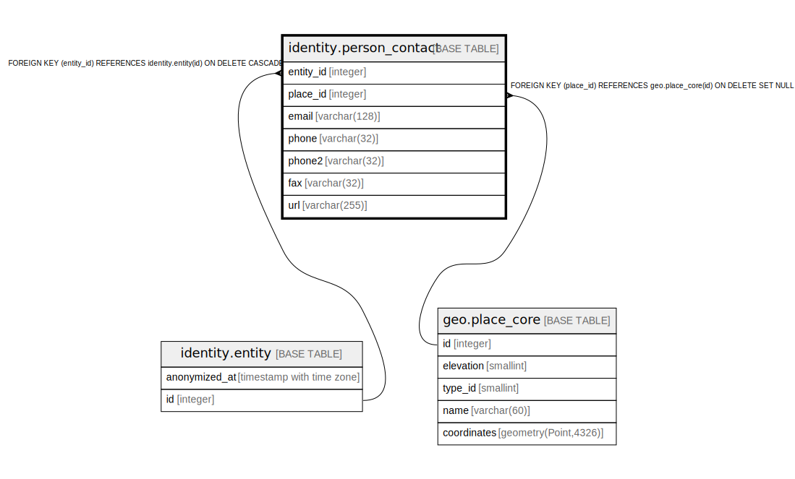

# identity.person_contact

## Description

## Columns

| Name | Type | Default | Nullable | Children | Parents | Comment |
| ---- | ---- | ------- | -------- | -------- | ------- | ------- |
| entity_id | integer |  | false |  | [identity.entity](identity.entity.md) |  |
| place_id | integer |  | true |  | [geo.place_core](geo.place_core.md) |  |
| email | varchar(128) |  | true |  |  |  |
| phone | varchar(32) |  | true |  |  |  |
| phone2 | varchar(32) |  | true |  |  |  |
| fax | varchar(32) |  | true |  |  |  |
| url | varchar(255) |  | true |  |  |  |

## Constraints

| Name | Type | Definition |
| ---- | ---- | ---------- |
| person_contact_entity_id_fkey | FOREIGN KEY | FOREIGN KEY (entity_id) REFERENCES identity.entity(id) ON DELETE CASCADE |
| person_contact_pkey | PRIMARY KEY | PRIMARY KEY (entity_id) |
| fk_person_contact_place | FOREIGN KEY | FOREIGN KEY (place_id) REFERENCES geo.place_core(id) ON DELETE SET NULL |

## Indexes

| Name | Definition |
| ---- | ---------- |
| person_contact_pkey | CREATE UNIQUE INDEX person_contact_pkey ON identity.person_contact USING btree (entity_id) |

## Relations

---

> Generated by [tbls](https://github.com/k1LoW/tbls)
