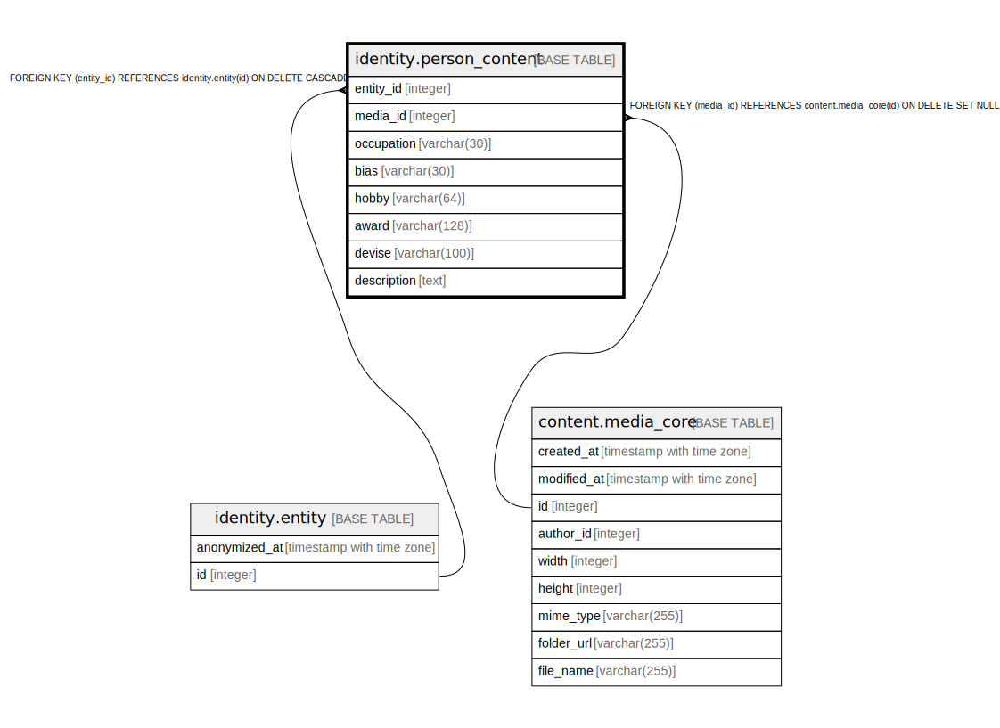

# identity.person_content

## Description

## Columns

| Name | Type | Default | Nullable | Children | Parents | Comment |
| ---- | ---- | ------- | -------- | -------- | ------- | ------- |
| entity_id | integer |  | false |  | [identity.entity](identity.entity.md) |  |
| media_id | integer |  | true |  | [content.media_core](content.media_core.md) |  |
| occupation | varchar(30) |  | true |  |  |  |
| bias | varchar(30) |  | true |  |  |  |
| hobby | varchar(64) |  | true |  |  |  |
| award | varchar(128) |  | true |  |  |  |
| devise | varchar(100) |  | true |  |  |  |
| description | text |  | true |  |  |  |

## Constraints

| Name | Type | Definition |
| ---- | ---- | ---------- |
| person_content_entity_id_fkey | FOREIGN KEY | FOREIGN KEY (entity_id) REFERENCES identity.entity(id) ON DELETE CASCADE |
| person_content_pkey | PRIMARY KEY | PRIMARY KEY (entity_id) |
| fk_person_content_media | FOREIGN KEY | FOREIGN KEY (media_id) REFERENCES content.media_core(id) ON DELETE SET NULL |

## Indexes

| Name | Definition |
| ---- | ---------- |
| person_content_pkey | CREATE UNIQUE INDEX person_content_pkey ON identity.person_content USING btree (entity_id) |

## Relations

---

> Generated by [tbls](https://github.com/k1LoW/tbls)
