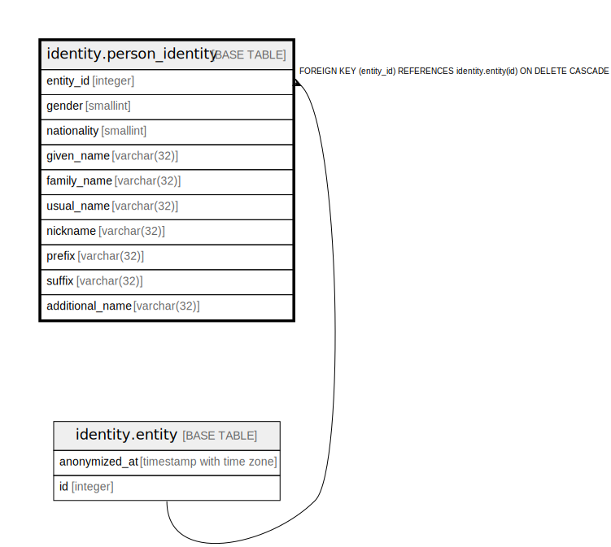

# identity.person_identity

## Description

## Columns

| Name | Type | Default | Nullable | Children | Parents | Comment |
| ---- | ---- | ------- | -------- | -------- | ------- | ------- |
| entity_id | integer |  | false |  | [identity.entity](identity.entity.md) |  |
| gender | smallint |  | true |  |  |  |
| nationality | smallint |  | true |  |  |  |
| given_name | varchar(32) |  | true |  |  |  |
| family_name | varchar(32) |  | true |  |  |  |
| usual_name | varchar(32) |  | true |  |  |  |
| nickname | varchar(32) |  | true |  |  |  |
| prefix | varchar(32) |  | true |  |  |  |
| suffix | varchar(32) |  | true |  |  |  |
| additional_name | varchar(32) |  | true |  |  |  |

## Constraints

| Name | Type | Definition |
| ---- | ---- | ---------- |
| nationality_range | CHECK | CHECK (((nationality IS NULL) OR ((nationality >= 1) AND (nationality <= 999)))) |
| person_identity_entity_id_fkey | FOREIGN KEY | FOREIGN KEY (entity_id) REFERENCES identity.entity(id) ON DELETE CASCADE |
| person_identity_pkey | PRIMARY KEY | PRIMARY KEY (entity_id) |

## Indexes

| Name | Definition |
| ---- | ---------- |
| person_identity_pkey | CREATE UNIQUE INDEX person_identity_pkey ON identity.person_identity USING btree (entity_id) |
| person_identity_name | CREATE INDEX person_identity_name ON identity.person_identity USING btree (family_name, given_name) WHERE (family_name IS NOT NULL) |

## Triggers

| Name | Definition |
| ---- | ---------- |
| person_identity_deny_entity_id_update | CREATE TRIGGER person_identity_deny_entity_id_update BEFORE UPDATE ON identity.person_identity FOR EACH ROW WHEN ((old.entity_id IS DISTINCT FROM new.entity_id)) EXECUTE FUNCTION identity.fn_deny_entity_id_update() |

## Relations

---

> Generated by [tbls](https://github.com/k1LoW/tbls)
