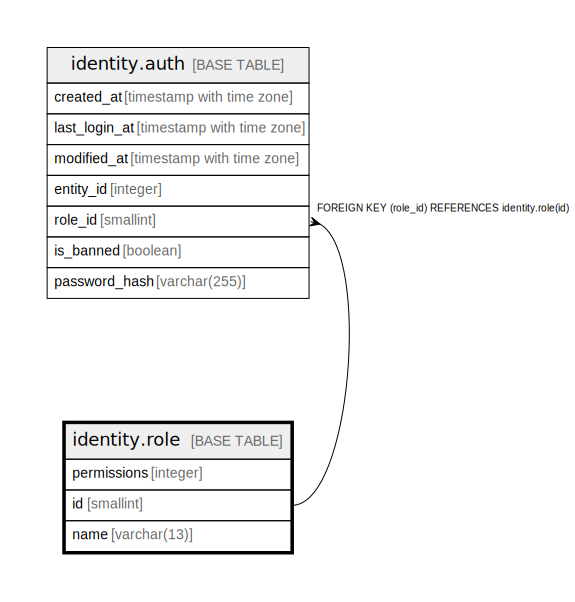

# identity.role

## Description

## Columns

| Name | Type | Default | Nullable | Children | Parents | Comment |
| ---- | ---- | ------- | -------- | -------- | ------- | ------- |
| permissions | integer | 16384 | false |  |  |  |
| id | smallint |  | false | [identity.auth](identity.auth.md) |  |  |
| name | varchar(13) |  | false |  |  |  |

## Constraints

| Name | Type | Definition |
| ---- | ---- | ---------- |
| permissions_range | CHECK | CHECK (((permissions >= 0) AND (permissions <= 2097151))) |
| role_pkey | PRIMARY KEY | PRIMARY KEY (id) |
| role_name_key | UNIQUE | UNIQUE (name) |

## Indexes

| Name | Definition |
| ---- | ---------- |
| role_pkey | CREATE UNIQUE INDEX role_pkey ON identity.role USING btree (id) |
| role_name_key | CREATE UNIQUE INDEX role_name_key ON identity.role USING btree (name) |

## Relations

---

> Generated by [tbls](https://github.com/k1LoW/tbls)
