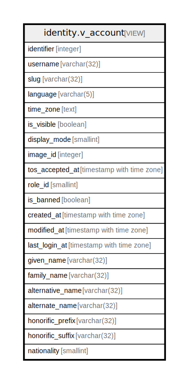

# identity.v_account

## Description

<details>
<summary><strong>Table Definition</strong></summary>

```sql
CREATE VIEW v_account AS (
 SELECT ac.entity_id AS identifier,
    ac.username,
    ac.slug,
    ac.language,
    ac.time_zone,
    ac.is_visible,
    ac.display_mode,
    ac.media_id AS image_id,
    ac.tos_accepted_at,
    a.role_id,
    a.is_banned,
    a.created_at,
    a.modified_at,
    a.last_login_at,
    pi.given_name,
    pi.family_name,
    pi.usual_name AS alternative_name,
    pi.nickname AS alternate_name,
    pi.prefix AS honorific_prefix,
    pi.suffix AS honorific_suffix,
    pi.nationality
   FROM ((identity.account_core ac
     JOIN identity.auth a ON ((a.entity_id = ac.entity_id)))
     LEFT JOIN identity.person_identity pi ON ((pi.entity_id = ac.person_entity_id)))
  WHERE ((ac.entity_id = identity.rls_user_id()) OR ((identity.rls_auth_bits() & 256) = 256))
)
```

</details>

## Columns

| Name | Type | Default | Nullable | Children | Parents | Comment |
| ---- | ---- | ------- | -------- | -------- | ------- | ------- |
| identifier | integer |  | true |  |  |  |
| username | varchar(32) |  | true |  |  |  |
| slug | varchar(32) |  | true |  |  |  |
| language | varchar(5) |  | true |  |  |  |
| time_zone | text |  | true |  |  |  |
| is_visible | boolean |  | true |  |  |  |
| display_mode | smallint |  | true |  |  |  |
| image_id | integer |  | true |  |  |  |
| tos_accepted_at | timestamp with time zone |  | true |  |  |  |
| role_id | smallint |  | true |  |  |  |
| is_banned | boolean |  | true |  |  |  |
| created_at | timestamp with time zone |  | true |  |  |  |
| modified_at | timestamp with time zone |  | true |  |  |  |
| last_login_at | timestamp with time zone |  | true |  |  |  |
| given_name | varchar(32) |  | true |  |  |  |
| family_name | varchar(32) |  | true |  |  |  |
| alternative_name | varchar(32) |  | true |  |  |  |
| alternate_name | varchar(32) |  | true |  |  |  |
| honorific_prefix | varchar(32) |  | true |  |  |  |
| honorific_suffix | varchar(32) |  | true |  |  |  |
| nationality | smallint |  | true |  |  |  |

## Referenced Tables

| Name | Columns | Comment | Type |
| ---- | ------- | ------- | ---- |
| [identity.account_core](identity.account_core.md) | 12 |  | BASE TABLE |
| [identity.auth](identity.auth.md) | 7 |  | BASE TABLE |
| [identity.person_identity](identity.person_identity.md) | 10 |  | BASE TABLE |

## Relations



---

> Generated by [tbls](https://github.com/k1LoW/tbls)
