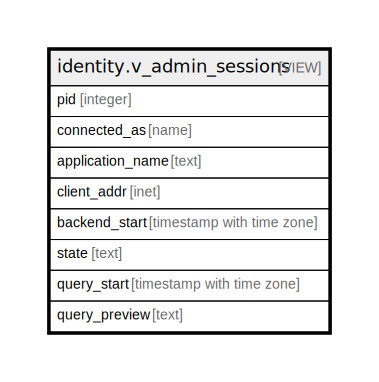

# identity.v_admin_sessions

## Description

Sessions actives de marius_admin. Toute ligne en production normale est une anomalie. ADR-001.

<details>
<summary><strong>Table Definition</strong></summary>

```sql
CREATE VIEW v_admin_sessions AS (
 SELECT pid,
    usename AS connected_as,
    application_name,
    client_addr,
    backend_start,
    state,
    query_start,
    "left"(query, 120) AS query_preview
   FROM pg_stat_activity
  WHERE ((usename = 'marius_admin'::name) AND (pid <> pg_backend_pid()))
)
```

</details>

## Columns

| Name | Type | Default | Nullable | Children | Parents | Comment |
| ---- | ---- | ------- | -------- | -------- | ------- | ------- |
| pid | integer |  | true |  |  |  |
| connected_as | name |  | true |  |  |  |
| application_name | text |  | true |  |  |  |
| client_addr | inet |  | true |  |  |  |
| backend_start | timestamp with time zone |  | true |  |  |  |
| state | text |  | true |  |  |  |
| query_start | timestamp with time zone |  | true |  |  |  |
| query_preview | text |  | true |  |  |  |

## Referenced Tables

| Name | Columns | Comment | Type |
| ---- | ------- | ------- | ---- |
| [pg_stat_activity](pg_stat_activity.md) | 0 |  |  |

## Relations



---

> Generated by [tbls](https://github.com/k1LoW/tbls)
