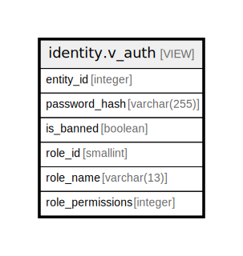

# identity.v_auth

## Description

<details>
<summary><strong>Table Definition</strong></summary>

```sql
CREATE VIEW v_auth AS (
 SELECT a.entity_id,
    a.password_hash,
    a.is_banned,
    a.role_id,
    r.name AS role_name,
    r.permissions AS role_permissions
   FROM (identity.auth a
     JOIN identity.role r ON ((r.id = a.role_id)))
)
```

</details>

## Columns

| Name | Type | Default | Nullable | Children | Parents | Comment |
| ---- | ---- | ------- | -------- | -------- | ------- | ------- |
| entity_id | integer |  | true |  |  |  |
| password_hash | varchar(255) |  | true |  |  |  |
| is_banned | boolean |  | true |  |  |  |
| role_id | smallint |  | true |  |  |  |
| role_name | varchar(13) |  | true |  |  |  |
| role_permissions | integer |  | true |  |  |  |

## Referenced Tables

| Name | Columns | Comment | Type |
| ---- | ------- | ------- | ---- |
| [identity.auth](identity.auth.md) | 7 |  | BASE TABLE |
| [identity.role](identity.role.md) | 3 |  | BASE TABLE |

## Relations



---

> Generated by [tbls](https://github.com/k1LoW/tbls)
