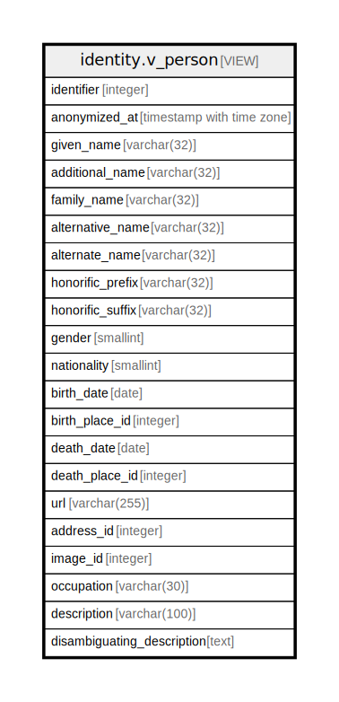

# identity.v_person

## Description

<details>
<summary><strong>Table Definition</strong></summary>

```sql
CREATE VIEW v_person AS (
 SELECT e.id AS identifier,
    e.anonymized_at,
    pi.given_name,
    pi.additional_name,
    pi.family_name,
    pi.usual_name AS alternative_name,
    pi.nickname AS alternate_name,
    pi.prefix AS honorific_prefix,
    pi.suffix AS honorific_suffix,
    pi.gender,
    pi.nationality,
    pb.birth_date,
    pb.birth_place_id,
    pb.death_date,
    pb.death_place_id,
    pc.url,
    pc.place_id AS address_id,
    pco.media_id AS image_id,
    pco.occupation,
    pco.devise AS description,
    pco.description AS disambiguating_description
   FROM ((((identity.entity e
     JOIN identity.person_identity pi ON ((pi.entity_id = e.id)))
     LEFT JOIN identity.person_biography pb ON ((pb.entity_id = e.id)))
     LEFT JOIN identity.person_contact pc ON ((pc.entity_id = e.id)))
     LEFT JOIN identity.person_content pco ON ((pco.entity_id = e.id)))
)
```

</details>

## Columns

| Name | Type | Default | Nullable | Children | Parents | Comment |
| ---- | ---- | ------- | -------- | -------- | ------- | ------- |
| identifier | integer |  | true |  |  |  |
| anonymized_at | timestamp with time zone |  | true |  |  |  |
| given_name | varchar(32) |  | true |  |  |  |
| additional_name | varchar(32) |  | true |  |  |  |
| family_name | varchar(32) |  | true |  |  |  |
| alternative_name | varchar(32) |  | true |  |  |  |
| alternate_name | varchar(32) |  | true |  |  |  |
| honorific_prefix | varchar(32) |  | true |  |  |  |
| honorific_suffix | varchar(32) |  | true |  |  |  |
| gender | smallint |  | true |  |  |  |
| nationality | smallint |  | true |  |  |  |
| birth_date | date |  | true |  |  |  |
| birth_place_id | integer |  | true |  |  |  |
| death_date | date |  | true |  |  |  |
| death_place_id | integer |  | true |  |  |  |
| url | varchar(255) |  | true |  |  |  |
| address_id | integer |  | true |  |  |  |
| image_id | integer |  | true |  |  |  |
| occupation | varchar(30) |  | true |  |  |  |
| description | varchar(100) |  | true |  |  |  |
| disambiguating_description | text |  | true |  |  |  |

## Referenced Tables

| Name | Columns | Comment | Type |
| ---- | ------- | ------- | ---- |
| [identity.entity](identity.entity.md) | 2 |  | BASE TABLE |
| [identity.person_identity](identity.person_identity.md) | 10 |  | BASE TABLE |
| [identity.person_biography](identity.person_biography.md) | 5 |  | BASE TABLE |
| [identity.person_contact](identity.person_contact.md) | 7 |  | BASE TABLE |
| [identity.person_content](identity.person_content.md) | 8 |  | BASE TABLE |

## Relations



---

> Generated by [tbls](https://github.com/k1LoW/tbls)
