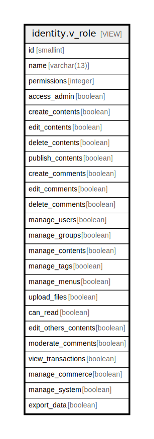

# identity.v_role

## Description

<details>
<summary><strong>Table Definition</strong></summary>

```sql
CREATE VIEW v_role AS (
 SELECT id,
    name,
    permissions,
    ((permissions & 1) <> 0) AS access_admin,
    ((permissions & 2) <> 0) AS create_contents,
    ((permissions & 4) <> 0) AS edit_contents,
    ((permissions & 8) <> 0) AS delete_contents,
    ((permissions & 16) <> 0) AS publish_contents,
    ((permissions & 32) <> 0) AS create_comments,
    ((permissions & 64) <> 0) AS edit_comments,
    ((permissions & 128) <> 0) AS delete_comments,
    ((permissions & 256) <> 0) AS manage_users,
    ((permissions & 512) <> 0) AS manage_groups,
    ((permissions & 1024) <> 0) AS manage_contents,
    ((permissions & 2048) <> 0) AS manage_tags,
    ((permissions & 4096) <> 0) AS manage_menus,
    ((permissions & 8192) <> 0) AS upload_files,
    ((permissions & 16384) <> 0) AS can_read,
    ((permissions & 32768) <> 0) AS edit_others_contents,
    ((permissions & 65536) <> 0) AS moderate_comments,
    ((permissions & 131072) <> 0) AS view_transactions,
    ((permissions & 262144) <> 0) AS manage_commerce,
    ((permissions & 524288) <> 0) AS manage_system,
    ((permissions & 1048576) <> 0) AS export_data
   FROM identity.role
)
```

</details>

## Columns

| Name | Type | Default | Nullable | Children | Parents | Comment |
| ---- | ---- | ------- | -------- | -------- | ------- | ------- |
| id | smallint |  | true |  |  |  |
| name | varchar(13) |  | true |  |  |  |
| permissions | integer |  | true |  |  |  |
| access_admin | boolean |  | true |  |  |  |
| create_contents | boolean |  | true |  |  |  |
| edit_contents | boolean |  | true |  |  |  |
| delete_contents | boolean |  | true |  |  |  |
| publish_contents | boolean |  | true |  |  |  |
| create_comments | boolean |  | true |  |  |  |
| edit_comments | boolean |  | true |  |  |  |
| delete_comments | boolean |  | true |  |  |  |
| manage_users | boolean |  | true |  |  |  |
| manage_groups | boolean |  | true |  |  |  |
| manage_contents | boolean |  | true |  |  |  |
| manage_tags | boolean |  | true |  |  |  |
| manage_menus | boolean |  | true |  |  |  |
| upload_files | boolean |  | true |  |  |  |
| can_read | boolean |  | true |  |  |  |
| edit_others_contents | boolean |  | true |  |  |  |
| moderate_comments | boolean |  | true |  |  |  |
| view_transactions | boolean |  | true |  |  |  |
| manage_commerce | boolean |  | true |  |  |  |
| manage_system | boolean |  | true |  |  |  |
| export_data | boolean |  | true |  |  |  |

## Referenced Tables

| Name | Columns | Comment | Type |
| ---- | ------- | ------- | ---- |
| [identity.role](identity.role.md) | 3 |  | BASE TABLE |

## Relations



---

> Generated by [tbls](https://github.com/k1LoW/tbls)
