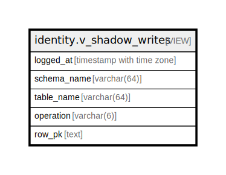

# identity.v_shadow_writes

## Description

DML émis directement par marius_user, hors procédures SECURITY DEFINER. Toute ligne est une violation ADR-001.

<details>
<summary><strong>Table Definition</strong></summary>

```sql
CREATE VIEW v_shadow_writes AS (
 SELECT logged_at,
    schema_name,
    table_name,
    operation,
    row_pk
   FROM identity.dml_audit_log
  WHERE (((db_session_user)::text = 'marius_user'::text) AND ((db_current_user)::text = 'marius_user'::text))
  ORDER BY logged_at DESC
)
```

</details>

## Columns

| Name | Type | Default | Nullable | Children | Parents | Comment |
| ---- | ---- | ------- | -------- | -------- | ------- | ------- |
| logged_at | timestamp with time zone |  | true |  |  |  |
| schema_name | varchar(64) |  | true |  |  |  |
| table_name | varchar(64) |  | true |  |  |  |
| operation | varchar(6) |  | true |  |  |  |
| row_pk | text |  | true |  |  |  |

## Referenced Tables

| Name | Columns | Comment | Type |
| ---- | ------- | ------- | ---- |
| [identity.dml_audit_log](identity.dml_audit_log.md) | 7 |  | BASE TABLE |

## Relations



---

> Generated by [tbls](https://github.com/k1LoW/tbls)
