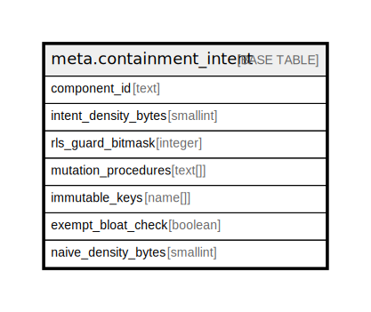

# meta.containment_intent

## Description

## Columns

| Name | Type | Default | Nullable | Children | Parents | Comment |
| ---- | ---- | ------- | -------- | -------- | ------- | ------- |
| component_id | text |  | false |  |  |  |
| intent_density_bytes | smallint |  | false |  |  |  |
| rls_guard_bitmask | integer |  | true |  |  |  |
| mutation_procedures | text[] |  | true |  |  |  |
| immutable_keys | name[] |  | true |  |  |  |
| exempt_bloat_check | boolean | false | false |  |  |  |
| naive_density_bytes | smallint |  | true |  |  |  |

## Constraints

| Name | Type | Definition |
| ---- | ---- | ---------- |
| component_id_format | CHECK | CHECK ((component_id ~ '^[a-z_]+\.[a-z_0-9]+$'::text)) |
| intent_density_positive | CHECK | CHECK ((intent_density_bytes > 0)) |
| naive_density_positive | CHECK | CHECK (((naive_density_bytes IS NULL) OR (naive_density_bytes > 0))) |
| naive_gte_intent | CHECK | CHECK (((naive_density_bytes IS NULL) OR (naive_density_bytes >= intent_density_bytes))) |
| containment_intent_pkey | PRIMARY KEY | PRIMARY KEY (component_id) |

## Indexes

| Name | Definition |
| ---- | ---------- |
| containment_intent_pkey | CREATE UNIQUE INDEX containment_intent_pkey ON meta.containment_intent USING btree (component_id) |

## Relations

---

> Generated by [tbls](https://github.com/k1LoW/tbls)
