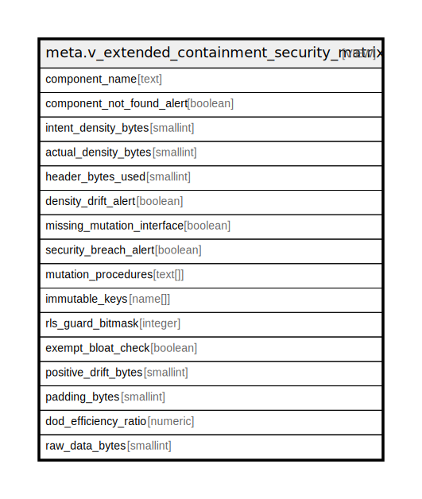

# meta.v_extended_containment_security_matrix

## Description

<details>
<summary><strong>Table Definition</strong></summary>

```sql
CREATE VIEW v_extended_containment_security_matrix AS (
 SELECT ci.component_id AS component_name,
    (to_regclass(ci.component_id) IS NULL) AS component_not_found_alert,
    ci.intent_density_bytes,
    ts.actual_density_bytes,
    ts.header_bytes_used,
    (ts.actual_density_bytes > ci.intent_density_bytes) AS density_drift_alert,
    ((ci.mutation_procedures IS NULL) OR (NOT (EXISTS ( SELECT 1
           FROM unnest(ci.mutation_procedures) p(sig)
          WHERE (to_regprocedure(p.sig) IS NOT NULL))))) AS missing_mutation_interface,
    ((ci.mutation_procedures IS NOT NULL) AND (EXISTS ( SELECT 1
           FROM (unnest(ci.mutation_procedures) p(sig)
             JOIN meta.v_introspection_security ps ON ((ps.proc_id = (to_regprocedure(p.sig))::oid)))
          WHERE ((NOT ps.is_security_definer) OR (NOT ps.has_secured_path))))) AS security_breach_alert,
    ci.mutation_procedures,
    ci.immutable_keys,
    ci.rls_guard_bitmask,
    ci.exempt_bloat_check,
        CASE
            WHEN (ts.actual_density_bytes IS NULL) THEN NULL::smallint
            WHEN (ts.actual_density_bytes < ci.intent_density_bytes) THEN (ci.intent_density_bytes - ts.actual_density_bytes)
            ELSE (0)::smallint
        END AS positive_drift_bytes,
    (ts.actual_density_bytes - ts.raw_data_bytes) AS padding_bytes,
        CASE
            WHEN ((ci.naive_density_bytes IS NOT NULL) AND (ci.intent_density_bytes > 0)) THEN (((ci.naive_density_bytes)::numeric / (ci.intent_density_bytes)::numeric))::numeric(4,2)
            ELSE NULL::numeric
        END AS dod_efficiency_ratio,
    ts.raw_data_bytes
   FROM (meta.containment_intent ci
     LEFT JOIN meta.v_introspection_layout ts ON ((ts.component_id = (to_regclass(ci.component_id))::oid)))
)
```

</details>

## Columns

| Name | Type | Default | Nullable | Children | Parents | Comment |
| ---- | ---- | ------- | -------- | -------- | ------- | ------- |
| component_name | text |  | true |  |  |  |
| component_not_found_alert | boolean |  | true |  |  |  |
| intent_density_bytes | smallint |  | true |  |  |  |
| actual_density_bytes | smallint |  | true |  |  |  |
| header_bytes_used | smallint |  | true |  |  |  |
| density_drift_alert | boolean |  | true |  |  |  |
| missing_mutation_interface | boolean |  | true |  |  |  |
| security_breach_alert | boolean |  | true |  |  |  |
| mutation_procedures | text[] |  | true |  |  |  |
| immutable_keys | name[] |  | true |  |  |  |
| rls_guard_bitmask | integer |  | true |  |  |  |
| exempt_bloat_check | boolean |  | true |  |  |  |
| positive_drift_bytes | smallint |  | true |  |  |  |
| padding_bytes | smallint |  | true |  |  |  |
| dod_efficiency_ratio | numeric |  | true |  |  |  |
| raw_data_bytes | smallint |  | true |  |  |  |

## Referenced Tables

| Name | Columns | Comment | Type |
| ---- | ------- | ------- | ---- |
| [unnest](unnest.md) | 0 |  |  |
| [meta.v_introspection_security](meta.v_introspection_security.md) | 5 |  | VIEW |
| [meta.containment_intent](meta.containment_intent.md) | 7 |  | BASE TABLE |
| [meta.v_introspection_layout](meta.v_introspection_layout.md) | 4 |  | VIEW |

## Relations



---

> Generated by [tbls](https://github.com/k1LoW/tbls)
