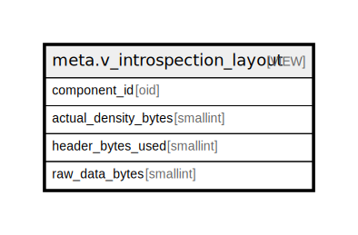

# meta.v_introspection_layout

## Description

<details>
<summary><strong>Table Definition</strong></summary>

```sql
CREATE VIEW v_introspection_layout AS (
 WITH RECURSIVE registered_oids AS (
         SELECT (to_regclass(containment_intent.component_id))::oid AS relid
           FROM meta.containment_intent
          WHERE (to_regclass(containment_intent.component_id) IS NOT NULL)
        ), cols AS (
         SELECT a.attrelid,
            a.attnum,
            a.attname,
            ((((((23)::numeric + ceil(((c.relnatts)::numeric / (8)::numeric))))::integer + 7) / 8) * 8) AS header_bytes,
                CASE
                    WHEN (a.attlen = '-1'::integer) THEN COALESCE(( SELECT s.avg_width
                       FROM pg_stats s
                      WHERE ((s.schemaname = n.nspname) AND (s.tablename = c.relname) AND (s.attname = a.attname))
                     LIMIT 1), 4)
                    ELSE (a.attlen)::integer
                END AS effective_len,
                CASE a.attalign
                    WHEN 'c'::"char" THEN 1
                    WHEN 's'::"char" THEN 2
                    WHEN 'i'::"char" THEN 4
                    WHEN 'd'::"char" THEN 8
                    ELSE 4
                END AS align_bytes,
            row_number() OVER (PARTITION BY a.attrelid ORDER BY a.attnum) AS seq
           FROM ((pg_attribute a
             JOIN pg_class c ON ((c.oid = a.attrelid)))
             JOIN pg_namespace n ON ((n.oid = c.relnamespace)))
          WHERE ((a.attnum > 0) AND (NOT a.attisdropped) AND (a.attrelid IN ( SELECT registered_oids.relid
                   FROM registered_oids)))
        ), layout_calc(attrelid, seq, attname, offset_bytes, len_bytes, align_bytes, header_bytes) AS (
         SELECT cols.attrelid,
            cols.seq,
            cols.attname,
            cols.header_bytes AS offset_bytes,
            cols.effective_len AS len_bytes,
            cols.align_bytes,
            cols.header_bytes
           FROM cols
          WHERE (cols.seq = 1)
        UNION ALL
         SELECT c.attrelid,
            c.seq,
            c.attname,
            ((l.offset_bytes + l.len_bytes) + ((c.align_bytes - ((l.offset_bytes + l.len_bytes) % c.align_bytes)) % c.align_bytes)) AS offset_bytes,
            c.effective_len,
            c.align_bytes,
            l.header_bytes
           FROM (cols c
             JOIN layout_calc l ON (((c.attrelid = l.attrelid) AND (c.seq = (l.seq + 1)))))
        )
 SELECT attrelid AS component_id,
    ((((max((offset_bytes + len_bytes)) + 7) / 8) * 8))::smallint AS actual_density_bytes,
    (max(header_bytes))::smallint AS header_bytes_used,
    ((max(header_bytes) + sum(len_bytes)))::smallint AS raw_data_bytes
   FROM layout_calc
  GROUP BY attrelid
)
```

</details>

## Columns

| Name | Type | Default | Nullable | Children | Parents | Comment |
| ---- | ---- | ------- | -------- | -------- | ------- | ------- |
| component_id | oid |  | true |  |  |  |
| actual_density_bytes | smallint |  | true |  |  |  |
| header_bytes_used | smallint |  | true |  |  |  |
| raw_data_bytes | smallint |  | true |  |  |  |

## Referenced Tables

| Name | Columns | Comment | Type |
| ---- | ------- | ------- | ---- |
| [meta.containment_intent](meta.containment_intent.md) | 7 |  | BASE TABLE |
| [pg_stats](pg_stats.md) | 0 |  |  |
| [pg_attribute](pg_attribute.md) | 0 |  |  |
| [pg_class](pg_class.md) | 0 |  |  |
| [pg_namespace](pg_namespace.md) | 0 |  |  |
| [registered_oids](registered_oids.md) | 0 |  |  |
| [cols](cols.md) | 0 |  |  |
| [layout_calc](layout_calc.md) | 0 |  |  |

## Relations



---

> Generated by [tbls](https://github.com/k1LoW/tbls)
